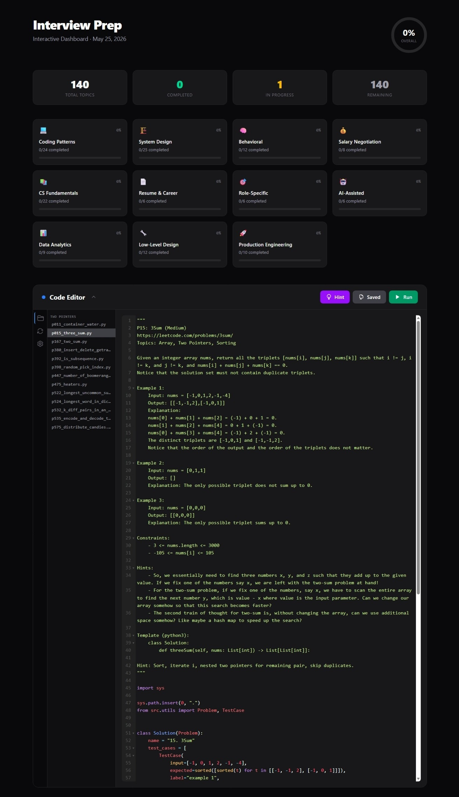

# Interview Prep

A comprehensive interview preparation toolkit covering coding patterns, system design, behavioral interviews, CS fundamentals, salary negotiation, resume/career prep, role-specific topics, AI-assisted interview scenarios, data analytics, low-level design, and production engineering. Track progress across 144 coding problems and 140 topics with a unified CLI dashboard. Solutions available in **Python, C, C++, and Rust**.

**Features:**
- Progress ring, stats cards, and per-section breakdowns
- **Code Editor** — auto-loads all in-progress problem files with CodeMirror syntax highlighting
- **Save & Run** — edit code in the browser, save (`Ctrl+S`), and run (`Ctrl+R`) directly from the editor header
- **Terminal** card showing PASS/FAIL/SKIP results
- **File tree sidebar** — activity bar with collapsible file explorer + language filter tabs (Py / C / C++ / Rs)
- **Version history** — every save creates a version snapshot; revert to any previous version
- Click any topic name to open its files in the editor
- Filter by status (New / In Progress / Done) and instant search



[See full screenshot](screenshot.jpeg)

## Quick Start

```bash
git clone https://github.com/quanhua92/interview-prep.git
cd interview-prep
docker compose up -d
```

Go to [http://localhost:8888](http://localhost:8888) to view the dashboard.

For a minimal setup (no file persistence):

```bash
docker run -d -p 8888:8888 -v $(pwd)/progress:/app/progress quanhua92/interview-prep
```

### CLI

```bash
# Install dependencies
uv sync

# Install git hooks (blocks accidental commits of problem solve() methods)
git config core.hooksPath .githooks

# View progress dashboard
uv run python main.py status

# Run a problem file directly
uv run python tier1_foundation/sliding_window/problems/p003_longest_substring.py

# Mark topic progress
uv run python main.py update sliding_window in_progress
uv run python main.py update url_shortener completed

# Record a practice attempt
uv run python main.py attempt sliding_window

# Run problem stubs (default — expects SKIP for unimplemented problems)
uv run python run.py                   # WIP pattern problem stubs (Python)
uv run python run.py two_pointers      # Run a specific pattern's problems
uv run python run.py --all             # All pattern problem stubs

# Run solution files (answer keys)
uv run python run.py --solution         # WIP pattern solutions (Python)
uv run python run.py --solution --lang c  # All pattern solutions, C versions
uv run python run.py --solution --lang cpp  # All pattern solutions, C++ versions
uv run python run.py --solution --lang rs  # All pattern solutions, Rust versions

# Generate static HTML progress report
uv run python main.py report

# Launch interactive web dashboard (0.0.0.0:8888)
uv run python main.py start
```


## Project Structure

```
interview-prep/
├── main.py                        # CLI entry point
├── tracker.py                     # Data layer (CRUD on tracker.json)
├── web.py                         # FastAPI server + HTML dashboard
├── index.html                     # HTML template (Tailwind CSS)
├── static/app.js                  # Client-side JS (filters, API calls)
├── static/app.css                 # Editor and sidebar styles
├── static/codemirror/             # Vendored CodeMirror (syntax highlighting)
├── static/tailwind-browser.js    # Vendored Tailwind CSS runtime
├── Dockerfile                     # Docker image (Python 3.14-slim)
├── docker-compose.yml             # Docker Compose with volume mounts for progress + tier dirs
├── tier{1-4}_*/                   # 24 coding patterns
│   └── <pattern>/
│       ├── template.py
│       ├── problems/              # Practice stubs
│       ├── solutions/             # Answer keys
│       └── README.md
├── system_design/                 # 25 system design topics
│   └── <topic>/
│       ├── discussion.md
│       └── checklist.md
├── behavioral/                    # 12 behavioral themes
│   └── <theme>/
│       ├── discussion.md
│       └── checklist.md
├── salary_negotiation/            # 7 salary negotiation topics
│   └── <topic>/
│       ├── discussion.md
│       └── checklist.md
├── cs_fundamentals/               # 22 CS fundamentals topics
│   └── <topic>/
│       ├── discussion.md
│       └── checklist.md
├── resume_career/                 # 6 resume & career topics
│   └── <topic>/
│       ├── discussion.md
│       └── checklist.md
├── role_specific/                 # 6 role-specific topics
│   └── <topic>/
│       ├── discussion.md
│       └── checklist.md
├── ai_assisted/                   # 6 AI-assisted interview scenarios
│   └── <scenario>/
│       ├── README.md              # Interview prompt + follow-ups
│       └── TIPS.md                # Concepts, mistakes, AI strategy
├── data_analytics/                # 9 data analytics topics
│   └── <topic>/
│       ├── discussion.md
│       └── checklist.md
├── low_level_design/              # 12 low-level design topics
│   └── <topic>/
│       ├── discussion.md
│       └── checklist.md
├── production_engineering/        # 10 production engineering topics
│   └── <topic>/
│       ├── discussion.md
│       └── checklist.md
├── tests/                         # pytest suite
├── src/utils/                     # Shared utilities (Problem, TestCase, ListNode, TreeNode)
├── src/runners/                   # Cross-language test runners (C, C++, Rust)
└── progress/tracker.json          # Progress data (gitignored)
```

## Coding Patterns (24 patterns, 4 tiers)

### Tier 1: Foundation (Must Master)

| Pattern | Key Problems |
|---------|-------------|
| Sliding Window | P003 Longest Substring, P438 Find All Anagrams, P424 Longest Repeating Char, P567 Permutation in String, P395 Longest Substring K Repeating, P495 Teemo Attacking |
| Two Pointers | P167 Two Sum II, P011 Container With Most Water, P015 3Sum, P392 Is Subsequence, P524 Longest Word through Deleting |
| Fast & Slow Pointers | P141 Linked List Cycle, P202 Happy Number, P876 Middle of Linked List, P382 Linked List Random Node |
| Merge Intervals | P056 Merge Intervals, P253 Meeting Rooms II, P057 Insert Interval |
| BFS | P102 Binary Tree Level Order, P994 Rotting Oranges, P1091 Shortest Path Binary Matrix, P513 Find Bottom Left Tree Value, P515 Find Largest Value in Each Tree Row |

### Tier 2: Intermediate (Very Common)

| Pattern | Key Problems |
|---------|-------------|
| DFS | P200 Number of Islands, P695 Max Area of Island, P1306 Jump Game III, P572 Subtree of Another Tree, P538 Convert BST to Greater Tree, P508 Most Frequent Subtree Sum |
| Two Heaps | P295 Median Finder, P480 Sliding Window Median |
| Top K Elements | P215 Kth Largest Element, P347 Top K Frequent Elements, P973 K Closest Points, P407 Trapping Rain Water II |
| Binary Search | P704 Binary Search, P153 Find Minimum in Rotated Sorted Array, P278 First Bad Version, P493 Reverse Pairs, P354 Russian Doll Envelopes, P450 Delete Node in a BST |
| Dynamic Programming | P070 Climbing Stairs, P322 Coin Change, P198 House Robber, P516 Longest Palindromic Subsequence, P518 Coin Change II, P514 Freedom Trail, P552 Student Attendance Record II, P576 Out of Boundary Paths |
| Prefix Sum | P560 Subarray Sum Equals K, P238 Product Except Self, P713 Subarray Product Less Than K, P523 Continuous Subarray Sum, P525 Contiguous Array |
| Stack | P020 Valid Parentheses, P394 Decode String, P155 Min Stack |
| Divide & Conquer | P023 Merge k Sorted Lists, P912 Sort an Array, P169 Majority Element, P427 Construct Quad Tree |
| Bit Manipulation | P191 Number of 1 Bits, P136 Single Number, P338 Counting Bits, P470 Implement Rand10 Using Rand7, P476 Number Complement |

### Tier 3: Advanced (Important for Top Companies)

| Pattern | Key Problems |
|---------|-------------|
| Backtracking | P078 Subsets, P039 Combination Sum, P017 Letter Combinations, P473 Matchsticks to Square, P491 Non-decreasing Subsequences |
| Modified Binary Search | P033 Search in Rotated Sorted Array, P875 Koko Eating Bananas, P410 Split Array Sum |
| Cyclic Sort | P442 Find All Duplicates, P268 Missing Number, P448 Find Disappeared |
| Subsets | P046 Permutations, P090 Subsets II, P077 Combinations |
| Trie | P208 Implement Trie, P212 Word Search II, P211 Design Add and Search Words, P472 Concatenated Words |

### Tier 4: Expert (Differentiators)

| Pattern | Key Problems |
|---------|-------------|
| Union Find | P323 Connected Components, P684 Redundant Connection, P990 Satisfiability Equations |
| Monotonic Stack | P739 Daily Temperatures, P084 Largest Rectangle in Histogram, P853 Car Fleet, P907 Sum of Subarray Minimums, P456 132 Pattern, P503 Next Greater Element II |
| Greedy | P055 Jump Game, P455 Assign Cookies, P134 Gas Station, P135 Candy, P452 Min Arrows to Burst Balloons, P502 IPO, P556 Next Greater Element III, P564 Find the Closest Palindrome |
| Matrix Traversal | P054 Spiral Matrix, P048 Rotate Image, P498 Diagonal Traverse, P542 01 Matrix, P391 Perfect Rectangle |
| Graph | P207 Course Schedule, P210 Course Schedule II, P997 Find the Town Judge, P488 Zuma Game |

Each pattern contains:
- `template.py` — Annotated skeleton with variants
- `problems/` — Practice stubs with test cases (implement `solve()`)
- `solutions/` — Answer keys (`.py` + `.c` / `.cpp` / `.rs` counterparts)
- `README.md` — Pattern explanation, when to recognize it, complexity table

## System Design (25 topics)

| Topic | Core Concepts |
|-------|--------------|
| [URL Shortener](system_design/url_shortener/) | ID generation, caching, base62, sharding |
| [Chat System](system_design/chat_system/) | WebSockets, message queues, presence |
| [Rate Limiter](system_design/rate_limiter/) | Token bucket, sliding window, Redis |
| [News Feed](system_design/news_feed/) | Fan-out on write/read, graph, ranking |
| [Notification Service](system_design/notification_service/) | Push/pull, reliability, dedup, priority |
| [Search Autocomplete](system_design/search_autocomplete/) | Trie, ranking, prefix search at scale |
| [Distributed Cache](system_design/distributed_cache/) | Consistent hashing, replication, eviction |
| [Key-Value Store](system_design/key_value_store/) | SSTables, LSM trees, Bloom filters |
| [Web Crawler](system_design/web_crawler/) | URL frontier, politeness, dedup, BFS |
| [Ticket Booking](system_design/ticket_booking/) | Concurrency, locks, idempotency, oversell |

Each topic contains:
- `discussion.md` — Concise reference (key concepts, trade-offs, vocabulary)
- `checklist.md` — Step-by-step working checklist with 5 phases + practice notes

## Behavioral (12 themes, STAR method)

| Theme | Competency |
|-------|-----------|
| [Teamwork Conflict](behavioral/teamwork_conflict/) | Collaboration, empathy |
| [Handling Failure](behavioral/handling_failure/) | Self-awareness, resilience |
| [Leadership Without Authority](behavioral/leadership_initiative/) | Influence, ownership |
| [Difficult Decision](behavioral/difficult_decision/) | Judgment, trade-off analysis |
| [Adapting to Change](behavioral/adapting_to_change/) | Flexibility, prioritization |
| [Working Under Pressure](behavioral/meeting_deadline_pressure/) | Time management, composure |
| [Receiving Feedback](behavioral/receiving_feedback/) | Humility, growth |
| [Mentoring a Teammate](behavioral/mentoring_other/) | Teaching, patience |
| [Owning a Mistake](behavioral/owning_mistake/) | Accountability, transparency |
| [Competing Priorities](behavioral/competing_priorities/) | Prioritization, stakeholder management |

Each theme contains:
- `discussion.md` — STAR framework guidance, what interviewers look for, story mining prompts
- `checklist.md` — Story workshop with drafting checkboxes, refinement checks, practice log

## Salary Negotiation (8 topics)

| Topic | Focus |
|-------|-------|
| [Market Research](salary_negotiation/market_research/) | Compensation data, leveling, market positioning |
| [Total Comp Breakdown](salary_negotiation/total_comp_breakdown/) | Base, bonus, equity, benefits, hidden value |
| [Initial Offer Evaluation](salary_negotiation/initial_offer_eval/) | Reading offer letters, negotiation levers |
| [Negotiation Tactics](salary_negotiation/negotiation_tactics/) | Anchoring, framing, timing, communication |
| [Equity & RSU Evaluation](salary_negotiation/equity_rsu_evaluation/) | Stock options, vesting, dilution, tax |
| [Difficult Scenarios](salary_negotiation/difficult_scenarios/) | Lowball offers, exploding offers, competing offers |
| [Counteroffer & Staying](salary_negotiation/counteroffer_staying/) | Counteroffer risks, resigning professionally |
| [Remote Negotiation](salary_negotiation/remote_negotiation/) | Remote/hybrid comp adjustments, cost of living, location arbitrage |

Each topic contains:
- `discussion.md` — Benchmarks, frameworks, scripts, talking points
- `checklist.md` — Preparation steps, script practice, scenario walkthroughs

## CS Fundamentals (22 topics)

| Topic | Focus |
|-------|-------|
| [Operating Systems](cs_fundamentals/operating_systems/) | Processes, threads, memory, file systems |
| [Computer Networking](cs_fundamentals/computer_networking/) | TCP/IP, HTTP, DNS, TLS, network models |
| [Databases](cs_fundamentals/databases/) | SQL, indexing, transactions, ACID, normalization |
| [Concurrency](cs_fundamentals/concurrency/) | Threads, locks, race conditions, deadlocks |
| [Distributed Systems](cs_fundamentals/distributed_systems/) | CAP, consensus, replication, fault tolerance |
| [Data Structures & Algos](cs_fundamentals/data_structures_algos/) | Arrays, trees, graphs, hash tables, complexity |
| [System Security](cs_fundamentals/system_security/) | OWASP, auth, encryption, secure design |

Each topic contains:
- `discussion.md` — Key concepts, definitions, common questions, reference tables
- `checklist.md` — Concept self-assessment, explain-out-loud prompts, practice log

## Resume & Career (6 topics)

| Topic | Focus |
|-------|-------|
| [Resume Structure](resume_career/resume_structure/) | One-page format, sections, bullet writing |
| [Elevator Pitch](resume_career/elevator_pitch/) | 30-60 second self-introduction |
| [Career Narrative](resume_career/career_narrative/) | Connecting experience into a coherent story |
| [Explaining Gaps](resume_career/explaining_gaps/) | Employment gaps, career changes, layoffs |
| [Portfolio Showcase](resume_career/portfolio_showcase/) | Presenting projects, GitHub, writing samples |
| [Questions for Interviewer](resume_career/questions_for_interviewer/) | Strategic questions to ask at interviews |

Each topic contains:
- `discussion.md` — Best practices, structure, good vs bad examples, common mistakes
- `checklist.md` — Drafting, refinement, and practice phases with practice log

## Role-Specific (6 topics)

| Topic | Focus |
|-------|-------|
| [Backend Engineer](role_specific/backend_engineer/) | APIs, databases, services, scalability |
| [Frontend Engineer](role_specific/frontend_engineer/) | DOM, frameworks, performance, accessibility |
| [Data Engineer](role_specific/data_engineer/) | ETL, data pipelines, warehousing, streaming |
| [ML/AI Engineer](role_specific/ml_ai_engineer/) | ML fundamentals, deployment, evaluation |
| [DevOps/SRE](role_specific/devops_sre/) | CI/CD, containers, monitoring, reliability |
| [Full-Stack Engineer](role_specific/full_stack_engineer/) | Frontend + backend breadth, system integration |

Each topic contains:
- `discussion.md` — Core competencies, common topics, key terminology, cross-references
- `checklist.md` — Per-competency prep checklist, practice questions, system design bridge

## AI-Assisted Interview Scenarios (6 scenarios)

Practice modern project-based interviews where you collaborate with an AI assistant to build, debug, or extend production-like systems — the format used by Meta, LinkedIn, and Google.

| Scenario | Difficulty | Key Skills |
|----------|-----------|------------|
| [URL Shortener](ai_assisted/url_shortener/) | Medium | Encoding, caching, database trade-offs |
| [Spreadsheet Application](ai_assisted/spreadsheet/) | Hard | Dependency graphs, cycle detection, concurrency |
| [Distributed Rate Limiter](ai_assisted/rate_limiter/) | Hard | Throttling algorithms, distributed state, resilience |
| [Maze Solver / Pathfinder](ai_assisted/maze_solver/) | Medium | Graph traversal, pathfinding, memory optimization |
| [Card Game Logic](ai_assisted/card_game/) | Medium | Game rules, extensibility, input validation |
| [Notification Service](ai_assisted/notification_service/) | Hard | Async processing, idempotency, priority queuing |

Each scenario contains:
- `README.md` — Realistic interview prompt with requirements, starter code, and 4 progressive follow-up questions
- `TIPS.md` — Key concepts, common mistakes, AI prompting strategy, and what interviewers look for

See [ai_assisted/README.md](ai_assisted/) for the full guide including interview formats, evaluation rubric, and prompting strategy.
