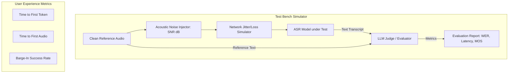

# Speech LLMs: Agent Benchmarking & Evaluation Frameworks

- **Category**: LLM Systems
- **Difficulty**: Hard
- **Target Role**: Conversational AI Engineer / Voice AI Architect
- **Source**: Google & NVIDIA Evaluation Frameworks
- **Flashcards**: [LLM Systems deck](../flash_cards/llm/llm_systems.md)

---

## Concept Overview

Deploying interactive voice agents into production requires robust benchmarking frameworks. Unlike text-based chatbots, voice agents must operate under real-world degradation: acoustic noise, room reverberation, microphone clipping, network jitter, and packet loss.

Think of evaluating a voice agent like testing a drive-thru intercom system at a busy restaurant:
* **Signal-to-Noise Ratio (SNR)** is like testing the intercom during a heavy rainstorm with loud car engines idling nearby. Can the system still understand the order?
* **Speech Quality (POLQA/MCD)** evaluates the cashier's voice: does it sound like a friendly, clear human, or a crackly, robotic walkie-talkie?
* **TTFT vs. TTFA** is the latency gap: TTFT is how fast the cashier registers the answer in their brain (first text token), whereas TTFA is how long it takes for their voice to actually travel out of the intercom speaker (first audio wave).
* **Barge-In Success** is when you interrupt the cashier mid-sentence. Does the cashier immediately stop talking to listen, or do they keep reading their script over you?

### The Problem It Solves

Without automated voice benchmarking frameworks:
1. **Unnoticed Performance Drift**: Upgrades to LLM engines can inadvertently introduce token delays that break streaming ASR-TTS coordination.
2. **Brittle Turn-Taking**: VAD models calibrated in quiet environments fail in production, leading to constant false-interruptions or dead air.
3. **Audio Timbre Degradation**: Fast-pitch or vocoder optimizations that speed up inference might degrade audio quality, introducing robotic clicks that repel users.

### How It Works

1. **Physical & Perceptual Quality Metrics**:
   * **PESQ (ITU-T P.862)**: Compares reference and degraded signals after time-alignment. Limited to wideband $16\text{ kHz}$ telephony.
   * **POLQA (ITU-T P.863)**: Successor to PESQ, supporting full-band $48\text{ kHz}$ high-fidelity audio, modeling modern packet loss concealment (PLC) and time-stretching.
   * **Mel-Cepstral Distance (MCD)**: A physical distance metric measuring spectral divergence between Mel-Frequency Cepstral Coefficients (MFCCs). Lower is better.
   * **ViSQOL**: Google's structural spectrogram similarity index (SSIM) metric, scoring audio from 1.0 to 5.0.
2. **Transcription Metrics**:
   ASR output is compared to ground-truth scripts via Levenshtein distance:
   $$\text{WER} = \frac{S + D + I}{N}$$
   where $S$ = substitutions, $D$ = deletions, $I$ = insertions, and $N$ = reference word count.
3. **Latency Benchmarking**:
   TTFT measures server token generation onset. TTFA measures the full loop: client silence onset ($T_{\text{EOS}}$) to client speaker playback activation ($T_{\text{playback\_start}}$).
4. **Conversation Flow Metrics**:
   * **Barge-In Success Rate**: Percentage of times the agent halts playback and flushes downstream network buffers within $150\text{ ms}$ of user speech detection.
   * **Turn-Taking Accuracy**: Measures false-interruptions (agent cut off user mid-thought) and sluggish turns (agent waited $> 1.0$ second to respond).

---

## Worked Example

### Automated Test Simulator Metrics Report

We run a simulated test bench evaluating a voice agent under varying room noise levels (SNR) and network packet loss rates.

#### 1. Test Conditions & Inputs:
* **Audio Source**: 2-second clean mono WAV file of the phrase: *"Hello, I would like to book a flight to Seattle."*
* **Acoustic Noise**: Gaussian white noise injected at target SNR levels.
* **Network Profile**: $80\text{ ms}$ mean delay, $25\text{ ms}$ jitter, variable packet loss.

#### 2. Before / After Performance Matrix:

| Test Scenario | Room Noise (SNR) | Network Packet Loss | Word Error Rate (WER) | ViSQOL Score (MOS) | Mean TTFA (ms) | Task Success (LLM-as-a-Judge) |
| :--- | :--- | :--- | :--- | :--- | :--- | :--- |
| **1. Ideal Baseline** | Clean ($>40\text{ dB}$) | $0\%$ | $0.0\%$ | $4.5$ (Excellent) | $420\text{ ms}$ | **SUCCESS** ($5.0/5.0$) |
| **2. Moderate Noise** | Noisy Room ($15\text{ dB}$) | $2\%$ | $10.0\%$ (Seattle misheard) | $3.8$ (Good) | $450\text{ ms}$ | **SUCCESS** ($4.0/5.0$) |
| **3. High Degradation** | Heavy Static ($5\text{ dB}$) | $10\%$ | $45.0\%$ (phrase fragmented) | $2.1$ (Poor) | $780\text{ ms}$ (jitter buffer delay) | **FAILED** ($1.2/5.0$) |

#### 3. Mel-Cepstral Distortion (MCD) Calculation:
$$\text{MCD} = \frac{10\sqrt{2}}{\ln 10} \frac{1}{T} \sum_{t=1}^{T} \sqrt{\sum_{k=1}^{D} (mc_{t,k} - mc'_{t,k})^2}$$
*For high-fidelity TTS vocoding, production-grade output should aim for a $\text{MCD} < 2.5\text{ dB}$ relative to clean speaker recordings.*

---

## Complexity & Trade-offs

| Metric | Value | Notes |
|---|---|---|
| **Audio Quality Evaluation** | POLQA vs. ViSQOL | **POLQA**: High accuracy, models telephony networks, but requires expensive commercial licenses. **ViSQOL**: Open-source (Google), excellent for neural codecs, but sensitive to time-alignment offsets. |
| **ASR Metric** | WER vs. CER | **WER**: Standard for English. **CER**: Best for phonetically dense languages (Mandarin) or morphology-rich languages (Finnish) where sub-word changes modify meaning. |
| **VAD Silence Window** | $250\text{ ms}$ vs. $500\text{ ms}$ | **250ms**: Lowers TTFA, but causes frequent false-interruptions if the user pauses to think. **500ms**: Natural conversations, but adds $250\text{ ms}$ of dead air to every turn. |
| **Jitter Buffer Depth** | Static ($30\text{ ms}$) vs. Adaptive | **Static**: Predictable latency, but causes audio drops during network spikes. **Adaptive**: Adjusts buffer depth dynamically, preventing drops but increasing mean latency. |

---

## Common Interview Questions & How to Answer

### Q1: How do you measure Time-to-First-Audio (TTFA) accurately in a streaming WebSocket-based system?
- **Answer**:
  * We cannot rely on server logs because they omit network transit and client-side playback buffering. To measure TTFA:
    1. **Inject Timestamp Markers**: When the client-side VAD detects the end of the user's speech, it records a local microsecond timestamp ($T_{\text{EOS}}$) and sends a metadata frame containing this timestamp to the orchestrator.
    2. **Propagate Markers**: The orchestrator carries this start timestamp through the pipeline. When the first synthesized audio chunk is generated, the server tags the binary WebSocket frame with the original $T_{\text{EOS}}$.
    3. **Client Playback Logging**: When the client-side audio hardware player callback processes the very first PCM sample of this tagged frame, the client records the current local clock time ($T_{\text{playback\_start}}$).
    4. **Calculate Loop Latency**:
       $$\text{TTFA} = T_{\text{playback\_start}} - T_{\text{EOS}}$$
       This measures the actual end-to-end user experience, including all networking and hardware overhead.

### Q2: How do you evaluate the robustness of a voice agent's VAD and turn-taking behavior before deploying it to production?
- **Answer**:
  * We use **Conversational Audio Mixes** for automated stress testing:
    1. **Synthetic Audio Generation**: Mix clean speech recordings with varying types of background noise at target SNR levels ($5\text{ dB}$ to $20\text{ dB}$).
    2. **Background Distractors**: Inject non-speech sounds (breathing, sighing, keyboard typing, page turning) and "babble noise" (overlapping background chatter) to test if the VAD triggers false speech starts.
    3. **Pause Injection**: Insert silence windows of varying lengths ($100\text{--}800\text{ ms}$) inside the input audio. We measure if the VAD triggers an End-of-Utterance (EoU) during a mid-sentence thinking pause, helping us tune the silence threshold window.

---

## Pro-Tip: How to Impress the Interviewer

* **Propose Automated Dual-Audio Loopback Benchmarking**:
  Describe setting up an automated physical test bench using two docker containers on a network namespace. One container runs a **User Simulator** (playing raw user audio files and listening for responses), while the second hosts the **Voice Agent under Test**. By establishing a virtual audio loopback (e.g., using Pulseaudio virtual sinks or ALSA loopback devices), the user simulator can play audio, detect agent playback, measure barge-in speeds by playing interrupting audio mid-stream, and log millisecond-accurate TTFA directly from virtual hardware clocks.
* **Detail Hardware Contention Profiling under Load**:
  Explain that when scaling voice agents, CPU/GPU context-switching overhead causes latency spikes. Propose benchmarking under simulated load (using tools like Locust to simulate 1000 concurrent streaming gRPC calls) while profiling kernel execution queues with NVIDIA Nsight Systems. This helps identify if Triton's dynamic batcher is starving TTS vocoder kernels during heavy LLM prefill spikes.
