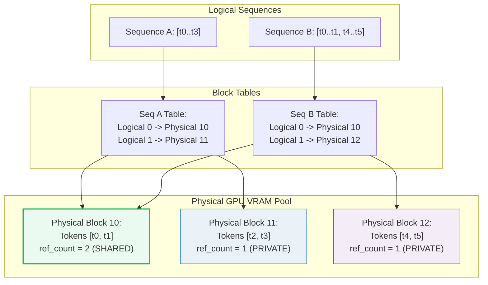

# LLM Block Manager (Paged Memory Allocation)

- **Category**: LLM Systems
- **Difficulty**: Hard
- **Target Role**: LLM Inference Engineer / LLM Serving Engineer
- **Source**: vLLM paper (SOSP 2023) / nano-vllm
- **Flashcards**: [LLM Systems deck](../flash_cards/llm/llm_systems.md)

---

## Concept Overview

Imagine an operating system's virtual memory manager, but instead of managing virtual-to-physical RAM pages for running processes, it manages token-to-GPU-VRAM blocks for active LLM generation requests. In naive LLM serving engines, a request is pre-allocated a contiguous chunk of memory equal to the maximum possible generation length (`max_seq_len`). The **LLM Block Manager** solves this waste by breaking the Key-Value (KV) cache into fixed-size physical blocks (or pages) containing a small number of tokens (e.g., 16 tokens). It maps a request's logical sequence of tokens to these physical blocks using a per-sequence block table, allocating new blocks on demand only when page boundaries are crossed.

### The Problem It Solves

Without a Block Manager, static memory allocation suffers from severe fragmentation and memory waste. Memory is wasted in three ways:
1. **Internal Fragmentation**: Space is reserved for the maximum generation length, but the request finishes early (e.g., reserving 2048 slots but generating only 300).
2. **Reservation Waste**: Space is reserved for future tokens that have not been generated yet.
3. **External Fragmentation**: Memory is allocated contiguously, so varying request lengths leave unusable gaps.

In naive servers, this waste accounts for **60% to 80%** of total GPU memory. This limits the maximum batch size, directly degrading throughput. The Block Manager eliminates external fragmentation and reduces internal fragmentation to less than the size of a single block (under 4% waste for a block size of 16).

### How It Works

1. **Physical Block Pool**: The engine pre-allocates a global pool of physical block frames in GPU memory.
2. **Logical Blocks**: The prompt and generated tokens of a sequence are grouped into logical blocks of `block_size` tokens.
3. **Block Table**: A lookup table maps each logical block index `i` of a sequence to a physical block ID in the global pool.
4. **Reference Counting (`ref_count`)**: Each physical block tracks how many active sequences are reading it. When `ref_count > 1`, the block is shared (e.g., a shared system prompt). When `ref_count` drops to `0`, the block is returned to the free list, but its content remains cached (reclaimable) until overwritten.
5. **Chained Hashing**: To identify shared prefixes, each block's content is fingerprinted using a hash function. To guarantee prefix correctness, block $k$'s hash is chained to block $k-1$'s hash:
   $$\text{Hash}_k = H(\text{Tokens}_k \parallel \text{Hash}_{k-1})$$

---

## Worked Example

This example uses verified numbers from the companion code (`block_size = 2` tokens per block, global pool of 6 physical blocks).

### 1. Prefix Fingerprinting via Chained Hash
Two requests arrive at the serving stack:
- **Request A**: `[10, 11, 12, 13]` $\rightarrow$ Logical Block 0: `[10, 11]`, Logical Block 1: `[12, 13]`
- **Request B**: `[10, 11, 14, 15]` $\rightarrow$ Logical Block 0: `[10, 11]`, Logical Block 1: `[14, 15]`

Both requests share the 2-token prefix `[10, 11]`.

| Request | Block Index | Tokens | Prefix (Prev Hash) | Chained Hash | Result |
|---|---|---|---|---|---|
| **A** | 0 | `[10, 11]` | `-1` (root) | `0xfece5a30e12404d4` | Shared with B |
| **B** | 0 | `[10, 11]` | `-1` (root) | `0xfece5a30e12404d4` | Shared with A |
| **A** | 1 | `[12, 13]` | `0xfece5a30e12404d4` | `0x2cb48a641a5b1565` | Diverges |
| **B** | 1 | `[14, 15]` | `0xfece5a30e12404d4` | `0x2ab4c06583ce3085` | Diverges |

**Gold Fingerprint Value**: `hash(A.block0) = hash(B.block0) = 18360711896818255060` (`0xfece5a30e12404d4`). Because the fingerprints for Logical Block 0 match, Request B can reuse physical Block 0 instead of recomputing it.

### 2. Physical Allocation and Reference Count
When Request A is allocated, the manager pops blocks from the free list.
When Request B is allocated, it reuses A's Block 0 (incrementing its reference counter).

**GPU Block Pool State (A and B allocated):**

| Physical Block ID | Reference Count | State | Reader Sequences | Token IDs |
|---|---|---|---|---|
| **0** | 2 | LIVE (Shared) | `['A', 'B']` | `[10, 11]` |
| **1** | 1 | LIVE (Private) | `['A']` | `[12, 13]` |
| **2** | 1 | LIVE (Private) | `['B']` | `[14, 15]` |

*The shared physical Block 0 has `ref_count = 2`, saving one prefill block computation.*

### 3. Partial Block Registration Pitfall
Suppose Request C is executing: `[10, 11, 12]` with `block_size = 2`.
This comprises 2 logical blocks:
- Block 0: `[10, 11]` (FULL)
- Block 1: `[12]` (PARTIAL — 1 of 2 slots filled)

During post-step processing, the manager maps:
$$\text{start} = \frac{\text{cached\_tokens}}{\text{block\_size}} = \frac{0}{2} = 0$$
$$\text{end} = \frac{\text{cached\_tokens} + \text{scheduled\_tokens}}{\text{block\_size}} = \frac{3}{2} = 1$$

The manager registers blocks in the range `[0..1)`, which means it registers **Block 0 only**. Block 1 is skipped because it is partial.
> [!IMPORTANT]
> If a partial block was registered, a future request for `[10, 11, 12, 99]` would falsely match the cache on the partial block `[12]`, causing a cache hit on mismatched tokens.

### 4. Decode Growth Rule
During autoregressive token generation, a request appends tokens one by one. A new physical block is allocated **only** when `len(seq) % block_size == 1`.

Let's trace Request A (`block_size = 2`) starting at length 4 (`block_table = [0, 1]`):

| Step | Generated Token | Length | `len % block_size` | New Block Allocated? | `block_table` |
|---|---|---|---|---|---|
| 1 | 20 | 5 | $5 \pmod 2 = 1$ | **Yes** (opens new page) | `[0, 1, 2]` |
| 2 | 21 | 6 | $6 \pmod 2 = 0$ | No (fills slot 1 of block 2) | `[0, 1, 2]` |
| 3 | 22 | 7 | $7 \pmod 2 = 1$ | **Yes** (opens new page) | `[0, 1, 2, 3]` |

### 5. Preemption and Prefix Reclaim
When the GPU runs out of physical blocks, the scheduler preempts a sequence (e.g., Sequence A) and releases its blocks:
- **Block 1** (private to A): `ref_count` drops from $1 \rightarrow 0$. It is returned to the free list.
- **Block 0** (shared with B): `ref_count` drops from $2 \rightarrow 1$. It remains in memory because B is still running.

Crucially, **the hash and KV data of Block 1 remain in memory** even though its `ref_count` is 0.
If Request D (`[10, 11, 12, 13, 20, 21]`) arrives, `can_allocate` performs the chained hash walk:
- Block 0: hash hit on `0xfece5a30e12404d4` (reuses live Block 0, `ref_count` $1 \rightarrow 2$).
- Block 1: hash hit on `0x2cb48a641a5b1565` (reclaims Block 1 from the free list, `ref_count` $0 \rightarrow 1$).
Request D skips prefill compute for **4 tokens** (`num_cached_tokens = 4`), saving CPU/GPU execution time.

---

## Complexity & Trade-offs

| Metric | Value / Behavior | Notes |
|---|---|---|
| **Metadata Overhead** | $\mathcal{O}\left(\frac{\text{seq\_len}}{\text{block\_size}}\right)$ | Memory needed to store the block tables (very small; e.g., 4 bytes per block mapping). |
| **Lookup Cost** | $\mathcal{O}(\text{num\_blocks})$ | Traversing chained block hashes to find cache hits during admission. |
| **Block Size = 16** | Default in vLLM | Balance between memory overhead and sharing granularity. |
| **Block Size = 2** | Used in code simulation | Maximizes prefix-sharing opportunities at the cost of larger block tables. |

### Block Size Trade-offs
* **Smaller Block Size** (e.g., 2 tokens):
  * *Pros*: Captures very short prefix matches. Minimizes internal fragmentation.
  * *Cons*: Explodes the size of the block table. Increases CPU overhead because the attention kernel must fetch many scattered memory pages.
* **Larger Block Size** (e.g., 64 tokens):
  * *Pros*: Reduces block table overhead. Keeps memory layouts more contiguous, improving GPU memory coalescing during reads.
  * *Cons*: Increases internal fragmentation (wasting up to 63 slots on the last block). Mismatches prefix sharing if prompts diverge mid-block.

---

## Common Interview Questions & How to Answer

### Q1: How does a paged memory block manager handle physical memory allocation, and what happens when the GPU runs out of free blocks during generation?
- **Answer**: The block manager allocates fixed-size physical blocks from a pre-allocated memory pool on demand. Sequences do not get contiguous virtual memory; they write to pages scattered across VRAM, mapped via a block table. If a decode step needs a new block and the pool is exhausted (OOM), the block manager returns an OOM signal to the scheduler. The scheduler must then preempt one or more active sequences, transitioning them back to `WAITING` or `SWAPPED`. The block manager frees the preempted sequence's blocks by decrementing their `ref_count`. Blocks with `ref_count == 0` are placed back on the free list.

### Q2: Why must we use chained hashes instead of hashing each block's content individually?
- **Answer**: If we hashed each block's content in isolation (e.g., $H(\text{block\_tokens})$), two completely unrelated requests that happen to contain the same words in a single block would be mapped to the same physical page. This would result in incorrect sharing. Hashing a block chained to the hash of the preceding block ($H(\text{block\_tokens} \parallel \text{prev\_hash})$) ensures that a block's fingerprint represents the **entire sequence of tokens up to that block**. This guarantees cache hits only occur on true prefix matches.

---

## Pro-Tip: How to Impress the Interviewer

- **Co-Write (CoW) and Beam Search**: Show deep understanding of how parallel sampling/beam search forks are structured. Since forks share the same history blocks, incrementing their `ref_count` lets them read from the same memory. Only when a branch diverges does it trigger a Copy-on-Write to allocate a private physical block, saving massive amounts of GPU memory.
- **Radix Tree Contrast**: Real systems use Radix Trees (like SGLang's RadixAttention) rather than flat hash lists to cache prefixes. This is because flat hash caches are block-aligned; any system prompt that does not align with the block boundary gets cut off, whereas a Radix Tree enables token-granular sharing.
