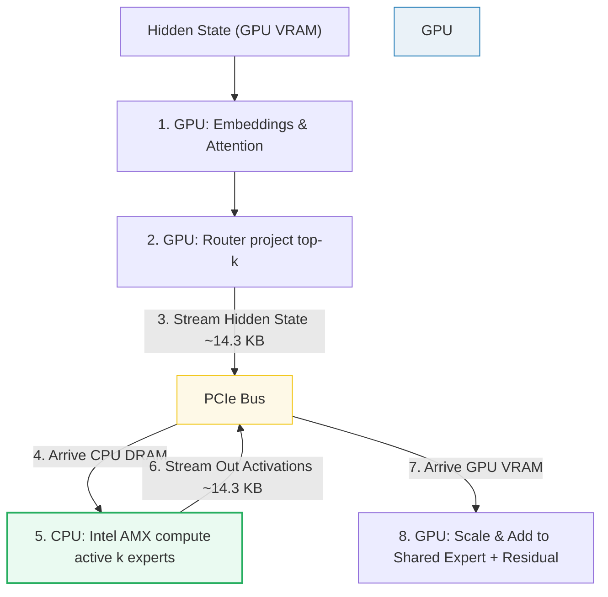

# KTransformers (Heterogeneous CPU/GPU Expert Offloading)

- **Category**: LLM Systems
- **Difficulty**: Expert
- **Target Role**: LLM Inference Architect / ML Platform Engineer
- **Source**: KTransformers SOSP Paper (Chen et al., 2025) / llama.cpp
- **Flashcards**: [LLM Systems deck](../flash_cards/llm/llm_systems.md)

---

## Concept Overview

Running ultra-large Mixture-of-Experts (MoE) models like DeepSeek-V3/R1 (671B parameters) on consumer hardware is constrained by GPU memory limits. A standard 24 GB GPU cannot fit the model, even when compressed. Naive offloading schemes (like llama.cpp's layer-by-layer offload) stream the entire model's weights across the slow PCIe bus for every single token, causing generation to stall.

**KTransformers** introduces **expert offloading**. Instead of moving weights, it partitions the execution: the embeddings, attention layers, router networks, always-on shared experts, and KV caches reside permanently on the GPU, while the routed expert weights are parked in CPU DRAM. For every token step, only the tiny **activation hidden states** (~14 KB) cross the PCIe bus to the CPU. The CPU executes the active experts using hardware vector extensions (Intel AMX) at high speed and returns the activation outputs to the GPU. This eliminates the PCIe bandwidth bottleneck, enabling local consumer boxes to run trillion-parameter MoE models at interactive speeds.

```
Layer Offload (llama.cpp) — PCIe Bottleneck:
[ GPU VRAM ] <=== (Stream 350 GB Weights / Token) === [ CPU DRAM ] (0.18 tok/s)

Expert Offload (KTransformers) — Activation-only:
[ GPU VRAM ] ── (Stream 14 KB Hidden State) ──> [ CPU DRAM (AMX Compute) ]
[ GPU VRAM ] <── (Stream 14 KB Out Activation) ── [ CPU DRAM ] (Fast execution)
```

### The Problem It Solves

DeepSeek-V3 holds **671B parameters**, requiring:
- **FP16 / BF16**: **1342.00 GB** of storage (14.6× over a 24 GB GPU).
- **W4A16 (4-bit)**: **335.50 GB** (14.0× over).
- **W4A16 + Scales/Bias**: **350.00 GB**.

If we offload this model layer-by-layer and stream weights over PCIe:

$$\text{Latency}_{layer} = \frac{\text{Model Size}}{\text{PCIe Bandwidth}}$$

- **PCIe Gen4 x16** (64 GB/s): $\frac{350 \text{ GB}}{64 \text{ GB/s}} = \mathbf{5.47 \text{ s/token}} \quad (\approx 0.18 \text{ tok/s})$
- **PCIe Gen5 x16** (128 GB/s): $\frac{350 \text{ GB}}{128 \text{ GB/s}} = \mathbf{2.73 \text{ s/token}} \quad (\approx 0.37 \text{ tok/s})$

Under layer offload, generating a standard 1000-token answer takes **1.5 hours**. KTransformers replaces weight streaming with activation streaming. For DeepSeek-V3 ($hidden = 7168$), a single expert-call activation (hidden state) size is:

$$\text{Size}_{activation} = \text{batch} \cdot \text{hidden} \cdot \text{bytes} = 1 \cdot 7168 \cdot 2 = 14,336 \text{ bytes } (\approx 14.3 \text{ KB})$$

Moving this activation across the PCIe bus takes:
- **PCIe Gen4 x16** (64 GB/s): $\frac{14,336 \text{ bytes}}{64 \times 10^9 \text{ bytes/s}} = \mathbf{0.22 \text{ }\mu\text{s}}$
- **PCIe Gen5 x16** (128 GB/s): $\frac{14,336 \text{ bytes}}{128 \times 10^9 \text{ bytes/s}} = \mathbf{0.11 \text{ }\mu\text{s}}$

Even when accounting for the worst-case total round-trips ($k=8$ experts, $61$ layers, both directions):

$$\text{Worst-case Volume} = 8 \cdot 61 \cdot 14,336 \text{ bytes} \cdot 2 = 13,991,936 \text{ bytes} \approx \mathbf{13.99 \text{ MB}}$$

This full-token transfer takes only **218.6 µs** over PCIe Gen4, which is **25,014× fewer bytes** than layer-by-layer offloading.

### How It Works

1. **Static Memory Allocation**:
   - **GPU VRAM**: embedding, attention, router, shared expert, KV cache (using PagedAttention).
   - **CPU DRAM**: 256 routed expert weights quantized to 4-bit (330 GB).
2. **Attention & Routing on GPU**: The GPU runs the attention block and passes the hidden state to the router, which calculates the top-$k$ expert assignments ($k=8$).
3. **Activation Streaming**: The GPU copies the $14.3$ KB hidden state to CPU DRAM over PCIe.
4. **CPU Systolic Compute**: The CPU identifies the $k$ active experts. It loads their 4-bit weights and performs the SwiGLU matrix math:
   $$E_i(x) = \text{down}(\text{silu}(\text{gate}(x)) \odot \text{up}(x))$$
   This computation is accelerated using **Intel AMX (Advanced Matrix Extensions)**, which processes tiled matrix multiplications in hardware, bypassing CPU vector ALU limits.
5. **Activation Return & Synthesis**: The CPU transfers the expert outputs back to the GPU. The GPU scales the outputs by the gate weights and sums them with the always-on shared expert output to update the residual stream:
   $$y = y_{\text{shared}} + \sum_{i \in \text{active}} G(x)_i \cdot E_i(x)$$



---

## Worked Example

This example demonstrates the data volume comparison between naive layer offloading and expert offloading on a quantized DeepSeek-V3 model.

### 1. Model Partitioning Footprint

| Sub-layer / Block | Precision | Parameter Count | Location | Memory Footprint |
|---|---|---|---|---|
| **Embeddings & Attention** | FP16 | ~37B | GPU VRAM | **74.00 GB** |
| **Shared Expert** | FP16 | ~1B | GPU VRAM | **2.00 GB** |
| **Routed Experts (256)** | W4A16 | ~633B | CPU DRAM | **316.50 GB** |
| **Metadata Scale/Bias** | FP16 | — | CPU DRAM | **15.00 GB** |
| **Total Model Footprint** | — | **671B** | Hybrid | **407.50 GB** |

### 2. Side-by-Side Data Transfer Volume (Per Token)

| Metrics | Naive Layer Offload | KTransformers Expert Offload (1 call) | KTransformers Expert Offload (Full worst-case) |
|---|---|---|---|
| **Data Transferred** | **350.00 GB** | **14.336 KB** | **13.992 MB** |
| **Transfer Time** (Gen4 64 GB/s) | **5.4688 s** | **0.224 µs** | **218.62 µs** |
| **Theoretical Token Rate** | **0.1829 tok/s** | — | **4574 tok/s** (uncapped by compute) |
| **Volume Saving Ratio** | Baseline | **24,414,062×** | **25,014×** |

*Verdict*: The PCIe bus is saturated by static weights under layer offloading. Expert offloading removes the PCIe bottleneck entirely, shifting the bottleneck to CPU AMX compute.

### 3. CPU Core Acceleration: Intel AMX Spec
KTransformers relies on the CPU executing the 8 active experts at near-GPU speed.
- **Intel AMX (Sapphire Rapids+, Jan 2023)**:
  - **Tile Registers**: 8 two-dimensional registers of **1024 bytes** each (16 rows × 64 bytes), totaling **8 KB** of on-chip tile storage.
  - **TMUL (Tile Matrix Multiply)**: Performs grid multiply-accumulate operations in a single instruction.
  - **Supports**: INT8 (for quantized inference) and BF16.
  - **Fallback**: AVX-512 VNNI (slower vector SIMD for systems without AMX).
- **Result (SOSP'25 Paper)**: Delivers **4.62–19.74× prefilling speedups** and **1.25–4.09× decoding speedups** over existing CPU offload frameworks.

---

## Complexity & Trade-offs

| Metric | Complexity / Value | Notes |
|---|---|---|
| **CPU Compute Complexity** | $\mathcal{O}(k \cdot \text{MLP compute})$ | Bounded by MoE sparsity: only $k=8$ of $E=256$ experts run (a **32× compute reduction**). |
| **PCIe Transfer Latency** | $\mathcal{O}(\text{layers} \cdot D \cdot \text{bytes})$ | Negligible; scale is in kilobytes rather than gigabytes. |
| **quantization Overhead** | INT4 $\rightarrow$ FP16 | Dequantization must occur in CPU L1/L2 caches to avoid memory bandwidth stalls. |
| **GPU Utilization** | Hybrid pipeline | GPU runs attention while CPU computes experts; requires pipelined async scheduling to prevent CPU stalls from idling the GPU. |

---

## Common Interview Questions & How to Answer

### Q1: Why is MoE sparsity the critical enabler for expert offloading, and why does this scheme fail on dense models like Llama-3-70B?
- **Answer**: The feasibility of expert offloading relies on **MoE sparsity**. In DeepSeek-V3, only $k=8$ of $E=256$ routed experts are active per token. The CPU only needs to calculate the matrix multiplications for those 8 active experts. The remaining 248 experts remain dormant in CPU DRAM, meaning we perform **32× fewer CPU calculations** compared to a dense model of equivalent capacity.
  If we attempt to offload a dense model (like Llama-3-70B) to the CPU, the FFN is not sparse: the CPU must compute the FFN projections for **100% of the parameters** for every token. Since a dense FFN does not have inactive branches, the CPU's compute throughput (even with AMX) becomes a massive bottleneck, resulting in very slow token generation rates. Thus, expert offloading only yields competitive performance on sparse MoE architectures.

### Q2: What is the "Expert Deferral" mechanism in KTransformers, and what problem does it solve?
- **Answer**: In a basic CPU/GPU offloading scheduler, execution is synchronous: the GPU computes attention, transfers activations to the CPU, waits for the CPU to compute the expert MLP, receives the outputs, and proceeds. This serial execution causes the GPU to sit idle while the CPU works, and the CPU to sit idle while the GPU works, degrading overall throughput.
  KTransformers introduces **Expert Deferral** (or asynchronous scheduling). During the prefill phase, instead of executing the CPU experts immediately, the engine **defers** the expert computation for a block of tokens. The GPU continues running attention for subsequent tokens, and the CPU computes the deferred experts asynchronously in the background. By decoupling the execution streams and overlapping GPU attention with CPU expert GEMMs, KTransformers maximizes CPU/GPU hardware utilization, increasing throughput by up to **1.45×** (as published in the SOSP'25 paper).

---

## Pro-Tip: How to Impress the Interviewer

- **NUMA-Aware Thread Pinning**: Show systems design expertise. CPU DRAM is partitioned into NUMA (Non-Uniform Memory Access) nodes. If CPU threads on Socket 0 access expert weights stored in Socket 1's DRAM, the traffic must traverse the QPI/UPI link, causing memory latency to double. Explain that KTransformers mitigates this by applying **NUMA-aware thread pinning**: pinning worker threads to specific CPU cores and allocating expert weights locally in the DRAM of the NUMA node corresponding to those cores.
- **On-the-fly SIMD Dequantization**: Point out that CPU DRAM bandwidth (~200 GB/s) is much lower than GPU HBM (~3 TB/s). To prevent DRAM bandwidth bottlenecks on the CPU, expert weights must remain quantized in memory. They should be dequantized **on the fly inside the CPU's L1/L2 caches** using AVX-512 or AMX register operations right before computing the TMUL GEMM, rather than pre-dequantizing in DRAM.
