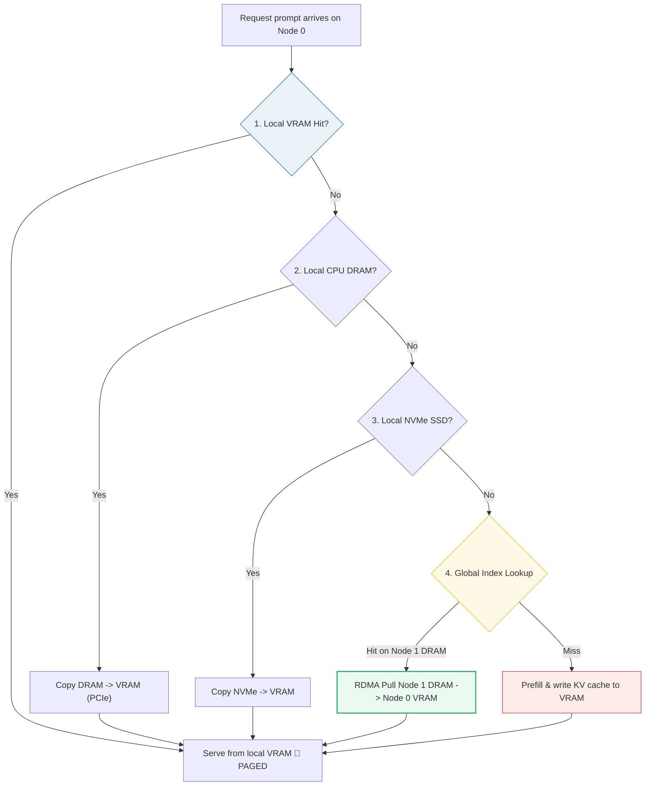

# LMCache (Hierarchical, Global KV Cache Pooling)

- **Category**: LLM Systems
- **Difficulty**: Hard
- **Target Role**: LLM Inference Architect / ML Platform Engineer
- **Source**: LMCache: An Efficient KV Cache Layer for Enterprise-Scale LLM Inference (Liu et al., 2025) / Mooncake: A KVCache-centric Disaggregated Architecture (Qin et al., 2024)
- **Flashcards**: [LLM Systems deck](../flash_cards/llm/llm_systems.md)

---

## Concept Overview

Prefix caching mechanisms (such as SGLang's RadixAttention or vLLM's BlockManager) store the Key-Value (KV) cache of prompt prefixes in GPU memory to avoid recomputing prefill steps. However, these systems are node-local: if a repeat prompt is routed to a different node in a cluster, the cache is missed, forcing a slow, redundant prefill.

**LMCache** extends local prefix caching to a **global, hierarchical KV cache pool**. It spans the entire cluster's memory hierarchy: GPU VRAM $\rightarrow$ CPU DRAM $\rightarrow$ Local NVMe $\rightarrow$ Remote S3/Redis. Using content-addressed hashing, it creates unique signatures for fixed-size token chunks. When a local cache miss occurs, the node queries a cluster-wide lookup index. If the chunk is cached anywhere in the cluster, the node streams the KV cache pages over high-speed networks (RDMA or optimized TCP/IP) directly into its local VRAM block table. Prefill computation is skipped, replacing a heavy compute bottleneck with a fast network transfer.

### The Problem It Solves

In a multi-node serving cluster, load balancing requests randomly distributes matching prompts.
- **Without LMCache**: A request landing on a cold node triggers a full prefill, loading all model weights (e.g., 2.08 GB for a 1.04B parameter GQA model) to perform attention math.
- **With LMCache**: The cold node pulls the precomputed KV cache instead. 

For a GQA model ($\text{layers}=24$, $n_{\text{q\_heads}}=16$, $n_{\text{kv\_heads}}=2$, $\text{head\_dim}=128$, prompt length $S=512$ tokens), the KV cache size is:
$$\text{Size}_{\text{KV}} = 2 \cdot \text{layers} \cdot n_{\text{kv\_heads}} \cdot \text{head\_dim} \cdot S \cdot \text{bytes} = 2 \cdot 24 \cdot 2 \cdot 128 \cdot 512 \cdot 2 = 12,582,912 \text{ bytes} \approx 12.00 \text{ MiB}$$

We compare the transfer latency of this 12.00 MiB KV cache against the target model's prefill roofline floor at batch size 1:

| Operation / Path | Bandwidth | Latency | vs. Prefill Floor |
|---|---|---|---|
| **Recompute Prefill** (A100 Floor) | — | **3.41 ms** | Baseline |
| **Local DRAM $\rightarrow$ VRAM** (PCIe Gen5) | 64.0 GB/s | **0.197 ms** | **17.3× faster** |
| **Remote DRAM $\rightarrow$ VRAM** (RoCE 400G) | 50.0 GB/s | **0.252 ms** | **13.5× faster** |
| **Remote DRAM $\rightarrow$ VRAM** (RoCE 100G) | 12.5 GB/s | **1.007 ms** | **3.4× faster** |
| **Local NVMe $\rightarrow$ VRAM** (SSD) | 7.0 GB/s | **1.798 ms** | **1.9× faster** |

Moving the KV cache over RoCE 400G takes just **0.252 ms**, which is 13.5× faster than the absolute fastest theoretical prefill (3.41 ms). On real hardware, where prefill execution suffers from low Model FLOPs Utilization (MFU) at batch=1, the win is even larger.

### How It Works

1. **KV Chunking**: Input prompts are parsed into chunks of a fixed token length (e.g., `chunk_size = 2` tokens).
2. **Content-Addressable Signatures**: Each chunk is hashed by its token values using a hashing algorithm (like FNV-1a):
   - Tokens `[100, 101]` $\rightarrow$ Signature `0xecd0403d962ff8f4`
   - Tokens `[102, 103]` $\rightarrow$ Signature `0xec2574297233efd4`
   - Tokens `[104, 105]` $\rightarrow$ Signature `0xde27887129c0e434`
3. **Hierarchical Lookup**:
   - Check local node GPU VRAM.
   - Check local node CPU DRAM.
   - Check local node NVMe.
   - Check LMCache Global Index (e.g., a distributed hash table mapping signature $\rightarrow$ node IP + memory tier).
4. **RDMA/TCP Stream**: If the chunk lives in a remote node's CPU DRAM, the local engine requests an RDMA pull. The remote DRAM streams the KV tensor over the network straight into the local GPU VRAM.
5. **Block Table Mapping**: The pulled bytes are mapped into the local PagedAttention block table (logical page $\rightarrow$ physical page). Once mapped, the attention kernel reads the pages seamlessly; the transfer is fully transparent.
6. **VRAM Eviction Offloading**: When a node runs low on VRAM, rather than evicting and losing the KV cache, LMCache offloads it down the tier ladder (to DRAM, NVMe, or S3) to be retrieved later.

---

## Worked Example

This example demonstrates how local-only prefix caching fails under load balancing, and how LMCache resolves it in a 4-node cluster ($N=4$) processing 4 identical prompt queries.

### 1. The Multi-Node Miss (Local-Only Prefix Cache)
Four requests for the same prompt arrive. The load balancer distributes them across the 4 nodes:
- **Request 0** routed to **Node 0**: Cold miss. Prefills and stores KV chunks ($c_0, c_1, c_2$) in Node 0's VRAM.
- **Request 1** routed to **Node 2**: Cold miss. Node 2 check its local VRAM $\rightarrow$ Miss. Node 2 recomputes prefill.
- **Request 2** routed to **Node 3**: Cold miss. Node 3 check its local VRAM $\rightarrow$ Miss. Node 3 recomputes prefill.
- **Request 3** routed to **Node 1**: Cold miss. Node 1 check its local VRAM $\rightarrow$ Miss. Node 1 recomputes prefill.

**Local Hit Rate**: 1/4 = **25%** (only the first node's cache was utilized, despite the KV cache existing in the cluster).

### 2. The LMCache Global Index & Transfer
Under LMCache, when Node 1 processes Request 3:
1. **Local Check**: Miss.
2. **Global Query**: Node 1 queries the global index for the three chunk signatures:
   - `0xecd0403d962ff8f4` $\rightarrow$ Found: `Node 0 VRAM`
   - `0xec2574297233efd4` $\rightarrow$ Found: `Node 0 VRAM`
   - `0xde27887129c0e434` $\rightarrow$ Found: `Node 0 VRAM`
3. **RDMA Pull**: Node 1 initiates a 400G RoCE pull.
   - Chunks ($c_0, c_1, c_2$) totaling 192 bytes (in this small example) are copied from Node 0 VRAM $\rightarrow$ Node 1 VRAM.
   - Node 1 maps these pages into its block table:
     - `logical 0` $\rightarrow$ `physical page 0`
     - `logical 1` $\rightarrow$ `physical page 1`
     - `logical 2` $\rightarrow$ `physical page 2`
4. **Result**: Prefill is skipped. Gathered KV is byte-equal to the original.

| Prompt | Cached on Node | Request Routed to | Local Hit? | LMCache Global Hit? | Action |
|---|---|---|---|---|---|
| **0** | Node 0 | Node 0 | **YES** | **YES** | Local VRAM Read |
| **1** | Node 1 | Node 2 | No | **YES** | RoCE Pull from Node 1 DRAM |
| **2** | Node 2 | Node 3 | No | **YES** | RoCE Pull from Node 2 DRAM |
| **3** | Node 3 | Node 1 | No | **YES** | RoCE Pull from Node 3 DRAM |

**Global Hit Rate**: 4/4 = **100%**. LMCache amplifies effective cache hit rate by **4×** in this workload, scaling with the number of nodes $N$.

---

## Complexity & Trade-offs

| Metric | Complexity / Value | Notes |
|---|---|---|
| **Local Index Lookup** | $\mathcal{O}(L)$ | Walk local radix tree or probe hash table. |
| **Global Index Lookup** | $\mathcal{O}(L \cdot \text{RTT}_{Redis})$ | Network round-trip to the distributed index. |
| **KV Copy Bandwidth** | Up to 50 GB/s (RoCEv2) | Transfer latency is linear with the chunk size and prompt length. |
| **Metadata Overhead** | $\mathcal{O}(S / \text{chunk\_size})$ | Small chunk sizes allow fine-grained matches but explode index metadata size. |

---

## Common Interview Questions & How to Answer

### Q1: Why does LMCache use content-addressed chunk signatures rather than chained signatures for the global index?
- **Answer**: Local prefix caches (such as SGLang's RadixAttention) typically use **chained hashing** (e.g., $Hash(block_i) = F(Hash(block_{i-1}), tokens_i)$) to represent the prefix history. This works well for walking a local radix tree from the root down to find the longest matching prefix. However, chained hashing is history-dependent: if two prompts share a middle segment but have different starting tokens, their chained hashes for that shared segment will differ.
  LMCache uses **content-addressed, unchained hashing** at the chunk level (e.g., FNV-1a over only the tokens inside the chunk). Because the signature depends only on the chunk's own token values, identical chunks generate the identical signature regardless of their prefix histories. This allows different prompts with shared inner segments (e.g., a shared document in a RAG pipeline) to match and pull KV caches globally, enabling much higher cache reuse across diverse workloads.

### Q2: Under what conditions does LMCache fail to beat the prefill cost, and how does the memory tier ladder mitigate this?
- **Answer**: LMCache beats prefill when the network transfer latency is lower than the time required to compute the prefill:
  $$\text{Latency}_{\text{transfer}} = \frac{\text{Size}_{\text{KV}}}{\text{Bandwidth}} < \text{Latency}_{\text{prefill}}$$
  This inequality can fail in two scenarios:
  1. **De-cached/Deep Tiers**: If the KV cache has been evicted to slow storage tiers like local NVMe (7 GB/s) or WAN S3, the bandwidth drops. For a very long prompt, the transfer time from NVMe may approach or exceed the GPU prefill computation time.
  2. **Short Prompts**: For very short prompts (e.g., <64 tokens), the prefill cost is extremely small (~1 ms). In this regime, the latency of querying the global index (a network round-trip to Redis) plus the transfer overhead exceeds the cost of just doing the prefill on-device.
  LMCache's hierarchical memory tier ladder mitigates this by applying an LRU eviction policy. Hot, frequently queried prefixes are kept high in the hierarchy (GPU VRAM or CPU DRAM) to ensure high transfer bandwidth, while cold, historical prefixes are spilled to NVMe/S3. If a global lookup points to a slow tier where transfer exceeds prefill cost, the engine can fall back to local recomputation.

---

## Pro-Tip: How to Impress the Interviewer

- **Context Truncation Vulnerability**: Demonstrate real-world systems awareness. Point out that in many multi-turn chat applications, engines apply **context truncation** (discarding oldest system messages or early chat history) to fit within context length limits. Context truncation changes the prefix sequence, which breaks prefix cache matching. Point out that according to the LMCache paper, context truncation can **roughly halve the prefix-cache hit ratio**. Suggest mitigating this by using sliding window attention or designing custom chunking boundaries that align with the truncated context offsets.
- **Unified Engine Integration**: Explain that LMCache is designed to be **engine-agnostic**. It uses a modular KV Cache Connector that intercepts the physical page pool allocations of SGLang and vLLM. This allows cross-engine cache sharing, where a prompt prefilled by SGLang can be pulled and decoded by a vLLM instance in the same cluster.
