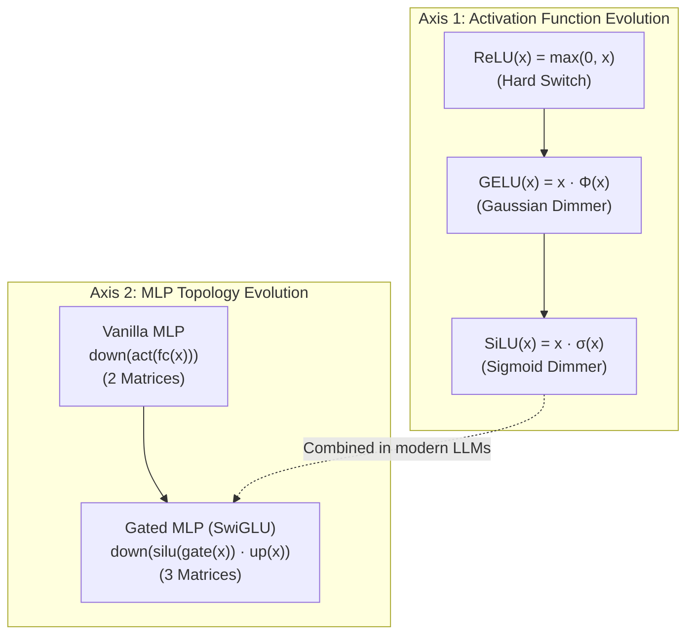

# MLP Activations: ReLU → GELU → SiLU & SwiGLU

- **Category**: LLM Systems
- **Difficulty**: Medium
- **Target Role**: LLM Inference Engineer / ML Systems Engineer
- **Source**: MLP_ACTIVATION.md + mlp_activation_output.txt (Hendrycks & Gimpel 2016, Shazeer 2020)
- **Flashcards**: [LLM Systems deck](../flash_cards/llm/llm_systems.md)

---

## Concept Overview

Think of a neural network's activation function as a **decision gate** or **dimmer switch** that controls how much signal flows through a neuron, while the MLP (Multi-Layer Perceptron) block is a **tiny brain** that mixes and extracts features after the attention layer. Traditional networks used **ReLU** (a hard wall switch that cuts off everything below zero), but modern LLMs use smooth, probabilistic curves like **GELU** (in GPT-2) and **SiLU** (in LLaMA/Qwen). The ultimate evolution is **SwiGLU**, which introduces a **gated faucet**: one path acts as the 'handle' that regulates flow (`silu(gate)`), another path is the 'water' (`up`), and their element-wise product is passed downstream. By dropping the mean-centering and employing multiplicative gating, SwiGLU achieves significantly better learning capacity.

### The Problem It Solves

Without proper activation functions and MLP architectures, deep networks fail to learn or run efficiently:
- **Dying ReLUs**: In traditional networks using ReLU ($\max(0, x)$), any neuron with a negative activation gets a gradient of exactly $0$ during backward passes. It becomes stuck "off" forever, leading to underutilized capacity.
- **Optimization Bottlenecks**: Discontinuous boundaries (like the kink in ReLU at $x=0$) introduce optimization noise. Smooth activation functions permit more stable gradient propagation.
- **Representational Capacity**: Vanilla MLPs apply a non-linearity to a single projection and then map it back. SwiGLU replaces this with a gated structure, resolving the representation bottleneck by letting features conditionally gate each other.
- **Silent Implementation Corruption**: In SwiGLU, if the activation function is incorrectly applied to the wrong branch (e.g., `silu(up) * gate` instead of `silu(gate) * up`), the tensor shapes remain identical, and code runs with no errors. However, the outputs are corrupted, leading to an absolute difference of up to **0.0035** on a small test tensor and causing silent model degradation.

### How It Works

Modern MLP blocks evolved along two independent axes: activation functions and network topology.

#### Step-by-Step Gated MLP (SwiGLU) Pipeline:
1. **Parallel Projections**: Project the input tensor $x$ (shape `[B, L, E]`) into two parallel branches of intermediate dimension `FFN` (typically tuned to $\approx 5.4\times E$ in Qwen3-0.5B):
   - $\text{gate}(x) = x W_{\text{gate}}$
   - $\text{up}(x) = x W_{\text{up}}$
2. **Gating Nonlinearity**: Apply the SiLU activation function only to the gate path:
   - $\text{silu\_gate} = \text{silu}(\text{gate}(x)) = \text{gate}(x) \cdot \sigma(\text{gate}(x))$
3. **Element-wise Multiplication (Gated Fusion)**: Multiply the activated gate and raw up-projection to let the gate regulate the features:
   - $\text{gated\_features} = \text{silu\_gate} \odot \text{up}(x)$
4. **Output Projection**: Mix and project the gated features back to the model dimension $E$:
   - $\text{output} = \text{gated\_features} W_{\text{down}}$

---

## Worked Example

### Activation Functions Comparison
For the input grid $x = [-2.0, -1.0, -0.5, 0.0, 0.5, 1.0, 2.0, 3.0]$, the table below demonstrates how the non-linearities behave (sourced from `mlp_activation_output.txt`):

| $x$ | $\text{ReLU}(x)$ | $\text{GELU}_{\text{tanh}}(x)$ | $\text{GELU}_{\text{exact}}(x)$ | $\text{SiLU}(x)$ |
|---|---|---|---|---|
| −2.0 | +0.0000 | −0.0454 | −0.0455 | **−0.2384** |
| −1.0 | +0.0000 | −0.1588 | −0.1587 | **−0.2689** |
| −0.5 | +0.0000 | −0.1543 | −0.1543 | −0.1888 |
| +0.0 | +0.0000 | +0.0000 | +0.0000 | +0.0000 |
| +0.5 | +0.5000 | +0.3457 | +0.3457 | +0.3112 |
| +1.0 | +1.0000 | **+0.8412** | +0.8413 | **+0.7311** |
| +2.0 | +2.0000 | +1.9546 | +1.9545 | +1.7616 |
| +3.0 | +3.0000 | +2.9964 | +2.9960 | +2.8577 |

Key takeaway: ReLU zeros out negative values completely, GELU allows a small negative bleed (minimum at $\approx -0.16$), and SiLU yields a deeper negative lobe (floor at $\approx -0.278$ near $x = -1.278$).

### SwiGLU Step-by-Step Execution
For input token $m=0$: `[0.9635, 0.7436, 0.4504, -1.0528, 0.3392, -0.6173, -0.0215, -0.8023]` (dimensions: $E=8, FFN=16$), the first 6 intermediate values are:

| FFN Index | $\text{gate}(x)$ | $\text{silu}(\text{gate}(x))$ | $\text{up}(x)$ | $\text{silu}(\text{gate}) \odot \text{up}$ |
|---|---|---|---|---|
| 0 | +0.1026 | +0.0539 | −0.0122 | **−0.0007** |
| 1 | −0.2043 | −0.0917 | −0.1630 | **+0.0150** |
| 2 | −0.1920 | −0.0868 | −0.0385 | **+0.0033** |
| 3 | +0.1967 | +0.1080 | −0.3284 | **−0.0355** |
| 4 | +0.3060 | +0.1762 | −0.0111 | **−0.0020** |
| 5 | +0.1981 | +0.1088 | +0.4402 | **+0.0479** |

Applying the final linear transformation $W_{\text{down}}$ results in the output vector for token $m=0$:
`[0.0120, 0.0047, 0.0058, -0.0141, 0.0046, 0.0084, -0.0110, 0.0173]`.
The gold pin value at index `[0, 0, 0]` is exactly **0.012014**.

### The Operand-Order Pitfall
Swapping the branches to compute `silu(up) * gate` instead of `silu(gate) * up` yields incorrect output logits (dim $d=0$ comparison):

| Token index ($m$) | $y_{\text{correct}}$ ($\text{silu}(\text{gate}) \odot \text{up}$) | $y_{\text{buggy}}$ ($\text{silu}(\text{up}) \odot \text{gate}$) | Absolute Difference |
|---|---|---|---|
| 0 | +0.0120 | +0.0133 | 0.0013 |
| 1 | +0.0056 | +0.0048 | 0.0008 |
| 2 | +0.0052 | +0.0077 | 0.0025 |
| 3 | −0.0042 | −0.0043 | 0.0000 |

*Maximum absolute difference over the whole tensor: **0.0035**.*

---

## Complexity & Trade-offs

| Metric | Value | Notes |
|---|---|---|
| **Weight Matrices** | 3 (`gate_proj`, `up_proj`, `down_proj`) | Vanilla MLPs only require 2 matrices (`fc`, `proj`) |
| **Parameter Size** | $3 \cdot E \cdot FFN$ | In Qwen3-0.5B, this accounts for ~88% of all hidden layer parameters |
| **FFN Dimension Ratio** | $\approx 5.43\times$ (e.g., $FFN=4864$ for $E=896$) | GPT-2 hardcoded $4\times$. SwiGLU models empirically tune this ratio to match baseline params |
| **FLOPs per Token** | $6 \cdot E \cdot FFN$ | Gated structures require ~1.5x more FLOPs than a vanilla MLP of the same FFN dimension |
| **Activation Memory** | High | Storing intermediate activations for `gate` and `up` paths increases backward-pass memory requirements |
| **Non-linearity Locality** | Only on the gate path | Up-projection remains linear, simplifying element-wise kernel fusion opportunities |

---

## Common Interview Questions & How to Answer

### Q1: What is the difference between a vanilla MLP and a SwiGLU MLP, and why does SwiGLU perform better?
- **Answer**: A vanilla MLP projects inputs to a hidden space, applies an activation, and projects back: $y = \text{down}(\text{act}(\text{fc}(x)))$. SwiGLU uses three matrices and a multiplicative gating mechanism: $y = \text{down}(\text{silu}(\text{gate}(x)) \odot \text{up}(x))$. The activation function is applied only to the gate path. SwiGLU performs better because the gate operates as a soft, continuous feature mask. It scales and filters the linear features on the `up` path dynamically based on context, providing much higher representational capacity and regularization than a static per-element threshold.

### Q2: What is the "operand-order pitfall" in SwiGLU, and how do you prevent it?
- **Answer**: The operand-order pitfall occurs when the activation function is accidentally applied to the `up` branch rather than the `gate` branch, i.e., computing $\text{silu}(\text{up}(x)) \odot \text{gate}(x)$ instead of $\text{silu}(\text{gate}(x)) \odot \text{up}(x)$. Because PyTorch or Triton will compile this without errors (shapes are identical), it becomes a silent bug. Swapping the operands yields different results (with a maximum absolute difference of **0.0035** on a tiny test tensor), corrupting model weights and performance. To prevent this, always refer to the trained model's config and reference code to ensure the activation is strictly applied to the first projection (`W_gate`).

### Q3: Why is the MLP intermediate dimension in LLaMA or Qwen not exactly $4 \times E$?
- **Answer**: In older models like GPT-2, the intermediate size was hardcoded to $4 \times E$. However, in SwiGLU-based models, using three matrices instead of two increases parameters by 50% for the same hidden size. To keep the parameter count and computational footprint equivalent to a vanilla MLP, Shazeer (2020) suggested setting the FFN size to $\approx \frac{8}{3} E$. In practice, models tune the FFN size empirically to align with hardware-friendly boundaries (e.g., multiples of 128 or 256 for optimal Tensor Core utilization). For Qwen3-0.5B, the hidden size $E=896$ and intermediate size $FFN=4864$, yielding a ratio of **5.4286x**.

### Q4: From a GPU optimization perspective, why is naive SwiGLU slow, and how do we optimize it?
- **Answer**: Naive SwiGLU executes three separate GEMMs (`gate_proj`, `up_proj`, and `down_proj`) and two element-wise kernels (SiLU activation, and element-wise multiplication). This is memory-bandwidth bound, especially during the auto-regressive decode phase. We optimize this by:
  1. **Fused Projections**: Combining `w_gate` and `w_up` into a single fused projection matrix of shape $[2 \cdot FFN, E]$, reducing kernel launches from three to two.
  2. **Fused Element-wise Kernel**: Fusing the SiLU activation and element-wise multiplication into a single Custom CUDA/Triton kernel. This keeps the intermediate outputs in GPU registers/shared memory, avoiding round-trips to High Bandwidth Memory (HBM).

---

## Pro-Tip: How to Impress the Interviewer

- **Demonstrate Kernel-Level Awareness**: Explain that in production serving stacks (like vLLM or Hugging Face's TGI), the gate and up projections are always concatenated. Cite the parameter mapping: `gate_up_proj = nn.Linear(hidden_size, 2 * intermediate_size)`. Mention that you know that in Triton, you slice the output of this linear layer along the last dimension, apply SiLU to the first half, multiply by the second half, and write only the fused result back to global memory.
- **Trace the Activation Lineage Accurately**: Clarify that **SiLU** was actually introduced and named in the original **GELU paper** (Hendrycks & Gimpel 2016, Section 2) as the "Sigmoid Linear Unit", before being popularized as **Swish** with $\beta=1$ by Google (Ramachandran et al. 2017). Showing you know this historical detail demonstrates deep literature reading.
- **Reference Gold Values**: Memorize and quote specific values to show you have worked with the code: e.g., $\text{SiLU}(1.0) = \mathbf{0.7311}$ and $\text{GELU\_tanh}(1.0) = \mathbf{0.8412}$.
