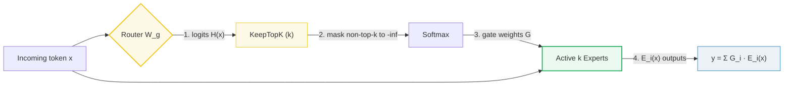

# Mixture-of-Experts (MoE) Routing

- **Category**: LLM Systems
- **Difficulty**: Expert
- **Target Role**: LLM Inference Architect / ML Platform Engineer
- **Source**: Sparsely-Gated MoE (Shazeer et al., 2017) / GShard (Lepikhin et al., 2020) / Switch Transformer (Fedus et al., 2022) / Mixtral (Jiang et al., 2024) / DeepSeek-V3 (DeepSeek-AI, 2024)

---

## Concept Overview

Mixture-of-Experts (MoE) is like a consulting firm consisting of a receptionist (the **router**) and a wall of specialists (the **experts**). Instead of forcing every employee to read and work on every single incoming document, the receptionist scans the document and routes it to only the top-$k$ most relevant specialists. 

In deep learning architectures, a standard dense FFN activates all its parameters for every token, meaning that scaling knowledge capacity requires a proportional scale-up in per-token compute. MoE breaks this lock: it replaces the FFN block with a router and $E$ expert MLPs. By routing each token to only the top-$k$ experts ($k \ll E$), total model capacity (knowledge) scales with $E$, but the active per-token compute (FLOPs) remains bounded by the small $k$ experts. For example, a model can have 671 billion parameters of total capacity but run at the latency and compute cost of a 37 billion parameter dense model.

### The Problem It Solves

In a standard Transformer, parameters reside heavily in the FFN layer. Making this FFN wider to increase the model's knowledge capacity directly scales the per-token computational cost (FLOPs) and latency. 
- **Without MoE**: A dense SwiGLU FFN with hidden size $D=8$ and intermediate size $F=16$ requires **384 parameters** per token, translating to **768 FLOPs/token** (excluding attention).
- **With MoE ($E=4, k=2$)**: The model stores **1536 parameters** (4× the capacity), but computes only **768 active parameters** and **1536 FLOPs/token**. 

On a production scale, this parameter-to-FLOPs decoupling is massive:
- **Mixtral 8x7B**: Holds **46.7B total parameters**, but only **12.9B parameters are active** per token.
- **DeepSeek-V3**: Holds **671B total parameters**, but only **37B parameters are active** per token.

### How It Works

1. **Logit Computation**: The router (a linear layer $W_g \in \mathbb{R}^{E \times D}$) scores each expert for an input token $x \in \mathbb{R}^D$:
   $$H(x) = x \cdot W_g^T \in \mathbb{R}^E$$
2. **KeepTopK Sparsification**: All logits except the top-$k$ largest values are set to $-\infty$.
3. **Renormalized Softmax**: A softmax is applied over the sparsified logits to produce gating weights $G(x)_i$:
   $$G(x) = \text{softmax}(\text{KeepTopK}(H(x), k))$$
   This ensures that inactive experts receive a gating weight of exactly 0, and the $k$ active experts' weights sum to $1$.
4. **Expert Computation & Output Synthesis**: The token is forwarded through only the chosen $k$ experts (each is a SwiGLU MLP: $E_i(x) = \text{down}(\text{silu}(\text{gate}(x)) \odot \text{up}(x))$). The output is the weighted sum:
   $$y = \sum_{i \in \text{active}} G(x)_i \cdot E_i(x)$$
5. **Load Balancing**: Without a penalty, routers suffer from **router collapse**, where they send all tokens to 1–2 favorite experts, leaving the others untrained. To prevent this, two auxiliary losses are optimized during training:
   - **Load-balance loss ($L_{bal}$)**: Penalizes uneven distribution of hard routing counts ($f_i$) and soft gate probabilities ($P_i$):
     $$L_{bal} = E \cdot \sum_{i=1}^E f_i \cdot P_i \quad (\text{minimum } = k \text{ when balanced})$$
   - **Router z-loss ($L_z$)**: Penalizes large router logits to prevent softmax saturation and stabilize FP8/FP16 training:
     $$L_z = \frac{1}{N}\sum_{j=1}^N (\log \sum_{i=1}^E e^{H(x_j)_i})^2$$

---

## Worked Example

This example walks through routing for a model with hidden dimension $D=8$, expert intermediate dimension $F=16$, $E=4$ total experts, and $k=2$ active experts per token.

### 1. Top-k Routing Step-by-Step (Token $m=0$)
- **Input Hidden State**:
  $$x[0,0] = [+0.9635, +0.7436, +0.4504, -1.0528, +0.3392, -0.6173, -0.0215, -0.8023]$$
- **Raw Router Logits** ($H[0,0] = x[0,0] \cdot W_g^T$):
  $$H[0,0] = [+0.0952, +0.3465, -0.0658, -0.0547]$$
- **Top-2 Selection**:
  $$\text{Values} = [+0.3465, +0.0952] \quad \rightarrow \quad \text{Experts} = [1, 0]$$
- **KeepTopK Masking** (set non-top-2 logits to $-\infty$):
  $$\text{KeepTopK}[0,0] = [+0.0952, +0.3465, -\infty, -\infty]$$
- **Renormalized Softmax Gating Weights** ($G[0,0]$):
  $$G[0,0] = [+0.4375, +0.5625, 0.0000, 0.0000] \quad (\text{sums to } 1.0000)$$

### 2. Router Decisions Across 4 Tokens ($N=4$)

| Token ($m$) | Logits ($H[0,m]$) | Chosen Experts | Renormalized Gate Weights ($G[0,m]$) |
|---|---|---|---|
| **0** | `+0.095, +0.347, -0.066, -0.055` | **1, 0** | `+0.4375, +0.5625, +0.0000, +0.0000` |
| **1** | `+0.141, +0.232, +0.376, +0.061` | **2, 1** | `+0.0000, +0.4640, +0.5360, +0.0000` |
| **2** | `+0.011, -0.042, -0.371, +0.222` | **3, 0** | `+0.4474, +0.0000, +0.0000, +0.5526` |
| **3** | `+0.130, +0.052, -0.142, +0.132` | **3, 0** | `+0.5004, +0.0000, +0.0000, +0.4996` |

### 3. Output Combination (Token $m=0$)
The token is routed only to Experts 0 and 1:
- $E_0(x[0,0]) = [+0.010, -0.012, -0.004, +0.006, \dots]$
- $E_1(x[0,0]) = [+0.007, +0.006, -0.008, -0.012, \dots]$
- Outputs of Expert 2 and 3 are ignored since their gate weights are 0.
- **Combined Output**:
  $$y[0,0] = 0.5625 \cdot E_1(x) + 0.4375 \cdot E_0(x) = [+0.008519, -0.001960, -0.006698, -0.004337, -0.006180, -0.000598, -0.001436, -0.006064]$$

### 4. Load Balance Loss Calculation
From the routing decisions above:
- **Routing Fraction ($f_i$)**: Fraction of total selections ($N \cdot k = 8$) routed to expert $i$:
  - $f_0 = 3/4 = 0.7500$
  - $f_1 = 2/4 = 0.5000$
  - $f_2 = 1/4 = 0.2500$
  - $f_3 = 2/4 = 0.5000$
  - Check: $\sum_{i} f_i = 2.0 = k$.
- **Average Gate Probability ($P_i$)**:
  - $P_0 = 0.3461$, $P_1 = 0.2566$, $P_2 = 0.1340$, $P_3 = 0.2632$. (Check: $\sum_{i} P_i = 1.0$)
- **Load-balance Loss ($L_{\text{bal}}$)**:
  $$L_{\text{bal}} = 4 \cdot (0.75 \cdot 0.3461 + 0.5 \cdot 0.2566 + 0.25 \cdot 0.1340 + 0.5 \cdot 0.2632) = 4 \cdot 0.553034 = 2.212137$$
  Since $L_{\text{bal}} = 2.212 > 2.0$, the router is slightly imbalanced, providing gradients to redirect training.
- **Router $z$-loss ($L_{\text{z}}$)**:
  $$L_{\text{z}} = 2.164589$$

### 5. Token Dropping under Expert Capacity $C$
When running distributed training using **Expert Parallelism (EP)**, experts reside on different GPUs. GPUs allocate static buffers using an **Expert Capacity** factor to cap memory and transfer size:
$$C = \text{capacity\_factor} \cdot \frac{N \cdot k}{E}$$
For $\text{capacity\_factor} = 1.0$, $N=4$, $k=2$, $E=4$, we get $C = 2.0$.
- Expert 0 receives 3 tokens ($t_0, t_2, t_3$) $\rightarrow$ **drops 1 token** (only 2 run; dropped token passes through residual only).
- Expert 1 receives 2 tokens ($t_0, t_1$) $\rightarrow$ exact fit.
- Expert 2 receives 1 token ($t_1$) $\rightarrow$ **padded with 1 zero**.
- Expert 3 receives 2 tokens ($t_2, t_3$) $\rightarrow$ exact fit.

*Note: Dropping tokens degrades performance. Production serving engines (like vLLM) run with dynamic capacity / no-drop policies.*

---

## Complexity & Trade-offs

| Metric | Complexity / Value | Notes |
|---|---|---|
| **Router Time Complexity** | $\mathcal{O}(B \cdot L \cdot E \cdot D)$ | Linear projection of hidden states to $E$ logits. |
| **Sparsification Complexity** | $\mathcal{O}(B \cdot L \cdot E \log k)$ | Finding the top-$k$ elements using a min-heap. |
| **All-to-All Communication** | $\mathcal{O}(\text{EP size})$ | Bottleneck in distributed systems; mitigated by overlapping communication with compute. |
| **Grouped GEMM** | $\mathcal{O}(\sum M_i \cdot D \cdot F)$ | Avoids padding execution buffers to $\max(M_i)$, speeding up training/inference. |

---

## Common Interview Questions & How to Answer

### Q1: What is "router collapse," and how do load-balancing loss and DeepSeek-V3's auxiliary-loss-free bias prevent it?
- **Answer**: **Router collapse** is a common MoE failure mode where the routing network converges to selecting a small subset of experts (often just 1 or 2) for all tokens. As a result, only those few experts receive gradients and train, while the other experts remain idle and unoptimized.
  1. **Auxiliary Load-Balancing Loss ($L_{bal}$)**: It computes the product of the routing fraction $f_i$ (hard routing count) and the average gate probability $P_i$ (soft probability). This product is differentiable through $P_i$. Minimizing $L_{bal}$ pushes the router toward routing tokens uniformly across all $E$ experts.
  2. **DeepSeek-V3's Aux-Loss-Free Bias**: A high $L_{bal}$ coefficient can compete with the main language modeling loss, degrading model quality. DeepSeek-V3 solves this by keeping the model weights' gradients focused entirely on the main loss. Instead, it adds a learnable bias term $b_i$ directly to the logits: $G(x)_i = \text{softmax}(H(x)_i + b_i)$. If an expert becomes overloaded during a step, its bias $b_i$ is decremented; if it is starved, its bias is incremented. This dynamically balances the load with **zero gradient interference**.

### Q2: Why is Grouped GEMM essential for Mixture-of-Experts inference, and what problem does it solve?
- **Answer**: During MoE execution, different tokens are routed to different experts, leading to uneven workload distributions where expert $i$ receives $M_i$ tokens. Standard batch matrix multiplication (`torch.bmm`) requires uniform dimensions across all batches. Without Grouped GEMM, the engine would have to pad the inputs of all experts to the maximum number of tokens routed to any single expert: $\max_i(M_i)$. This padding wastes massive amounts of compute and memory bandwidth on dead rows containing zero-padding. **Grouped GEMM** (implemented in Triton or CUTLASS) executes all $E$ independent matrix multiplications of shape $(M_i \times N \times K)$ in a single GPU kernel without padding, processing the ragged buffers natively and saving significant compute.

---

## Pro-Tip: How to Impress the Interviewer

- **Shared Expert Design**: Demonstrate knowledge of modern architectural optimizations. Explain how modern architectures (like DeepSeek-V3) combine routed experts with a **shared, always-on expert**. In DeepSeek-V3, the output is calculated as $y = y_{shared} + y_{routed}$. The shared expert captures generic, task-agnostic features across all tokens. This offloads general knowledge representation from the routed experts, allowing them to specialize in fine-grained features, substantially improving parameter efficiency.
- **Dequantization Placement**: Explain that in high-performance MoE serving, expert weights are stored in 4-bit or 8-bit precision. To avoid saturating memory bandwidth, weights are dequantized **on the fly** in SRAM right before matrix multiplication rather than in VRAM.
