# Speech LLMs: Multimodal Audio-Language Models (ALMs)

- **Category**: LLM Systems
- **Difficulty**: Hard
- **Target Role**: Conversational AI Engineer / Voice AI Architect
- **Source**: AudioPaLM / GPT-4o / SeamlessM4T research papers
- **Flashcards**: [LLM Systems deck](../flash_cards/llm/llm_systems.md)

---

## Concept Overview

Traditional voice assistants rely on a cascaded chain of three distinct models: speech-to-text transcription, a text LLM, and text-to-speech synthesis. Native Audio-Language Models (ALMs) replace this cascade with a single, end-to-end neural network that ingests and generates audio and text tokens natively.

Think of this transition like translating a live performance:
* **The Cascaded Pipeline**: You write down the spoken words on paper (ASR), translate the paper text (LLM), and have a separate speaker read the translation aloud (TTS). The pitch, emotion, sarcasm, and background music are completely lost.
* **The Native Multimodal ALM**: A bilingual voice actor listens to the performance and immediately translates it live, preserving the exact tone, laughter, emotion, and pace.
* **Residual Vector Quantization (RVQ)** is like painting with hierarchical brushes: instead of saving the exact color of every pixel (raw audio), the first brush paints the coarse shapes (Layer 1), the second adds shadows (Layer 2), and the third adds fine details (Layer 3). The final sound is the sum of these layers.

```mermaid
graph TD
    %% Native Multimodal Pipeline
    subgraph Native Multimodal ALM
        AudioIn[User Speech Waveform] --> Encoder[Audio Encoder: Whisper / AST]
        Encoder -->|Continuous Features| Projector[Projection Module: MLP / Q-Former]
        Projector -->|Projected Embeddings| LLM[Decoder-Only LLM Token Space]
        LLM -->|Discrete Audio Tokens| Vocoder[Neural Vocoder: Vocos / BigVGAN]
        Vocoder --> AudioOut[Synthesized Speech Waveform]
    end
    
    %% Residual Vector Quantization
    subgraph RVQ Processing
        Continuous[Continuous Embedding Z] --> Q1[Quantizer 1: Coarse Index c1]
        Continuous -->|Subtract| E1[Residual e1]
        E1 --> Q2[Quantizer 2: Index c2]
        E1 -->|Subtract| E2[Residual e2]
        E2 --> Q3[Quantizer 3: Fine Index c3]
        Q1 & Q2 & Q3 -->|Sum Reconstruction| Reconstructed[Reconstructed Embedding Z_hat]
    end
```

### The Problem It Solves

Cascaded voice systems suffer from fundamental architectural flaws:
1. **Loss of Paralinguistics**: Discarding acoustic cues (sarcasm, anger, hesitation, gender, or background noise) results in dry, context-blind LLM responses.
2. **Error Propagation**: If ASR mishears a word, the LLM cannot correct it, and spelling/punctuation errors lead to robotic TTS pronunciation stutters.
3. **Framing Latency**: Compounding serialization and execution overhead across three independent models makes sub-$300\text{ ms}$ conversational loops mathematically impossible.

### How It Works

1. **Neural Audio Codecs**:
   Raw audio waveforms ($16\text{--}48\text{ kHz}$) are compressed into discrete sequences using CNN encoder-decoders. To represent the continuous space without infinite codebook memory, **Residual Vector Quantization (RVQ)** applies $R$ cascaded codebooks. Each codebook quantizes the residual error of the previous step:
   $$\mathbf{\hat{z}} = \sum_{r=1}^{R} \mathbf{q}_r$$
   This represents each audio frame as an array of $R$ discrete indices (typically $K=1024$ vocabulary size per codebook).
2. **Projection Modules**:
   Continuous features from ASR encoders (like Whisper) are mapped to the LLM token dimension using an MLP or a **Q-Former**. Frame-stacking or convolutional downsampling is applied to reduce the sequence length.
3. **Token Interleaving & Serialization**:
   To generate audio from the LLM, the multi-codebook RVQ tokens must be fed into the autoregressive loop. Models use either:
   * **Flat Serialization**: Linearizes codebooks sequentially (e.g., $A_{1,1}, A_{1,2}, \dots, A_{1,R}, A_{2,1}, \dots$).
   * **Delayed Pattern**: Generates the $R$ codebook streams in parallel but shifts each stream by 1 token step to model cross-codebook dependency.
   * **Hierarchical Generation**: The LLM predicts the first (coarse) codebook stream, and a small feedforward net predicts the remaining $R-1$ streams.
4. **Vocoding**:
   The output tokens are mapped back to audio waveforms using generative models: **HiFi-GAN** (using Multi-Period and Multi-Scale discriminators), **Vocos** (predicts Fourier-domain magnitude/phase directly), or **BigVGAN** (integrates Snake activation functions to avoid aliasing).

---

## Worked Example

### Neural Audio Codec Comparison for LLM Ingestion

Below is the trade-off matrix for the leading neural codecs used to represent audio inside autoregressive Transformer loops:

| Codec | Downsampling Factor | Frame Rate | Codebooks ($R$) | Bitrate Range | Reconstruction Quality (ViSQOL) | Key Innovation |
| :--- | :--- | :--- | :--- | :--- | :--- | :--- |
| **SoundStream** (Google) | $320\times$ | $50\text{ Hz}$ ($20\text{ ms}$ frames) | up to 16 | $3\text{--}18\text{ kbps}$ | $\approx 3.5$ (Good) | WaveGAN-style adversarial training |
| **EnCodec** (Meta) | $320\times$ | $75\text{ Hz}$ ($13.3\text{ ms}$ frames) | up to 32 | $1.5\text{--}24\text{ kbps}$ | $\approx 3.7$ (Very Good) | Multiscale spectrogram discriminators + LSTM |
| **Descript Audio Codec (DAC)** | $512\times$ | $47\text{ Hz}$ ($21\text{ ms}$ frames) | up to 9 | $1.5\text{--}9\text{ kbps}$ | $\approx 4.2$ (Excellent) | Periodic Snake activations to prevent aliasing |

#### Snake Activation Function formula:
$$f(x) = x + \frac{1}{\alpha}\sin^2(\alpha x)$$
*The periodic term $\sin^2$ introduces an inductive bias for periodic waveforms, preserving high-frequency details (e.g., vocal fricatives) at lower bitrates.*

---

## Complexity & Trade-offs

| Metric | Value | Notes |
|---|---|---|
| **Audio Token Serialization** | Flat vs. Delayed vs. Hierarchical | **Flat**: Increases context length by $R\times$, leading to $O((T \cdot R)^2)$ self-attention cost. **Delayed**: Parallel streams, but requires complex attention masking. **Hierarchical**: Keeps LLM context tiny ($O(T^2)$), but requires training a separate acoustic vocoder. |
| **Audio Frame Compression** | $320\times$ vs. $512\times$ | **320x**: Higher fidelity (75 Hz frame rate), but results in $75$ tokens per second of audio. **512x**: Fewer tokens ($47$ per second), reducing LLM attention overhead by $37\%$ at the cost of transient clarity. |
| **Vocoder Architecture** | Time Domain (HiFi-GAN) vs. Fourier Domain (Vocos) | **HiFi-GAN**: Captures rich, detailed audio phase, but slow due to sequential transposed convolutions. **Vocos**: Instantaneous Fourier magnitude/phase prediction, running at $5\times$ speedup. |
| **RVQ Codebooks ($R$)** | $R=1$ vs. $R=8$ | **R=1**: Tiny vocabulary overhead, but voice sounds highly compressed (robotic). **R=8**: Natural timbre and pitch, but multiplies token generation steps by $8\times$. |

---

## Common Interview Questions & How to Answer

### Q1: How do you address the issue of "codebook collapse" in RVQ training, where only a fraction of the available codebook vectors are actively used?
- **Answer**:
  * **The Problem**: During training, a few codebook entries receive the majority of updates, while the remaining entries are ignored. Once an entry is neglected, its probability of selection falls to zero, reducing the effective bandwidth of the codec.
  * **The Solutions**:
    1. **Random Restarts**: Monitor the usage frequency of all codebook vectors. If a vector's assignment rate falls below a threshold (e.g., $10^{-5}$), replace its weights with a random training sample from the current batch plus minor Gaussian noise.
    2. **K-Means Initialization**: Initialize the codebook vectors by running K-means clustering on the first batch of encoder features, ensuring vectors are distributed evenly across the data manifold.
    3. **L2 Normalization**: Project both encoder features and codebook weights onto a unit sphere (L2 normalization) and perform quantization using Cosine Similarity instead of Euclidean distance. This prevents scale variations from clustering updates around a few large vectors.

### Q2: Why is the rate mismatch between speech tokenization and text tokenization a major problem for multimodal LLMs, and how do you resolve it?
- **Answer**:
  * **The Problem**: Text tokenizers process roughly $3\text{--}4$ tokens per second of spoken speech. In contrast, neural audio codecs (like EnCodec) at 75 Hz with 8 codebooks generate $75 \times 8 = 600$ tokens per second of audio. This $150\times$ mismatch causes the audio tokens to completely dominate the self-attention context window, slowing down generation speed and limiting conversational history.
  * **The Solutions**:
    1. **Temporal Convolutions / Stacking**: Apply a 1D convolution layer with a stride of 2 or 4 over the audio encoder embeddings before feeding them to the LLM, reducing the input sequence length.
    2. **Q-Former Compression**: Use a Querying Transformer (Q-Former) with a fixed set of learnable query tokens (e.g., 64 queries per audio segment) to extract semantic vectors via cross-attention, decoupling token length from audio duration.
    3. **Hierarchical Modeling**: Only output the first RVQ codebook from the LLM, offloading the remaining codebook generation to a non-autoregressive parallel prediction model.

---

## Pro-Tip: How to Impress the Interviewer

* **Detail RVQ Loss Formulations and Stop-Gradients**:
  Show you know the mathematics of quantizers. Write the codebook loss and commitment loss equations, highlighting the use of the stop-gradient operator (`sg`) to copy gradients from the decoder back to the encoder:
  $$\mathcal{L}_{\text{RVQ}} = \|\text{sg}[\mathbf{z}] - \mathbf{\hat{z}}\|_2^2 + \beta \|\mathbf{z} - \text{sg}[\mathbf{\hat{z}}]\|_2^2$$
  Explain that the first term updates the codebook vectors towards the encoder outputs, while the second term (commitment loss with weighting factor $\beta \approx 0.25$) prevents the encoder outputs from fluctuating too wildly between codebook entries.
* **Propose Multi-Period Discriminators (MPD) for Vocoding**:
  To explain how vocoders synthesize high-fidelity voices, detail how **Multi-Period Discriminators** reshape a 1D audio waveform into 2D matrices using prime number periods (e.g., 2, 3, 5, 7, 11). This allows the discriminator to inspect periodic patterns and harmonics in disjoint bands, which is why neural vocoders can reconstruct realistic pitch structures without sounding robotic.
