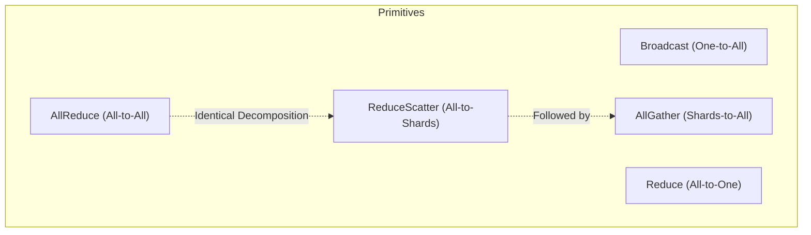

# NCCL Collective Communication Operations

- **Category**: LLM Systems
- **Difficulty**: Expert
- **Target Role**: LLM Systems Engineer / ML Platform Engineer
- **Source**: NCCL_COLLECTIVES.md + nccl_collectives_output.txt (Patarasuk & Yuan 2009, Gibiansky 2017)

---

## Concept Overview

Think of collective communication as a bucket brigade running along a circle of workers (a logical ring of GPUs). If you need to average gradients across $K$ GPUs to keep them in sync, a naive centralized approach appoints one "foreman" GPU to collect everyone's data, sum it up, and mail copies back. This creates a massive bandwidth bottleneck at the foreman, scaling as $O(K^2 \cdot N)$ total fabric traffic where $N$ is the message size. NCCL solves this by organizing GPUs in a logical ring where each GPU only communicates with its left and right neighbors. By sharding the message into $K$ chunks and passing them sequentially around the ring, every GPU computes the final sum after $2(K-1)$ steps. Crucially, the total data sent per GPU is limited to $2 \frac{K-1}{K} N \approx 2N$ bytes, which is completely independent of the world size $K$. This plateauing communication overhead is what enables training models across thousands of GPUs.

### The Problem It Solves

Naively coordinating communications across multiple GPUs leads to severe bandwidth bottlenecks.
If we use a centralized root rank (naive reduce-to-root then broadcast) to run AllReduce on a vector of size $N$ elements across $K$ ranks:
- The root rank must receive $(K-1) \cdot N$ elements.
- The root rank must send $(K-1) \cdot N$ elements back.
- The total bottleneck load on the root rank is $2(K-1) \cdot N$ elements.

For $K = 4$ ranks and $N = 16$ elements:
- NAIVE Root Bottleneck = $2 \times (4 - 1) \times 16 = 96$ elements transferred at the root.
- RING-AllReduce per-GPU load = $2 \times \frac{4-1}{4} \times 16 = 24$ elements transferred.
Thus, the naive method incurs a $4.0\times$ higher load on the root node compared to any node in the ring. As $K$ scales to hundreds or thousands of GPUs, this bottleneck scales linearly with $K$, rendering distributed training impossible without ring collectives.

### How It Works

NCCL implements 5 core collective primitives that define the vocabulary of distributed training:
1. **Broadcast**: Copies a buffer from a designated `root` rank to all other ranks.
2. **Reduce**: Performs an element-wise reduction (usually SUM) across all ranks, storing the final result on the `root` rank only.
3. **AllReduce**: Performs an element-wise reduction across all ranks and distributes the final result to all ranks.
4. **ReduceScatter**: Performs an element-wise reduction across all ranks, splits the result into $K$ chunks, and distributes chunk $r$ to rank $r$.
5. **AllGather**: Gathers a shard from each rank, concatenates them in rank order, and distributes the full concatenated buffer to all ranks.

#### Ring-AllReduce Mechanics
The ring-AllReduce algorithm splits the buffer of $N$ elements on each rank into $K$ equal chunks. It then runs in two phases, each consisting of $K-1$ steps:
- **Phase 1: Scatter-Reduce ($K-1$ steps)**: Every rank $i$ sends its chunk $c$ to rank $i+1$ (modulo $K$) while receiving a chunk from rank $i-1$. The received chunk is accumulated (added) to the local chunk. After $K-1$ steps, each rank holds the complete element-wise sum of one specific chunk.
- **Phase 2: AllGather ($K-1$ steps)**: Every rank sends its fully summed chunk to rank $i+1$ to overwrite (not accumulate) the stale data. After another $K-1$ steps, every rank holds the fully summed buffer of $N$ elements.

---

## Worked Example

### 1. Verification of the Collective Primitives ($K = 4$, $N = 4$)
Inputs on each rank $r$ are initialized to distinct values `[10r+1, 10r+2, 10r+3, 10r+4]`:
- Rank 0: `[1, 2, 3, 4]`
- Rank 1: `[11, 12, 13, 14]`
- Rank 2: `[21, 22, 23, 24]`
- Rank 3: `[31, 32, 33, 34]`

From `nccl_collectives_output.txt`:

- **Broadcast (root=0)**: All ranks receive Rank 0's buffer:
  - Rank 0, 1, 2, 3: `[1, 2, 3, 4]`
- **Reduce (root=0, op=sum)**: Sum stored on Rank 0 only:
  - Rank 0: `[64, 68, 72, 76]` (derived from $1+11+21+31=64$, etc.)
  - Rank 1, 2, 3: unchanged.
- **AllReduce (op=sum)**: Sum distributed to all ranks:
  - Rank 0, 1, 2, 3: `[64, 68, 72, 76]`
- **ReduceScatter (op=sum)**: Summed chunks of size $N/K = 1$ scattered to respective ranks:
  - Rank 0: `[64]` (summed chunk 0)
  - Rank 1: `[68]` (summed chunk 1)
  - Rank 2: `[72]` (summed chunk 2)
  - Rank 3: `[76]` (summed chunk 3)
- **AllGather**: Gathers the scattered shards back:
  - Rank 0, 1, 2, 3: `[64, 68, 72, 76]`

### 2. The Identity: $\text{AllReduce} \equiv \text{ReduceScatter} + \text{AllGather}$
Running `ReduceScatter` followed by `AllGather` on the above input yields:
- Output: `[64, 68, 72, 76]`
- Diff: `max|AllReduce - (ReduceScatter+AllGather)| = 0.000e+00`
This identity holds bit-for-bit, which forms the theoretical foundation of the ZeRO optimization framework.

### 3. Ring-AllReduce Execution ($K = 4, N = 16$)
Every rank starts with an identical vector $v = [1, 2, 3, \dots, 16]$. 
- **Expected Sum**: $4 \cdot v = [4, 8, 12, \dots, 64]$
- **Elements Sent per GPU**:
  $$\text{Data Sent} = 2 \frac{K-1}{K} N = 2 \times \frac{3}{4} \times 16 = 24\text{ elements}$$
- **Validation**:
  - Ring output on all ranks matches expectations exactly (Gold Scalar `result[0] = 4`).
  - Total measured elements sent per GPU = `24`.

### 4. Per-GPU Bandwidth and Scalability (Message Size $N=16$)
As $K \to \infty$, the factor $2\frac{K-1}{K} \to 2$, capping communication volume per GPU at $2N$ elements.

| $K$ (Ranks) | Elements Sent per GPU ($2 \frac{K-1}{K} N$) | Ratio to $N$ | Ratio to $2N$ (Ceiling) |
|---|---|---|---|
| 2 | 16.00 | $1.000$ | $0.500$ |
| 4 | **24.00** | $1.500$ | $0.750$ |
| 8 | 28.00 | $1.750$ | $0.875$ |
| 16 | 30.00 | $1.875$ | $0.938$ |
| 64 | 31.50 | $1.969$ | $0.984$ |
| 256 | 31.88 | $1.992$ | $0.996$ |

### 5. Wall-Clock Timing Analysis (1 GB Gradient, $K = 8$ GPUs)
Using different fabrics with per-link directional bandwidth $B$:
- **NVLink 4.0 (A100)**: $B \approx 600\text{ GB/s}$ aggregate ($300\text{ GB/s}$ per direction)
- **InfiniBand NDR**: $B \approx 50\text{ GB/s}$
- **PCIe Gen4**: $B \approx 64\text{ GB/s}$
- **100GbE Ethernet**: $B \approx 12.5\text{ GB/s}$

For $1\text{ GB}$ gradient on $K=8$ GPUs over NVLink ($600\text{ GB/s}$):
- **Ring-AllReduce Per-GPU Data**: $2 \times \frac{7}{8} \times 1\text{ GB} = 1.75\text{ GB}$
- **Ring-AllReduce Execution Time**: $\frac{1.75\text{ GB}}{600\text{ GB/s}} = 2.92\text{ ms}$ (Exact)
- **Naive Root Execution Time**: $\frac{K \cdot N}{B} = \frac{8\text{ GB}}{600\text{ GB/s}} = 13.33\text{ ms}$
- **Speedup**: Ring is **$4.56\times$** faster (requires only $0.22\times$ the naive execution time).

---

## Complexity & Trade-offs

| Collective | Elements Sent per GPU | Total Fabric Traffic | Use Case |
|---|---|---|---|
| **Broadcast** | $N$ (Root sends, others receive) | $O(K \cdot N)$ | Weight initialization sync |
| **Reduce** | $\frac{K-1}{K} N$ (Ring) | $O(K \cdot N)$ | Loss evaluation |
| **AllReduce** | $2 \frac{K-1}{K} N \approx 2N$ | $O(K \cdot N)$ | DDP gradient averaging, TP O-projections |
| **ReduceScatter** | $\frac{K-1}{K} N \approx N$ | $O(K \cdot N)$ | ZeRO gradient partitioning |
| **AllGather** | $\frac{K-1}{K} N \approx N$ | $O(K \cdot N)$ | ZeRO parameter reconstruction |

---

## Common Interview Questions & How to Answer

### Q1: Prove that the communications volume per GPU in Ring-AllReduce is bounded by $2N$ elements and is independent of the number of ranks $K$.
- **Answer**: 
  In Ring-AllReduce, we split the message of $N$ elements into $K$ chunks of size $N/K$. The algorithm consists of two phases: Scatter-Reduce and AllGather.
  - **Scatter-Reduce**: Runs for $K-1$ steps. In each step, each GPU sends exactly one chunk of size $N/K$ to its right neighbor. 
    $$\text{Data sent per GPU in Phase 1} = (K - 1) \cdot \frac{N}{K}\text{ elements}$$
  - **AllGather**: Also runs for $K-1$ steps. In each step, each GPU sends one fully accumulated chunk of size $N/K$ to its right neighbor.
    $$\text{Data sent per GPU in Phase 2} = (K - 1) \cdot \frac{N}{K}\text{ elements}$$
  - **Total Data Sent**:
    $$\text{Total Data Sent per GPU} = 2 \cdot (K - 1) \cdot \frac{N}{K} = 2 \frac{K - 1}{K} N\text{ elements}$$
  As the world size $K \to \infty$, the factor $\frac{K-1}{K} \to 1$, making the limit:
  $$\lim_{K \to \infty} 2 \frac{K - 1}{K} N = 2N\text{ elements}$$
  This bound is independent of $K$, meaning the communication volume per GPU plateaus at $2N$ elements.

### Q2: Why does Tensor Parallelism (TP) require high-bandwidth NVLink within a node, while Pipeline Parallelism (PP) can run over InfiniBand across nodes?
- **Answer**: 
  - **Tensor Parallelism (TP)** shards model layers (e.g., column-parallel and row-parallel matmuls). It requires executing an **AllReduce operation twice per transformer layer** (one after the self-attention block, and one after the MLP block) to synchronize activations. Because this occurs within the forward and backward passes of *every single layer*, the communication latency is on the critical path of execution. Slow links (like InfiniBand or PCIe) would stall the GPU. Hence, TP is confined to NVLink-connected GPUs within a single node.
  - **Pipeline Parallelism (PP)** splits the model across layer boundaries. It only requires point-to-point **Send/Recv** operations to pass intermediate activations and gradients at the boundaries between pipeline stages (typically once per micro-batch). This point-to-point communication is much less frequent and has lower bandwidth requirements, allowing PP to scale across nodes via InfiniBand.

### Q3: Explain the role of the collective identity $\text{AllReduce} \equiv \text{ReduceScatter} + \text{AllGather}$ in the ZeRO memory optimization framework.
- **Answer**: 
  In standard Data Parallelism (DDP), gradients are averaged across all ranks using a single `AllReduce` operation, and every rank maintains an identical copy of the weights, gradients, and optimizer states. 
  By decomposing `AllReduce` into `ReduceScatter` followed by `AllGather`, ZeRO partitions these redundant states:
  - **ZeRO-1 (Optimizer State Partitioning)**: Ranks run a `ReduceScatter` on gradients, so each rank only gets $1/K$ of the averaged gradients. Ranks update only their $1/K$ slice of optimizer states and master weights. Ranks then run an `AllGather` to distribute updated weights to all ranks.
  - **ZeRO-2 (Gradient Partitioning)**: Gradients are reduced directly into $1/K$ partitions via `ReduceScatter` during the backward pass, discarding the rest of the gradients immediately to save VRAM.
  - **ZeRO-3 (Parameter Partitioning)**: Weights themselves are sharded. Ranks run `AllGather` on-demand to fetch weights for a layer during the forward pass, and discard them immediately after.
  The total volume of communications remains $2N$ bytes (equivalent to AllReduce), but partitioning the states in between the collectives reduces VRAM overhead significantly.

---

## Pro-Tip: How to Impress the Interviewer

- **Contrast the Ring algorithm with the Tree-based collective algorithm.** Explain that while the Ring algorithm is bandwidth-optimal for large messages (like LLM gradients), it has a latency cost that scales linearly with $K$ (i.e., $2(K-1)$ startup latencies). For small messages or large world sizes, modern NCCL uses **Double Binary Tree** topologies, which reduce the latency scaling factor to $O(\log K)$ while maintaining high bandwidth utilization, automatically switching between Ring and Tree protocols based on message size and topology.
