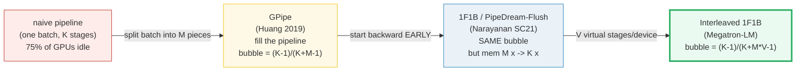

# Pipeline Parallelism (PP)

- **Category**: LLM Systems
- **Difficulty**: Expert
- **Target Role**: LLM Systems Engineer / Distributed Systems Engineer
- **Source**: GPipe (Huang et al., 2019) / Megatron-LM Pipeline Parallelism (Narayanan et al., 2021)

---

## Concept Overview

Imagine you are managing an automobile assembly line divided into four factories (stages). In a naive setup, Factory 1 builds the chassis, then drives the car to Factory 2 to mount the engine, then to Factory 3 for the body, and Factory 4 for the paint. If you only process **one car at a time**, Factory 2, 3, and 4 sit completely idle while Factory 1 is building the chassis. When the car moves to Factory 2, the other three factories are empty. This massive amount of idle time is called the **pipeline bubble**.

To fix this, you split your shipment into many smaller batches (**micro-batches**). As soon as Factory 1 finishes the chassis for Car 1 and sends it to Factory 2, it immediately starts working on the chassis for Car 2. In steady state, all four factories are working on different cars simultaneously. 

In LLM systems, **Pipeline Parallelism (PP)** partitions a model's layers sequentially across $K$ stages (nodes). Rather than executing a whole batch of inputs through the entire model layer-by-layer, PP splits a mini-batch into $M$ micro-batches and streams them through the partitioned stages. The communication is point-to-point: Stage $k$ sends its output activations directly to Stage $k+1$, and sends its gradients back to Stage $k-1$ in reverse.



### The Problem It Solves

Tensor Parallelism (TP) is constrained to a single node because its frequent `AllReduce` collectives demand NVLink speeds ($\ge 300\text{ GB/s}$). This limits $TP$ to $\le 8$ GPUs. A 175B model (which requires $350\text{ GB}$ of memory in FP16) or a 1T-class model cannot fit on a single node's total memory, even with $TP=8$.

To train models that span multiple nodes, we need a parallelization strategy that is tolerant of the lower bandwidth of **InfiniBand / Ethernet (RoCE) ($25\text{--}50\text{ GB/s}$)**. PP achieves this because it only communicates activation tensors at stage boundaries, which is a tiny fraction of the data transferred by TP's per-layer AllReduces.

For a Llama-2-70B model with $L=80$ layers and model dimension $E=8,192$, one layer consumes **$1.312\text{ GiB}$** of memory in FP16. Splitting layers across $K$ PP stages reduces the model footprint per node:

| PP Stages ($K$) | Layers per Stage | Model Memory per Stage (FP16) | Savings |
|---|---|---|---|
| **1** | $80$ | $105.000\text{ GiB}$ | Baseline |
| **2** | $40$ | $52.500\text{ GiB}$ | $2\times$ smaller |
| **4** | $20$ | $26.250\text{ GiB}$ | $4\times$ smaller |
| **8** | $10$ | $13.125\text{ GiB}$ | $8\times$ smaller |
| **16** | $5$ | $6.562\text{ GiB}$ | $16\times$ smaller |

Combined with $TP=8$ inside each node, a $K=8$ PP setup can scale a 70B model across 64 GPUs with plenty of room left for the KV cache and activation memory.

---

## How It Works

### 1. GPipe Scheduling (Huang et al., 2019)
GPipe splits the mini-batch into $M$ micro-batches. The schedule has three phases:
- **Warmup (Fill)**: Micro-batches are fed into the pipeline sequentially. As they flow forward, stages start processing them.
- **Steady State**: All stages are busy.
- **Cooldown (Drain)**: The pipeline drains as the final forward passes finish and the backward passes flow in reverse.

```
GPipe schedule  (K=4 stages, M=8 micro-batches):
          0   1   2   3   4   5   6   7   8   9  10  11  12  13  14  15  16  17  18  19  20  21
GPU0:   F0  F1  F2  F3  F4  F5  F6  F7   .   .   .   .   .   .  B7  B6  B5  B4  B3  B2  B1  B0
GPU1:    .  F0  F1  F2  F3  F4  F5  F6  F7   .   .   .   .  B7  B6  B5  B4  B3  B2  B1  B0   .
GPU2:    .   .  F0  F1  F2  F3  F4  F5  F6  F7   .   .  B7  B6  B5  B4  B3  B2  B1  B0   .   .
GPU3:    .   .   .  F0  F1  F2  F3  F4  F5  F6  F7  B7  B6  B5  B4  B3  B2  B1  B0   .   .   .
```

- **Bubble Size**: The idle slots per stage are $K-1$ during fill and $K-1$ during drain, totaling $2(K-1)$ idle slots out of $2(K+M-1)$ total slots:
  $$\text{Bubble Fraction} = \frac{K-1}{K+M-1}$$
- **The Catch**: All $M$ micro-batch forwards must complete before the backward pass starts. Ranks must stash the activation tensors for **all $M$ micro-batches** in HBM, which causes activation memory to scale linearly with $M$.

### 2. 1F1B Scheduling (Narayanan et al., 2021)
To prevent the activation memory bottleneck, **1F1B (One Forward, One Backward)** starts the backward pass as soon as the first micro-batch reaches the final stage. Ranks alternate between executing one forward and one backward pass.

```
1F1B schedule  (K=4 stages, M=8 micro-batches):
          0   1   2   3   4   5   6   7   8   9  10  11  12  13  14  15  16  17  18  19  20  21
GPU0:   F0  F1  F2  F3   .   .   .  B0  F4  B1  F5  B2  F6  B3  F7  B4   .  B5   .  B6   .  B7
GPU1:    .  F0  F1  F2   .   .  B0  F3  B1  F4  B2  F5  B3  F6  B4  F7  B5   .  B6   .  B7   .
GPU2:    .   .  F0  F1   .  B0  F2  B1  F3  B2  F4  B3  F5  B4  F6  B5  F7  B6   .  B7   .   .
GPU3:    .   .   .  F0  B0  F1  B1  F2  B2  F3  B3  F4  B4  F5  B5  F6  B6  F7  B7   .   .   .
```

- **Memory Bounding**: Stage $k$ executes $K-k-1$ warmup forward steps. Once the steady state is reached, every new forward step is paired with a backward step that releases stashed activations. The peak activation memory is bounded to **$K$** micro-batches (the number of stages), regardless of how large $M$ gets.
- **Bubble Size**: The total execution time and bubble fraction are identical to GPipe. It is a pure memory optimization.

### 3. Interleaved 1F1B (Megatron-LM SC21)
To shrink the bubble, each node is assigned $V$ **virtual stages**. For example, with $K=4$ GPUs, $L=16$ layers, and $V=2$:
- **Standard PP ($V=1$)**: GPU0 gets layers 0-3, GPU1 gets 4-7, GPU2 gets 8-11, GPU3 gets 12-15.
- **Interleaved PP ($V=2$)**: GPU0 gets layers 0-1 and 8-9; GPU1 gets 2-3 and 10-11; GPU2 gets 4-5 and 12-13; GPU3 gets 6-7 and 14-15.

A micro-batch visits each device $V$ times. Because each virtual stage contains $1/V$ of the layers, the wall-clock time of each forward/backward step shrinks by $V$.
$$\text{Interleaved Bubble Fraction} = \frac{K-1}{K + M \cdot V - 1}$$
At $V=2$, the bubble size is cut almost in half, but it requires $V-1$ additional point-to-point sends per micro-batch per rank.

---

## Worked Example

Below are exact values comparing schedules for a pipeline with $K=4$ stages, $M=8$ micro-batches, and varying virtual stages $V$:

### 1. Bubble & Memory Performance Table

| $K$ (Stages) | $M$ (Micro-batches) | $V$ (Virtual) | Bubble Fraction | Bubble % | GPipe Memory (Multiplier) | 1F1B Memory (Multiplier) |
|---|---|---|---|---|---|---|
| $4$ | $1$ | $1$ | $0.7500$ | $75.00\%$ | $1$ | $4$ |
| $4$ | $4$ | $1$ | $0.4286$ | $42.86\%$ | $4$ | $4$ |
| **$4$** | **$8$** | **$1$** | **$0.2727$** | **$27.27\%$** | **$8$** | **$4$** *(GOLD Row)* |
| $4$ | $16$ | $1$ | $0.1579$ | $15.79\%$ | $16$ | $4$ |
| $4$ | $32$ | $1$ | $0.0857$ | $8.57\%$ | $32$ | $4$ |
| $4$ | $8$ | $2$ | $0.1579$ | $15.79\%$ | $8$ | $4$ |
| $4$ | $8$ | $4$ | $0.0857$ | $8.57\%$ | $8$ | $4$ |
| $8$ | $32$ | $1$ | $0.1795$ | $17.95\%$ | $32$ | $8$ |
| $8$ | $32$ | $2$ | $0.0986$ | $9.86\%$ | $32$ | $8$ |

*Verification Pins:*
- **GPipe vs. 1F1B Memory**: For $M=8$, GPipe stores $8$ activation sets per rank while 1F1B stores at most $K=4$ sets ($2.0\times$ memory reduction). At $M=32$, the memory reduction is $8.0\times$.
- **Interleaved Bubble reduction**: For $K=4, M=8$, going from $V=1$ to $V=2$ shrinks the bubble fraction from $0.2727$ ($3/11$) to $0.1579$ ($3/19$) — a **$0.58\times$ reduction**.

### 2. Point-to-Point (P2P) Communication Arithmetic
Unlike standard data parallelism, which uses `AllReduce`, PP relies on point-to-point `send`/`recv` operations.
- Number of active stage boundaries: $K - 1$.
- For $M$ micro-batches, the forward pass requires $(K-1) \cdot M$ transfers.
- The backward pass requires another $(K-1) \cdot M$ transfers.
- **Total transfers per step**: $2(K-1) \cdot M$.

For $K=4$ stages, $M=2$ micro-batches:
- **Total P2P Transfers**: $2(4-1) \cdot 2 = 12$.
- **Tensor Shape**: $[B_{\text{micro}}, L_{\text{slice}}, E]$ where micro-batch size $B_{\text{micro}}=1$, sequence length $L_{\text{slice}}=1,024$, model dimension $E=8,192$, in FP16 ($2\text{ bytes}$).
- **Single Transfer Volume**: $1 \cdot 1,024 \cdot 8,192 \cdot 2\text{ bytes} = 16,777,216\text{ bytes} = \mathbf{16.00\text{ MiB}}$.
- **Total Comm Volume per Mini-batch**: $12 \cdot 16.00\text{ MiB} = \mathbf{0.188\text{ GiB}}$.
- **Interconnect Tolerances**: Since this communication volume is small and occurs only at stage boundaries, it runs efficiently even over $25\text{ GB/s}$ InfiniBand links.

---

## Complexity & Trade-offs

| Metric | Value | Notes |
|---|---|---|
| **Bubble Time Waste** | $\frac{K-1}{K+M-1}$ (for $V=1$) | Decreases as $M$ increases. Target rule of thumb: $M \ge 4K$. |
| **Peak Activation Memory** | $K \times \text{activations per micro-batch}$ | Bounded by $K$ under 1F1B, saving massive memory vs GPipe's $M$. |
| **Communication Type** | Point-to-Point `send`/`recv` | Low volume, latency-tolerant. Runs efficiently over InfiniBand. |
| **Load Balancing Sensitivity** | High | Unequal layers per stage or embeddings/heads can cause pipeline bottlenecks. |

### The Parallelism Trade-off Table

| Axis | Collective | Frequency | Link Requirement |
|---|---|---|---|
| **Tensor Parallelism (TP)** | `AllReduce` | $2\times$ per **layer** | NVLink ($\approx 300\text{ GB/s}$) |
| **Pipeline Parallelism (PP)** | `P2P Send/Recv` | $2(K-1)$ per **mini-batch** | InfiniBand ($\approx 25\text{--}50\text{ GB/s}$) |
| **Data Parallelism (DP)** | `AllReduce` | $1\times$ per **optimizer step** | InfiniBand ($\approx 25\text{--}50\text{ GB/s}$) |

---

## Common Interview Questions & How to Answer

### Q1: Why does 1F1B reduce activation memory compared to GPipe, and does it reduce total training time?
- **Answer**: 1F1B reduces activation memory by changing the execution schedule. In GPipe, all $M$ micro-batch forward passes are executed before any backward passes start, requiring the GPU to store $M$ sets of activations. 1F1B starts backward passes as soon as the first micro-batch reaches the final stage. After a brief warmup phase of $K-1$ steps, each rank alternates between running one forward and one backward pass. Because each backward pass releases the activations stashed by an earlier forward pass, the number of live activation sets is capped at $K$. 
However, **1F1B does not reduce total training time**. The total number of forward and backward passes is identical, and the pipeline bubble size remains $\frac{K-1}{K+M-1}$. It is purely a memory layout optimization.

### Q2: What is the downside of using a very high virtual stage factor $V$ in Interleaved 1F1B?
- **Answer**: While increasing $V$ reduces the bubble fraction to $\frac{K-1}{K + M \cdot V - 1}$, it has two primary downsides:
  1. **Increased Communication Frequency**: Each micro-batch must cross node boundaries $K \cdot V$ times instead of $K$ times. This increases the total number of P2P network transfers by a factor of $V$. If the interconnect bandwidth is low or network latency is high, the communication overhead can exceed the time saved by shrinking the bubble.
  2. **Inter-Stage Communication Overhead**: Interleaved PP requires communicating both activations and gradients across virtual stages. This consumes extra GPU memory buffers to store incoming/outgoing tensors and complicates the execution scheduler.

### Q3: How do we handle weight sharing between the embedding layer (stage 0) and the language model head (stage K-1)?
- **Answer**: In many GPT-style architectures, the input embedding weights and the output token projection weights are shared. Under Pipeline Parallelism, these layers are hosted on completely different physical nodes (Stage $0$ and Stage $K-1$). We can handle this in two ways:
  1. **Explicit Synchronization**: The weights are duplicated on both stages. During the backward pass, Stage $0$ and Stage $K-1$ compute gradients w.r.t. their local copy. Before the optimizer step, these gradients must be sent across the network and summed via a point-to-point communication hook.
  2. **Model Re-architecture**: Avoid weight sharing. Modern models (like Llama) do not share embedding and LM head weights, which avoids this cross-node synchronization bottleneck.

---

## Pro-Tip: How to Impress the Interviewer

- **Dynamic Pipeline Balancing**: Explain how to address load imbalances caused by non-uniform layers (e.g., embeddings at Stage 0, output projection head at Stage $K-1$, or activation checkpointing applied selectively). In production, you don't split layers evenly (e.g., $80/8 = 10$ layers per stage). Instead, you run a profiling step and allocate fewer layers to the stages that host the embeddings, the output head, or run without activation checkpointing. This balances the compute time across all stages and minimizes the actual bubble size.
- **Explain PyTorch Pipelining API Integration**: Discuss how `torch.distributed.pipelining` (available in PyTorch $\ge 2.4$) handles this under the hood. Show that you understand how to partition models on `meta` devices (avoiding loading the whole model into a single GPU's memory during initialization), wrapping the partitioned model in `PipelineStage`, and running it using predefined schedules like `ScheduleGPipe` or `Schedule1F1B`.
