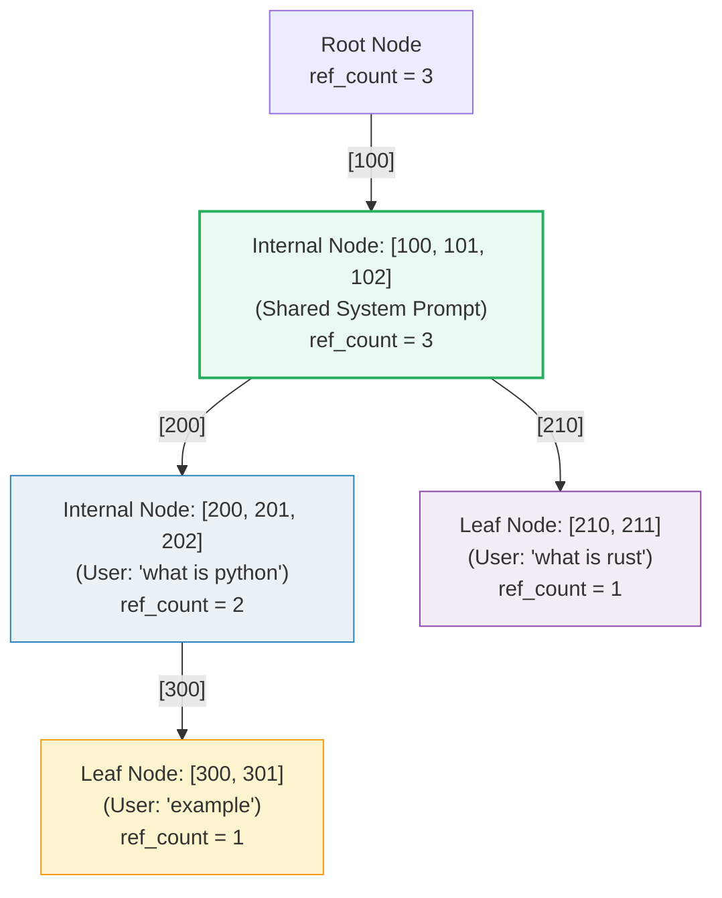

# RadixAttention (Prefix Caching with a Radix Tree)

- **Category**: LLM Systems
- **Difficulty**: Expert
- **Target Role**: LLM Inference Engineer / LLM Serving Engineer
- **Source**: SGLang paper (Zheng et al., 2023) / RadixAttention

---

## Concept Overview

In LLM serving, workflows like multi-turn chat, few-shot prompting, and agent loops reuse large portions of prompts across steps. A **prefix cache** stores the Key-Value (KV) cache of these prompts in GPU VRAM so that subsequent requests sharing the same prefix can skip prefill computation. 

While basic engines use a flat hash table that requires block alignment (e.g., vLLM's BlockManager), **RadixAttention** manages VRAM using a **radix tree** (a compressed trie) on the CPU. The edges of the tree store token segments of arbitrary lengths, and the nodes point to their corresponding KV caches. This allows for token-granular, tree-structured sharing that matches the exact branching structure of conversational prompts.

### The Problem It Solves

Chained-hash block managers (like vLLM's basic cache) group tokens into fixed-size blocks (e.g., `block_size = 16`). Because the cache is block-aligned, it can only reuse **whole blocks**. If a shared system prompt is 25 tokens long:
* The first block (16 tokens) is successfully cached and shared.
* The remaining 9 tokens are packed into the second block alongside query-specific tokens. Since the rest of the block differs for every user query, the second block's hash is unique to each request.
Consequently, those 9 shared tokens must be recomputed for every request. RadixAttention solves this by allowing token-granular sharing, saving **9 system tokens** (or up to **5× throughput** under multi-turn agent workloads).

### How It Works

1. **Radix Tree Index**: The CPU maintains a radix tree where the path from the root to a node represents a sequence of tokens.
2. **Token-Granular Allocation**: The GPU page pool allocates memory at the level of a single token (`page_size = 1`), matching the tree's granularity.
3. **Longest Prefix Match (LPM)**: When a new prompt arrives, the engine walks the tree to find the longest matching path, returning the matched token length and the target node.
4. **Insert & Split**: The prompt is inserted. If the match stops mid-edge, the edge is **split**: the matched prefix becomes a new internal node, and the old tail and new query suffix become child branches.
5. **Reference Counting & LRU Eviction**: Nodes track active generation readers (`ref_count`). When a request finishes, `ref_count` is decremented. When memory is full, the engine evicts the **least-recently-used (LRU) leaf nodes** with `ref_count == 0`, recursively pruning upwards.



---

## Worked Example

This example uses verified numbers from the companion code (`block_size = 2` tokens per block for the flat-hash comparison).

### 1. The Flat-Hash Blind Spot
We insert `Q1 = [100, 101, 102, 200, 201, 202]` into a flat hash cache.
The cache registers 3 full blocks:
* Block 0 `[100, 101]`: hash = `0xecd0403d962ff8f4`
* Block 1 `[102, 200]`: hash = `0x75ad5e3ce0e74fe3`
* Block 2 `[201, 202]`: hash = `0x1a04813492aee2f7`

Next, we probe `Q2 = [100, 101, 102, 210, 211]`, which shares the 3-token system prefix `[100, 101, 102]`.

* **Block 0** `[100, 101]`: Hash hit! (Reuses Block 0)
* **Block 1** `[102, 210]`: Hash is `0x35e2a5e982cdf239` $\rightarrow$ **MISS** (because Q1's Block 1 was `[102, 200]`).
The flat hash only matches **2 tokens**. The 3rd system token (`102`) is lost to block misalignment.

### 2. Radix Tree Construction (Q1, Q2, Q3)
* **Insert Q1** (`[100, 101, 102, 200, 201, 202]`):
  Cold miss. The tree creates a single leaf edge:
  ```
  root {ref=1}
    └─ [100] [100, 101, 102, 200, 201, 202] {ref=1, leaf}
  ```

* **Insert Q2** (`[100, 101, 102, 210, 211]`):
  LPM matches 3 tokens (`[100, 101, 102]`). The edge is **split** at token 3.
  ```
  root {ref=2}
    └─ [100] [100, 101, 102] {ref=2}
         ├─ [200] [200, 201, 202] {ref=1, leaf}
         └─ [210] [210, 211] {ref=1, leaf}
  ```
  *Q2 matches 3 tokens, skipping prefill for the entire system prompt.*

* **Insert Q3** (`[100, 101, 102, 200, 201, 202, 300, 301]`):
  LPM matches 6 tokens (`[100, 101, 102, 200, 201, 202]`). The Q1 leaf is promoted to a shared internal node, and Q3's suffix is attached:
  ```
  root {ref=3}
    └─ [100] [100, 101, 102] {ref=3}
         ├─ [200] [200, 201, 202] {ref=2}
         │    └─ [300] [300, 301] {ref=1, leaf}
         └─ [210] [210, 211] {ref=1, leaf}
  ```
  *Q3 matches 6 tokens, skipping prefill for the prompt and user question.*

### 3. Cumulative Savings
For a workload of Q1, Q2, and Q3:

| Query | Prompt Tokens | Radix Hit | Flat-Hash Hit | Radix Advantage |
|---|---|---|---|---|
| **Q1** | `[100, 101, 102, 200, 201, 202]` | 0 | 0 | 0 |
| **Q2** | `[100, 101, 102, 210, 211]` | **3** | 2 | **+1 token** |
| **Q3** | `[100, 101, 102, 200, 201, 202, 300, 301]` | 6 | 6 | 0 (boundary match) |
| **Total** | **19 tokens** | **9 saved** | **8 saved** | **+1 token** |

### 4. LRU Leaf Eviction Trace
* **Step 1: Release Q2**: The request finishes. The ref counts along Q2's path are decremented.
  ```
  root {ref=2}
    └─ [100] [100, 101, 102] {ref=2}
         ├─ [200] [200, 201, 202] {ref=2}
         │    └─ [300] [300, 301] {ref=1, leaf}
         └─ [210] [210, 211] {ref=0, leaf}  <-- EVICTABLE
  ```
* **Step 2: Eviction**: Memory limits trigger `evict_lru_leaves(1)`. The engine identifies leaf `[210, 211]` with `ref_count == 0` and removes it, releasing its GPU memory. 
* **Step 3: Upward Pruning**: The walk checks the parent node `[100, 101, 102]`. Since it still has the child branch `[200,...]`, the parent cannot be pruned.
* **Step 4: Future Query Match**: A new query `Q4 = [100, 101, 102, 210, 999]` arrives. Since `[210, 211]` was evicted, `Q4` matches only **3 tokens** (the system prompt) instead of 4.

---

## Complexity & Trade-offs

| Metric | Complexity / Value | Notes |
|---|---|---|
| **Match Latency** | $O(L)$ | Walk from the root down to the first divergence; sub-linear in practice by using child dicts. |
| **Insert Latency** | $O(L)$ | Matches and inserts the remaining suffix, splitting edges in $O(1)$ pointer swaps. |
| **Page Allocator** | `page_size = 1` | Eliminates fragmentation but increases block allocation metadata frequency. |
| **Scheduling Policy** | **Cache-Aware** | Schedulers sort the waiting queue to group requests sharing the same prefix together. |

---

## Common Interview Questions & How to Answer

### Q1: How does RadixAttention eliminate the block-alignment limitation found in flat chained-hash caches?
- **Answer**: In a flat-hash cache, the dedup unit is a fixed-size block (e.g., 16 tokens). If a shared prefix diverges mid-block, the entire block is marked unique to that request, preventing sharing of the matched tokens within that block. RadixAttention represents prefixes as paths in a radix tree. It performs a Longest Prefix Match (LPM) at the token level, matching the exact length of the shared prefix. When a divergence occurs mid-edge, it splits the edge at the exact token index, creating a shared parent node. Combined with a page allocator that supports single-token page sizes, it achieves token-granular sharing.

### Q2: Why does RadixAttention evict only leaves, and how does the recursive eviction process work?
- **Answer**: Internal nodes represent shared prefix backbones that other active child sequences still read. Evicting an internal node would corrupt the lookup path for its descendants. Therefore, eviction is restricted to leaf nodes (the tips of the tree) with a `ref_count == 0`. The eviction manager selects the coldest eligible leaf node using a Least Recently Used (LRU) policy and releases its KV cache. It then walks up to the parent node. If the parent has no other children and has `ref_count == 0`, the parent is also pruned. This process continues recursively until it hits a node that is either still shared (`ref_count > 0`) or has other active child branches.

---

## Pro-Tip: How to Impress the Interviewer

- **Cache-Aware Scheduling**: Explain that prefix caching is only half the battle. To maximize VRAM hits, the scheduler should use **cache-aware scheduling**: sorting incoming requests in the waiting queue by their matched prefix lengths. By scheduling requests that share the same prefix in the same batch, the engine keeps the shared prefix hot in GPU memory, avoiding eviction thrashing.
