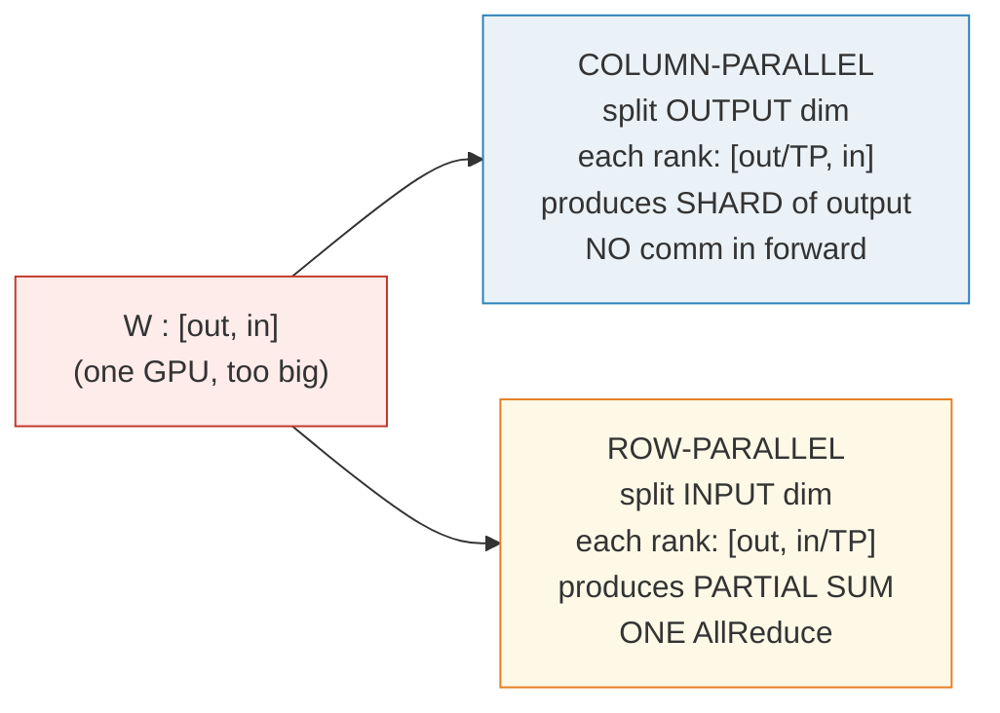
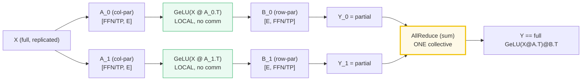

# Tensor Parallelism (TP)

- **Category**: LLM Systems
- **Difficulty**: Expert
- **Target Role**: LLM Systems Engineer / Distributed Systems Engineer
- **Source**: Megatron-LM (Shoeybi et al., 2019)

---

## Concept Overview

Imagine you have a warehouse with a pallet of goods that is too wide and heavy to fit on a single delivery truck. If you try to fit the whole pallet on one truck, it breaks down. Instead of loading whole pallets onto different trucks, you cut each pallet into **horizontal or vertical strips** and load one strip onto each truck. During the journey, the trucks drive in parallel, carrying out calculations on their specific strips of data. To deliver the final intact goods, the trucks briefly sync up at the destination (via a single network synchronization) to stitch their strips back together.

In LLM systems, **Tensor Parallelism (TP)** applies this sharding strategy to individual weight matrices inside a single Transformer layer. Instead of placing entire layers on different GPUs (which is Pipeline Parallelism), TP cuts each weight matrix along either its output dimension (column-parallel) or its input dimension (row-parallel). GPUs compute their local products in parallel and execute a single collective communication operation (`AllReduce`) to combine their partial results into the correct output.



### The Problem It Solves

As LLMs scale, a single weight matrix exceeds the High Bandwidth Memory (HBM) capacity of a single GPU. For example, in a Llama-2-70B-style MLP, the model dimension ($E$) is $8,192$ and the intermediate dimension ($FFN$) is $28,672$. 

A single FP16 weight matrix (`gate_proj`) of size $[28,672, 8,192]$ contains **$234,881,024$ elements**, which requires **$0.44\text{ GiB}$** ($0.88\text{ GiB}$ in FP32). The MLP block alone contains three such matrices (`gate_proj`, `up_proj`, `down_proj`), consuming **$1.3\text{ GiB}$** of static weights *per layer* in FP16. Across 80 layers plus embedding and output projection layers, the static weights alone exceed $100\text{ GiB}$, which cannot fit on a single $80\text{ GB}$ GPU (like the A100 or H100) before even accounting for KV cache, optimizer states, and activation memory.

By sharding every weight matrix by a factor of $TP$, memory scale savings are linear:

| TP | Shard Shape | Elements per Rank | Weight Memory per Rank (FP16) | Savings |
|---|---|---|---|---|
| **1** | $[28,672, 8,192]$ | $234,881,024$ | $0.438\text{ GiB}$ | Baseline |
| **2** | $[14,336, 8,192]$ | $117,440,512$ | $0.219\text{ GiB}$ | $2\times$ smaller |
| **4** | $[7,168, 8,192]$ | $58,720,256$ | $0.109\text{ GiB}$ | $4\times$ smaller |
| **8** | $[3,584, 8,192]$ | $29,360,128$ | $0.055\text{ GiB}$ | $8\times$ smaller |

### How It Works

Megatron-LM introduced a layout strategy that minimizes collective communication by alternating column-parallel and row-parallel layers.

#### 1. Column-Parallel Linear (e.g., QKV Projections, MLP Gate/Up)
Slices the weight matrix $W$ along its output dimension (dimension 0 in PyTorch `[out, in]`).
- **Weight Shards**: Rank $r$ stores $W_r$ of shape $[out/TP, in]$.
- **Forward Operation**: Rank $r$ computes $Y_r = X W_r^T$ locally. The input $X$ is replicated in full across all ranks.
- **Communication**: Zero communication is required during the forward pass. The output $Y_r$ has shape $[B, out/TP]$. To get the full output, an `AllGather` is needed, *unless* the next layer is row-parallel and can consume the sharded output directly.

#### 2. Row-Parallel Linear (e.g., Attention Out Projection, MLP Down)
Slices the weight matrix $W$ along its input dimension (dimension 1 in PyTorch `[out, in]`).
- **Weight Shards**: Rank $r$ stores $W_r$ of shape $[out, in/TP]$.
- **Forward Operation**: Rank $r$ computes $Y_{r, \text{partial}} = X_r W_r^T$ locally, where $X_r$ is the local shard of the input of shape $[B, in/TP]$.
- **Communication**: Each rank produces a "partial sum" tensor of shape $[B, out]$. An `AllReduce(sum)` operation must be executed across all $TP$ ranks to sum these partial tensors: $Y = \sum_{r=0}^{TP-1} Y_{r, \text{partial}}$.

#### 3. The Megatron MLP Optimization
For a standard MLP layer: $Y = \text{GeLU}(X @ A^T) @ B^T$. If we sharded both matrices independently, we would need communication collectives between $A$ and $B$.
Megatron-LM eliminates this intermediate communication by making the first layer ($A$) **column-parallel** and the second layer ($B$) **row-parallel**:

```
GPU 0: Z_0 = GeLU(X @ A_0.T)   -> Shape: [B, L, FFN/TP]
       Y_0 = Z_0 @ B_0.T       -> Shape: [B, L, E] (Partial Sum)

GPU 1: Z_1 = GeLU(X @ A_1.T)   -> Shape: [B, L, FFN/TP]
       Y_1 = Z_1 @ B_1.T       -> Shape: [B, L, E] (Partial Sum)

AllReduce: Y = Y_0 + Y_1       -> Shape: [B, L, E] (Identical to unsharded)
```

Because `GeLU` is an element-wise activation, it can be applied to local shards $Z_r$ independently without needing global information. By feeding the local output of $A$ directly into the row-parallel $B$, the intermediate synchronization is cancelled. **You pay exactly one `AllReduce` for the entire MLP block.**



#### 4. Attention TP
The same logic applies to Multi-Head Attention:
- Q, K, and V projections are packed into a single **column-parallel** layer. The query/key/value heads are divided evenly: each rank runs self-attention on its local heads ($H/TP$).
- The attention heads do not communicate with each other during QK multiplication or softmax.
- The output projection ($O$) is **row-parallel**. It takes the concatenated local head outputs and projects them back to the hidden size, producing partial sums that are combined via a single `AllReduce` at the end of the block.

---

## Worked Example

Below are exact values extracted from single-process simulations with $TP=2$:

### 1. Matrix Projection (Column-Parallel vs. Row-Parallel)
For a model input $X$ of shape $[1, 8]$ and weight matrix $W$ of shape $[8, 8]$:
- **Full Reference Forward ($Y = X W^T$)**:
  $$Y = [-0.8029, +0.4008, -1.2338, +0.4680, -0.0224, -0.8494, +0.7460, +0.3059]$$

- **Column-Parallel sharding ($W$ split along dim 0 into two $[4, 8]$ shards)**:
  - Rank 0 computes $Y_0 = X W_0^T = [-0.8029, +0.4008, -1.2338, +0.4680]$
  - Rank 1 computes $Y_1 = X W_1^T = [-0.0224, -0.8494, +0.7460, +0.3059]$
  - Concatenation matches the full $Y$ exactly with **zero** forward communication.

- **Row-Parallel sharding ($W$ split along dim 1 into two $[8, 4]$ shards, input $X$ split into two $[1, 4]$ shards)**:
  - Rank 0 computes partial sum $Y_{0, \text{partial}} = [-0.6191, +0.5776, -1.0092, +0.5250, +0.1207, -1.0074, -0.0579, +0.3386]$
  - Rank 1 computes partial sum $Y_{1, \text{partial}} = [-0.1837, -0.1768, -0.2245, -0.0570, -0.1431, +0.1580, +0.8039, -0.0328]$
  - Summing them: $Y = Y_{0, \text{partial}} + Y_{1, \text{partial}} = [-0.8029, +0.4008, -1.2338, +0.4680, -0.0224, -0.8494, +0.7460, +0.3059]$ (exactly identical to the unsharded run, requiring **one** `AllReduce`).

### 2. The Megatron MLP Trick in Action
Using $TP=2$, input $X [1, 8]$, column-parallel gate matrix $A [4, 8]$, and row-parallel down matrix $B [8, 4]$:

| Tensor | Values | Shape |
|---|---|---|
| **$Y_{0, \text{partial}}$ Rank 0** | $[+0.0182, +0.0190, +0.0269, -0.0209, +0.0697, +0.0000, -0.0059, -0.0326]$ | $[1, 8]$ |
| **$Y_{1, \text{partial}}$ Rank 1** | $[-0.1966, +0.0195, -0.0286, -0.0892, +0.1581, +0.1559, +0.6273, +0.3876]$ | $[1, 8]$ |
| **$Y_{\text{sum}}$ (AllReduce)** | $[-0.1784, +0.0385, -0.0017, -0.1101, +0.2278, +0.1560, +0.6214, +0.3550]$ | $[1, 8]$ |
| **Full Reference MLP** | $[-0.1784, +0.0385, -0.0017, -0.1101, +0.2278, +0.1560, +0.6214, +0.3550]$ | $[1, 8]$ |

*Gold Verification scalar:* The first element $Y_{full}[0, 0] = \mathbf{-0.178412}$ matches to numerical precision (max difference $< 7.5 \times 10^{-9}$).

### 3. Packed QKV Projections for Grouped-Query Attention (GQA)
When sharding packed Q, K, and V projections, Grouped-Query Attention ($H_{kv} < H_q$) introduces asymmetry. Take $H_q=4$, $H_{kv}=2$, head dimension $D=2$, and $TP=2$.
- The unsharded packed weight has shape $[(H_q + 2 \cdot H_{kv}) \cdot D, E] = [16, 8]$.
- Slicing along the output dimension for $TP=2$ shards:

| Rank | Q Heads | K Heads | V Heads | Shard Rows per Rank |
|---|---|---|---|---|
| **Rank 0** | $0..1$ | $0..0$ | $0..0$ | $8$ rows |
| **Rank 1** | $2..3$ | $1..1$ | $1..1$ | $8$ rows |

*Divisibility Constraint:* To map heads cleanly to ranks, $H_q$ and $H_{kv}$ must both be divisible by $TP$. If $H_{kv} \pmod{TP} \neq 0$ (e.g. $H_{kv}=2$ with $TP=4$), the loader throws an assertion error, which is why production GQA models choose $H_{kv}$ compatible with expected TP groups.

---

## Complexity & Trade-offs

| Metric | Value | Notes |
|---|---|---|
| **GPU Memory Reduction** | $1/TP$ of parameter weights | Reduces memory footprint of weight matrices linearly. |
| **Collective Comm Operations** | $2$ `AllReduce`s per Transformer layer | $1$ in the Attention block, $1$ in the MLP block. |
| **Per-Rank Comm Volume** | $2 \cdot \frac{TP-1}{TP} \cdot B \cdot L \cdot E \cdot 2\text{ bytes}$ | For a ring-AllReduce. Scales with sequence length $L$ and batch size $B$. |
| **Interconnect Requirement** | $\ge 300\text{ GB/s}$ bi-directional (NVLink) | High frequency makes it highly sensitive to network latency. |

### Comm Volume Example
For a large training run with batch size $B=32$, sequence length $L=4,096$, hidden size $E=8,192$ in FP16:
- **$TP=2$**: Per-rank traffic per AllReduce is $2.00\text{ GiB}$.
- **$TP=4$**: Per-rank traffic per AllReduce is $3.00\text{ GiB}$.
- **$TP=8$**: Per-rank traffic per AllReduce is $3.50\text{ GiB}$.

Running this AllReduce over a slow connection is disastrous:
- Over **NVLink ($300\text{ GB/s}$)**: One AllReduce takes **$223.7\text{ }\mu\text{s}$**.
- Over **InfiniBand ($25\text{ GB/s}$)**: One AllReduce takes **$2,684.4\text{ }\mu\text{s}$** ($12\times$ slower!).
As a result, **TP is strictly confined to intra-node NVLink domains**.

---

## Common Interview Questions & How to Answer

### Q1: Why can we not place a Tensor Parallel group across multiple nodes connected by InfiniBand?
- **Answer**: TP executes communication collectives (`AllReduce`) twice per Transformer layer (once per attention block, once per MLP block) during both the forward and backward passes. At large batch sizes and sequence lengths, the volume of data that needs to be synchronized is massive (e.g., multiple gigabytes per step). An NVLink connection provides up to $300\text{ GB/s}$ per direction ($900\text{ GB/s}$ aggregate for H100 SXM5), keeping the communication latency down to hundreds of microseconds. Standard InfiniBand is at least $10\times$ to $20\times$ slower ($25\text{--}50\text{ GB/s}$ per direction). Moving TP across nodes causes the GPUs to spend more than $80\%$ of their execution cycles waiting on network packets, stalling the entire pipeline.

### Q2: How does the backward pass of Column-Parallel and Row-Parallel linear layers handle gradients?
- **Answer**: The communication primitives in the backward pass are the mathematical duals of the forward pass:
  1. **Column-Parallel Linear**: During the forward pass, the input $X$ is replicated across all ranks, and each rank computes a shard of the output. In the backward pass, each rank computes a local gradient w.r.t. the input $\nabla X_r$. To reconstruct the full input gradient $\nabla X$, an **`AllReduce(sum)`** collective must be called.
  2. **Row-Parallel Linear**: During the forward pass, the input is sharded and an `AllReduce` is executed to sum partial outputs. In the backward pass, because the output was replicated after the forward `AllReduce`, the gradient w.r.t. the output $\nabla Y$ is replicated across all ranks. Each rank computes its local input gradient $\nabla X_r$ without communication. The only communication needed is a local **`AllGather`** or slice if the preceding layer requires sharded activations.

### Q3: How do we handle biases in Column-Parallel and Row-Parallel layers without corrupting the math?
- **Answer**: In a Column-Parallel layer ($Y_r = X @ W_r^T + bias_r$), the bias can be sharded alongside the weight columns ($bias_r = bias[r \cdot out/TP : (r+1) \cdot out/TP]$). Each rank adds its bias shard locally. 
In a Row-Parallel layer, the forward pass computes $Y_r = X_r @ W_r^T$ on each rank and then sums them: $Y = \sum Y_r + bias$. If we add the entire bias to each rank's local calculation, the final `AllReduce(sum)` will sum the bias $TP$ times, resulting in $TP \cdot bias$. To prevent this, the bias is either **only added on rank 0** (e.g., `bias if tp_rank == 0 else None`) or the bias addition is deferred to after the `AllReduce` operation has completed.

---

## Pro-Tip: How to Impress the Interviewer

- **Sequence Parallelism Integration**: Explain how Megatron-LM extends TP using **Sequence Parallelism**. While standard TP shards linear projections, non-tensor layers (such as LayerNorm and Dropout) are typically duplicated. Sequence Parallelism shards these layers along the sequence dimension ($L/TP$). This saves activation memory and is combined with the TP communication loops by replacing the standard `AllGather` and `ReduceScatter` in the TP boundaries with sequence-dimension splits.
- **Explain GQA Head Mapping**: Detail exactly how Grouped-Query Attention head mapping restricts TP scaling. If a model has $H_q = 32$ and $H_{kv} = 8$ heads, and you scale to $TP=8$, each rank gets $32/8 = 4$ Q-heads and $8/8 = 1$ KV-head. If you try to run $TP=16$, the KV-heads cannot divide evenly ($8/16 = 0.5$ heads per rank). This causes an assertion failure in standard engines. To avoid this, you must either replicate KV heads across TP ranks or adjust your TP group size.
