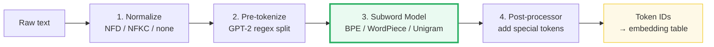
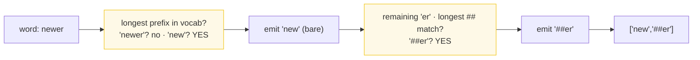

# Tokenization Pipelines: BPE, WordPiece, SentencePiece
- **Category**: LLM Systems
- **Difficulty**: Medium
- **Target Role**: LLM Inference Engineer / ML Systems Engineer
- **Source**: TOKENIZATION.md + tokenization_output.txt (Sennrich et al. 2016, Kudo & Richardson 2018)

---

## Concept Overview

A Transformer cannot read strings — it reads **integer token IDs**, each pointing at a row of an embedding table. Tokenization is the deterministic assembly line that turns raw text into those IDs. Think of it as chopping text into **reusable puzzle pieces**: the model has memorized one integer ID for every piece it knows. Short, common pieces (`low`, `est`, `ing`, `▁the`) are reused across thousands of words, so a modest vocabulary covers a whole language. Rare or unseen words are assembled from smaller pieces — `lowest` = `low` + `est`.

The assembly line has exactly **4 stages**: normalize → pre-tokenize → subword model → post-process. The **subword model** (stage 3) is where the three algorithm families live: **BPE** (rank-greedy merging, used by GPT-2/Llama/Qwen), **WordPiece** (greedy longest-match, used by BERT), and **SentencePiece** (raw-stream, no pre-split, used for CJK/multilingual). Every LLM in production uses one of these three families — knowing how they differ, when they produce `[UNK]`, and what bugs arise from mixing them is core inference engineering knowledge.

### The Problem It Solves

A character-level vocabulary (26 letters) makes sequences impossibly long. A word-level vocabulary cannot handle rare words and requires a massive vocab table. Subword tokenization hits the sweet spot: a vocabulary of ~50k–150k pieces covers any language with manageable sequence lengths. GPT-4's tiktoken vocabulary is 100,277 tokens. Qwen3's BPE vocabulary is 151,936 tokens.

### How It Works



**BPE Training algorithm** (Sennrich et al. 2016):
1. Init vocabulary = every base char/byte in the corpus
2. Count every adjacent symbol pair, weighted by pre-token frequency
3. Merge the most frequent pair → new token; replace everywhere in corpus
4. Repeat `V` times (V = desired vocab size)

**BPE Encoding**: split to chars, then repeatedly apply the **lowest-rank** (earliest-learned) merge until no learned pair remains.

**WordPiece Encoding** (BERT): greedy **longest-prefix** match; first piece is bare, continuations get `##` prefix; unknown char → `[UNK]`.

**SentencePiece**: no pre-tokenization; spaces → `▁` (U+2581); trains BPE or Unigram on the raw stream; works for CJK because it never needs spaces to split words.

---

## Worked Example

### BPE Training on the Gold Corpus

From `tokenization_output.txt` **Section B** — corpus:
```
"low low low low low"
"lower lower newest newest newest"
"newest widest widest"
```
Word frequencies: `low:5, lower:2, newest:4, widest:2`. Initial vocab = 10 sorted unique chars.

**Complete merge sequence (12 merges → vocab size 22):**

| rank | pair | → new token | count |
|---|---|---|---|
| 0 | `('l','o')` | `lo` | 7 |
| 1 | `('lo','w')` | `low` | 7 |
| 2 | `('e','s')` | `es` | 6 |
| 3 | `('es','t')` | `est` | 6 |
| 4 | `('n','e')` | `ne` | 4 |
| 5 | `('ne','w')` | `new` | 4 |
| 6 | `('new','est')` | `newest` | 4 |
| 7 | `('low','e')` | `lowe` | 2 |
| 8 | `('lowe','r')` | `lower` | 2 |
| 9 | `('w','i')` | `wi` | 2 |
| 10 | `('wi','d')` | `wid` | 2 |
| 11 | `('wid','est')` | `widest` | 2 |

Final vocabulary (size 22): `[d,e,i,l,n,o,r,s,t,w, lo,low,es,est,ne,new,newest,lowe,lower,wi,wid,widest]`

### BPE Encoding: Trace of `lowest → [11, 13]`

From `tokenization_output.txt` **Section C** — the gold used by the HTML check:

```
start      [l, o, w, e, s, t]
r=0 (l,o)  → [lo, w, e, s, t]        ← lowest-rank pair is ('l','o')
r=1 (lo,w) → [low, e, s, t]
r=2 (e,s)  → [low, es, t]
r=3 (es,t) → [low, est]              ← no learned pair left → stop
IDs: low=11, est=13  =>  [11, 13]
```

| word | char split | BPE pieces | token IDs |
|---|---|---|---|
| `lowest` | `l o w e s t` | `['low','est']` | **`[11, 13]`** |
| `newer` | `n e w e r` | `['new','e','r']` | **`[15, 1, 6]`** |
| `newest` | `n e w e s t` | `['newest']` | `[16]` |
| `xyz` | `x y z` | `['x','y','z']` | `[UNK]` (char-level) |

> **`newer` → `[new, e, r]`**: no `('e','r')` merge was ever learned, so rank-greedy stops after `new`. This is the key difference from WordPiece.

### WordPiece vs BPE (Section D)



| word | BPE pieces | WordPiece pieces | key difference |
|---|---|---|---|
| `lowest` | `['low','est']` | `['low','##est']` | Same split, `##` prefix on continuation |
| `newer` | `['new','e','r']` | `['new','##er']` | WordPiece grabs `##er` directly (longest match) |
| `xyz` | `['x','y','z']` | `['[UNK]']` | BPE never `[UNK]` if byte-level; WP can |

### SentencePiece (Section E)

`"low low new new"` → stream: `'low▁low▁new▁new'`

Because there is no pre-tokenization, merges can glue a word-final character to the following space:

| rank | pair | → token | note |
|---|---|---|---|
| 0 | `('w','▁')` | `w▁` | space-trailing token |
| 2 | `('lo','w▁')` | `low▁` | space-trailing token |
| 4 | `('low▁','low▁')` | `low▁low▁` | **▁ inside token — crosses word boundary** |

CJK: `"你好世界"` = 4 chars = 12 UTF-8 bytes. No spaces → a whitespace pre-tokenizer sees the whole sentence as ONE word. SentencePiece streams it char-by-char and byte-fallback keeps it tokenizable. **This is why Llama/Qwen/T5/ALBERT ship SentencePiece-style tokenizers.**

---

## Complexity & Trade-offs

| Property | BPE | WordPiece | SentencePiece |
|---|---|---|---|
| Train criterion | Most frequent adjacent pair | Max likelihood of training data | BPE or Unigram LM |
| Encode rule | **Rank-greedy** (lowest rank first) | **Greedy longest-match** | Rank-greedy or Viterbi |
| Unit trained on | Words (pre-split) or bytes | Words (pre-split) | **Raw stream** (no pre-split) |
| Space handling | `Ġ` via byte map (GPT-2) | Stripped (lost) | Escaped to `▁` U+2581 |
| `[UNK]` possible? | Byte-level: **never** | **Yes** | Byte fallback: **never** |
| CJK-friendly? | Needs pre-tok | Poor | **Yes** |
| Used by | GPT-2, GPT-4, Llama, Qwen | BERT | Llama, Qwen, T5, ALBERT |
| Normalization (stage 1) | None (raw bytes) | NFD + lowercase | NFKC |

---

## Common Interview Questions & How to Answer

### Q1: BPE and WordPiece both produce subword tokens — what is the fundamental algorithmic difference?

- **Answer**: The training criterion and the encoding algorithm differ. **BPE training** greedily merges the **most frequent** adjacent pair. **WordPiece training** merges the pair that maximizes training-data **likelihood** (a subtle but important difference). At **encoding time**, BPE applies merges in **rank order** (lowest rank = earliest learned first); WordPiece uses **greedy longest-prefix match** against a fixed dictionary. This is why `newer` → BPE `[new, e, r]` but WordPiece `[new, ##er]` — WordPiece finds `##er` in the dictionary directly, while BPE stops where learned merges ran out.

### Q2: What makes byte-level BPE (GPT-2/GPT-4) special compared to character-level BPE?

- **Answer**: The base vocabulary is all 256 byte values instead of Unicode characters. GPT-2 maps each byte through `bytes_to_unicode()` to a printable character, so the base vocab is always 256 and `[UNK]` is **impossible** — any input string is representable. Character-level BPE (like our demo) produces `[UNK]` for `xyz` because those chars were never in the training corpus. In production, byte-level BPE also means you never need special handling for unusual Unicode — every code point decomposes into 1–4 bytes, all of which are in the base vocab.

### Q3: Why does SentencePiece work for Chinese/Japanese but word-boundary BPE does not?

- **Answer**: Word-boundary BPE relies on a pre-tokenization step (e.g., the GPT-2 regex) that splits on whitespace and punctuation. Chinese and Japanese have no word boundaries — the whole sentence looks like a single "word" to a whitespace splitter. SentencePiece skips pre-tokenization entirely; it treats the raw character stream as input and escapes spaces to `▁`. So `你好世界` is processed char-by-char, and the BPE algorithm can learn useful character n-grams directly. UTF-8 byte fallback ensures every character is representable even if it never appeared in training.

### Q4: The GPT-2 pre-tokenization regex uses `\p{L}` — what is the production gotcha?

- **Answer**: Python's standard `re` module does **not** support `\p{L}` (Unicode letter property) — that requires the third-party `regex` module. This is why GPT-2's `encoder.py` depends on `regex`, and why a naive port that uses the stdlib `re` will silently mis-tokenize strings containing accented letters or non-ASCII characters. The full GPT-2 regex (verbatim): `'s|'t|'re|'ve|'m|'ll|'d| ?\p{L}+| ?\p{N}+| ?[^\s\p{L}\p{N}]+|\s+(?!\S)|\s+`. Each alternation handles a specific linguistic category — contractions, letter runs, digit runs, punctuation runs.

### Q5: How do you debug a tokenization mismatch between training and serving?

- **Answer**: The four-stage pipeline must be **identical** at train and serve time: (1) same Unicode normalization (`NFKC` vs `NFD` vs none), (2) same pre-tokenization regex or `▁` escape, (3) same merge ranks from the same vocabulary file, (4) same post-processing template (e.g., `<|im_start|>system...`). The most common mismatches are: wrong normalization form (NFKC at train, none at serve), mixing `Ġ` (GPT-2 byte map) with `▁` (SentencePiece), and non-deterministic merge order on ties. From the output: `[check] merge sequence matches pinned gold (12 merges): OK` — pin the merge sequence to a deterministic order (here: earliest-first on ties).

### Q6: What is token healing and when does it matter?

- **Answer**: Token healing arises during **inference serving** when the prompt ends in the middle of a token. Example: the prompt ends with `"import nump"` — `nump` is the start of `numpy` but it tokenizes differently as a standalone word than as a prefix of `numpy`. Without token healing, the model's first generated token is conditioned on a weird boundary. The fix: when the prompt ends mid-token, the server re-tokenizes the boundary (backs up one token, re-tokenizes from there with the next generated token). This is implemented in vLLM and other high-performance inference engines.

---

## Pro-Tip: How to Impress the Interviewer

- **Know the encoding algorithm type**: "BPE encodes by **rank-greedy** (lowest merge rank first, not longest match). WordPiece encodes by **greedy longest-prefix match**. The difference is testable: `newer` → BPE `[new,e,r]` but WordPiece `[new,##er]`." Most candidates blur these.
- **Qwen3 tokenizer specifics**: Qwen3's vocabulary is 151,936 tokens with special tokens `<|im_start|>`, `<|im_end|>`, `<|endoftext|>`. The training algorithm is byte-level BPE (not SentencePiece), though they may apply SentencePiece-style NFKC normalization first.
- **The 1 word ≈ 1–3 tokens rule**: English text averages ~1.3 tokens/word. A CJK character is typically 3 UTF-8 bytes → up to 3 tokens. Never equate tokens with words in latency/cost estimates.
- **The tie-break matters for reproducibility**: BPE tie-breaking (equal pair frequencies) must be deterministic. The gold in this guide uses earliest-first-seen order. A different tie-break produces a different vocabulary — two "identical" trainers that differ only in tie-break will diverge silently.
- **Gold to cite**: `lowest → [low, est] → IDs [11, 13]`; `newer → [new, e, r] → IDs [15, 1, 6]`. 12 merges, vocab size 22 on the standard BPE demo corpus.
