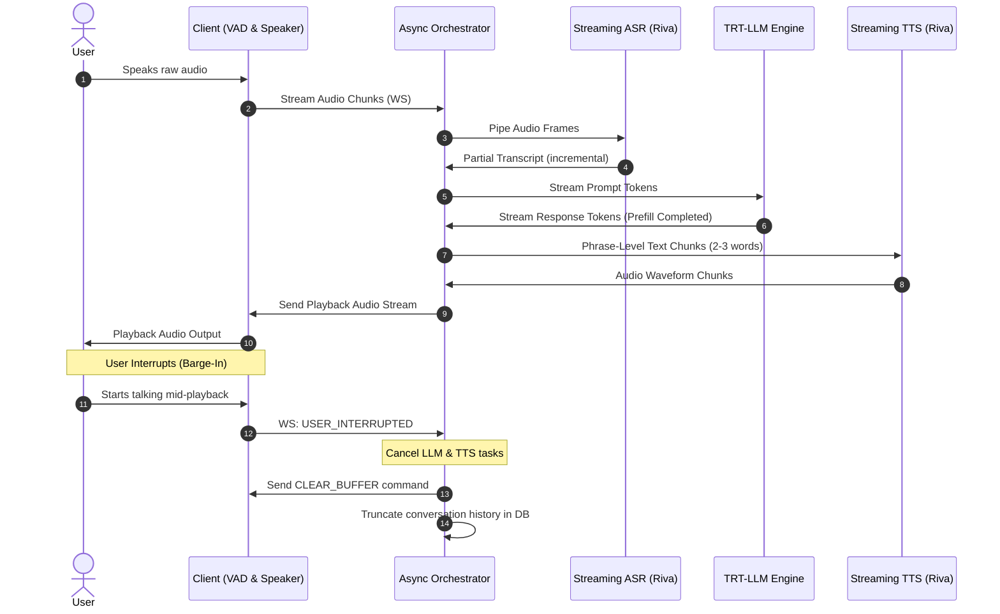

# Low-Latency Voice Agent Architecture (End-to-End Latency < 500ms TTFA)

- **Category**: LLM Systems
- **Difficulty**: Hard
- **Target Role**: Conversational AI Engineer / Voice AI Architect
- **Source**: NVIDIA Speech AI Team, NeMo & Riva Engineering
- **Flashcards**: [LLM Systems deck](../flash_cards/llm/llm_systems.md)

---

## Concept Overview

Achieving human-like conversation with an AI agent requires reducing the response loop to sub-second speeds. While text chats tolerate latency, a voice interaction feels sluggish and robotic if the Time-to-First-Audio (TTFA) exceeds $500\text{ ms}$.

Think of this architecture like a fast-paced game show contestant:
* **The Ears (VAD + ASR)** don't wait for a complete sentence; they translate incoming speech soundwaves into words frame-by-frame.
* **The Brain (LLM)** starts planning the beginning of the response before the question is fully finished, caching context to skip repetitive thoughts.
* **The Voice (TTS)** starts speaking the first few words (e.g., "Yes, I can...") while the brain is still thinking of the remaining words in the sentence.
* **The Reflexes (Barge-in Manager)** instantly stop the voice and clear the queue if the user interrupts, shifting the brain's focus immediately.

### The Problem It Solves

Traditional speech agents run in a **batch cascade**:
$$\text{User Audio} \rightarrow \text{Full Transcription} \rightarrow \text{LLM Call} \rightarrow \text{Full Speech Synthesis} \rightarrow \text{Playback}$$
This sequential design causes latency accumulation:
1. **Accumulated Latency**: Waiting for sentence boundaries at each step pushes TTFA to $2.5\text{--}4.0$ seconds.
2. **Broken Turn-Taking**: If the user interrupts, the agent continues speaking, forcing the user to wait until the agent's pre-rendered audio buffer completes.
3. **Robotic Speech Cadence**: Small, chopped text chunks lead to robotic pauses and vocal popping.

### How It Works

To fit inside a $< 500\text{ ms}$ budget, we partition operations into concurrent, streaming tasks:
1. **Streaming VAD**: Combines a fast energy-based detector ($<10\text{ ms}$ latency) with a deep learning classifier (Silero VAD, $<30\text{ ms}$ validation). If probability $P(\text{speech}) > 0.85$ for 2 frames $\rightarrow$ Trigger mute. If $P(\text{speech}) < 0.15$ for 15 frames ($300\text{ ms}$) $\rightarrow$ Trigger End-of-Utterance (EoU).
2. **Streaming ASR**: Uses FastConformer-RNNT with an $80\text{ ms}$ chunk size and a $40\text{ ms}$ lookahead, limiting acoustic context delay to $120\text{ ms}$.
3. **LLM Chunk Decoding**: Aggregates LLM tokens into *Syntactically Valid Speech Chunks*. To minimize TTFA, the first chunk is emitted aggressively (2-3 words). Subsequent chunks wait for punctuation or a 5-word boundary.
4. **Streaming TTS**: Employs FastPitch (acoustic model) and Vocos/HiFi-GAN (vocoder). Audio is synthesized using an overlap-and-add strategy ($25\text{ ms}$ overlap crossfade) to eliminate pops at chunk boundaries.
5. **Dual-Model Topology**: A small model (e.g., Nemotron-Mini 4B, $<150\text{ ms}$ TTFT) generates a conversational filler ("Sure, let me check that...") while a larger reasoning model (e.g., Llama-3-8B) computes the actual answer.

---

## Worked Example

### Latency Budget Allocation (TTFA < 500 ms target)

Below is the execution timing analysis for an optimized streaming pipeline vs. a traditional batch pipeline:

| Component | Operation | Batch Pipeline Latency | Streaming Pipeline Latency | Optimization Mechanism |
| :--- | :--- | :--- | :--- | :--- |
| **VAD** | Silence detection | $500\text{ ms}$ | $20\text{ ms}$ | Neural WebRTC VAD on sliding window |
| **ASR** | Audio transcription | $600\text{ ms}$ | $120\text{ ms}$ | FastConformer-RNNT ($80\text{ ms}$ chunk + $40\text{ ms}$ lookahead) |
| **IPC** | Data routing | $50\text{ ms}$ | $10\text{ ms}$ | Shared memory IPC |
| **LLM Prefill** | First token generation | $250\text{ ms}$ | $150\text{ ms}$ | TensorRT-LLM, FP8, dynamic prompt caching |
| **LLM Decode** | Syntactic chunking | $800\text{ ms}$ | $50\text{ ms}$ | First chunk emitted early (2-3 words) |
| **TTS Synthesis** | Waveform generation | $500\text{ ms}$ | $90\text{ ms}$ | FastPitch (JPA) + Vocos/HiFi-GAN |
| **Client Buffer** | Playback stability | $100\text{ ms}$ | $30\text{ ms}$ | Adaptive jitter buffer tuning |
| **Total TTFA** | **End-to-End Latency** | **$2800\text{ ms}$** | **$470\text{ ms}$** | **Streaming & Concurrent Execution** |

---

## Complexity & Trade-offs

| Metric | Value | Notes |
|---|---|---|
| **First TTS Chunk Size** | 2-3 words vs. Full Sentence | **2-3 words**: Ultra-low latency, but risks robotic prosody and flat intonation. **Full Sentence**: Natural voice patterns, but increases TTFA by $400\text{--}800\text{ ms}$. |
| **VAD Aggressiveness** | Low vs. High | **Low**: High reliability, but sluggish barge-in. **High**: Instantly mutes agent on user noise (coughs, background voices), causing false interruptions. |
| **Orchestrator Model** | Single LLM vs. Dual-Model | **Single**: Consistent context, but high latency. **Dual-Model**: Low latency backchannels, but requires orchestrating synchronization between two output buffers. |
| **Network Protocol** | WebSockets vs. HTTP/2 | **WebSockets**: Full-duplex persistent stream, lowest frame-overhead. **HTTP/2**: Multiplexed REST, higher framing latency. |

---

## Common Interview Questions & How to Answer

### Q1: What is the impact of thread blocking in Python's async environment when deploying a voice orchestrator at scale? How do you prevent it?
- **Answer**:
  * **The Problem**: In Python, `asyncio` runs on a single thread due to the Global Interpreter Lock (GIL). If any library performs synchronous file system access, blocking network calls, or intensive CPU processing (like tokenization, logit parsing, or audio resampling), the event loop freezes. This causes immediate network packet jitter, leading to dropouts or spikes in the TTFA.
  * **The Fix**: 
    1. **Offload Blocking Work**: Wrap CPU-intensive tasks in a `ThreadPoolExecutor` or `ProcessPoolExecutor` via `await loop.run_in_executor()`.
    2. **High-Performance Event Loop**: Replace the default asyncio event loop with `uvloop` (a Cython-based wrapper around `libuv`), which doubles I/O loop speeds.
    3. **Non-blocking Libraries**: Ensure all network calls use async clients (e.g., `aiohttp` or `httpx` instead of `requests`).

### Q2: How do you handle "late-arriving packets" from a cancelled TTS stream after a user barge-in?
- **Answer**:
  * **The Problem**: When a user interrupts the agent, the server cancels the TTS task, but packets already in transit in network buffers or client queues can still play. This results in the agent speaking for an extra fraction of a second after the user started talking.
  * **The Fix**:
    1. **Session Generation ID (GenID)**: Assign a unique incrementing `GenID` to each generation turn.
    2. **Packet Tagging**: Every audio packet sent from the server is tagged with the current `GenID`.
    3. **Client-Side Filter**: When client VAD triggers barge-in, the client increments its expected `GenID` locally and immediately discards any incoming packet carrying an older ID.
    4. **Speaker Buffer Flush**: The client executes a hard flush command on the speaker hardware (e.g., flushing the Web Audio API buffer source or calling ALSA `snd_pcm_drop()`) to clear remaining audio frames.

---

## Pro-Tip: How to Impress the Interviewer

* **Propose Dual-State Prompt Caching**:
  Show that you understand LLM memory mechanics. For voice agents, conversation history keeps changing. Explain that you would split the KV Cache into a **static prefix** (e.g., system instructions and tool schemas) which is permanently pinned in GPU memory, and a **dynamic history buffer** managed via Paged KV Cache. This cuts prefill time on every turn.
* **Detail Triton Shared Memory Inter-Process Communication (IPC)**:
  Standard REST/gRPC calls between system blocks introduce serialization overhead. Suggest using Triton's IPC backend, allowing ASR, LLM, and TTS pods hosted on the same physical node (connected via PCIe Gen5 or NVLink) to read/write output tensors directly from shared GPU memory buffers without host-to-device memory copy rounds.
