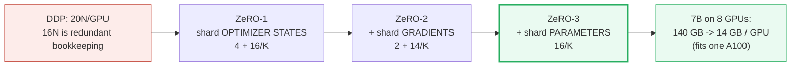
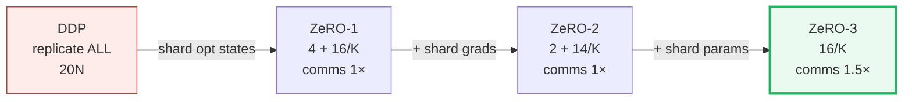

# Zero Redundancy Optimizer (ZeRO)

- **Category**: LLM Systems
- **Difficulty**: Expert
- **Target Role**: LLM Systems Engineer / Distributed Systems Engineer
- **Source**: ZeRO (Rajbhandari et al., 2019) / DeepSpeed
- **Flashcards**: [LLM Systems deck](../flash_cards/llm/llm_systems.md)

---

## Concept Overview

Imagine you are a team of eight bookkeepers (GPUs) audit-logging a company's financial ledgers. In a standard setup (like DDP), every bookkeeper is handed an identical, full copy of the entire ledger. Each person has a copy of the master accounts, the daily logs, and the calculation sheets. Photocopying this massive ledger eight times is pure redundancy and wastes a huge amount of desk space (GPU HBM). 

Instead, you decide to **shard the ledger**. You split the ledger into eight folders, giving one folder to each bookkeeper. Bookkeeper 0 handles accounts 0–9, Bookkeeper 1 handles accounts 10–19, and so on. During the audit, when a calculation needs the full ledger, you briefly pool the folders together on a table (an `AllGather` collective), perform the calculation, and then immediately return the folders to their respective owners. You do the exact same work, but your desk footprint is reduced to a fraction of the original size.

In LLM systems, the **Zero Redundancy Optimizer (ZeRO)** keeps the data-parallel training flow but shards the states that are normally duplicated across ranks:
1. **Stage 1**: Shards the optimizer states (Adam's master weights, momentum, and variance).
2. **Stage 2**: Also shards the gradients.
3. **Stage 3**: Also shards the model parameters (weights) themselves.

### The Problem It Solves

Standard Data Parallelism (DDP) replicates the entire model, gradients, and optimizer states on every single GPU. In mixed-precision training (FP16 weights/gradients with FP32 Adam optimizer states), this bookkeeping creates a massive memory footprint:

| Component | Precision | Bytes per Parameter | Why |
|---|---|---|---|
| **Parameters** | FP16 | $2$ | Used in the forward and backward passes. |
| **Gradients** | FP16 | $2$ | Computed during the backward pass. |
| **Master Parameters** | FP32 | $4$ | Master copy updated by the optimizer to avoid underflow. |
| **Grad Copy** | FP32 | $4$ | Upcast FP16 gradients for optimizer calculations. |
| **Adam Momentum** | FP32 | $4$ | First moment (beta1 running average). |
| **Adam Variance** | FP32 | $4$ | Second moment (beta2 running average). |
| **TOTAL** | **Mixed** | **$20\text{ bytes}$** | Replicated on **every** data-parallel GPU. |

Of these $20N$ bytes, **$16N$ bytes is identical bookkeeping** duplicated across all $K$ ranks. For a 7B parameter model, standard DDP requires **$140\text{ GB}$ of memory per GPU** just to hold the static weights and optimizer states, which is too large to fit on a single $80\text{ GB}$ A100 or H100. ZeRO eliminates this redundancy.

---

## How It Works

ZeRO shards the memory footprint incrementally across the $K$ data-parallel ranks:

### 1. ZeRO-1: Optimizer State Partitioning ($P_{os}$)
 Ranks retain full copies of the FP16 parameters ($2N$) and gradients ($2N$). However, the four FP32 optimizer columns (master parameters, grad copy, momentum, and variance = $16N$ bytes) are split evenly. Each rank stores and updates only $1/K$ of the optimizer states.
- **Footprint**: $2 + 2 + \frac{16}{K} = \mathbf{4 + \frac{16}{K}\text{ bytes/parameter}}$.
- **Forward & Backward**: Identical to standard DDP.
- **Optimizer Step**: Each rank updates its own $1/K$ parameter shard. An `AllGather` collective is then executed to broadcast the updated parameters to all other ranks.

### 2. ZeRO-2: Gradient Partitioning ($P_g$)
Along with the optimizer states, the FP16 gradients are sharded. During the backward pass, as soon as a layer's gradient is computed, it is sent to its owner rank using a `ReduceScatter` collective and immediately deleted on all other ranks.
- **Footprint**: $2 + \frac{2 + 12}{K} = \mathbf{2 + \frac{14}{K}\text{ bytes/parameter}}$ (the $4N$ FP32 grad copy column is eliminated since the optimizer upcasts the local FP16 gradient shard transiently).
- **Optimizer Step**: Each rank updates its local shard of parameters using its local gradient shard. The updated weights are distributed via `AllGather`.

### 3. ZeRO-3: Parameter Partitioning ($P_p$)
Even the persistent FP16 parameters are sharded. Each GPU only stores a $1/K$ slice of the model weights.
- **Footprint**: $\frac{2 + 2 + 12}{K} = \mathbf{\frac{16}{K}\text{ bytes/parameter}}$ (at large $K$, the memory requirement drops to near zero).
- **Forward Pass**: Before a layer runs, ranks execute an `AllGather` to reconstruct the full weights for that layer. The forward pass is run, and the non-owned weights are discarded immediately.
- **Backward Pass**: The weights are gathered again via `AllGather` to compute the gradients. After compute, they are discarded, and the gradients are `ReduceScattered` to their owners.

---

## Worked Example

Below are exact values comparing standard DDP and the three ZeRO stages:

### 1. Memory Reduction Scaling (FP16/FP32 Adam)

#### Tiny Gold Benchmark ($N = 1,000,000$ parameters, $K = 4$ GPUs)
- **DDP**: $20\text{ bytes/param} \cdot 10^6 = \mathbf{20.00\text{ MB}}$
- **ZeRO-1**: $(4 + 16/4)\text{ bytes/param} \cdot 10^6 = \mathbf{8.00\text{ MB}}$
- **ZeRO-2**: $(2 + 14/4)\text{ bytes/param} \cdot 10^6 = \mathbf{5.50\text{ MB}}$
- **ZeRO-3**: $(16/4)\text{ bytes/param} \cdot 10^6 = \mathbf{4.00\text{ MB}}$

#### Production Scale ($N = 7\text{B}$ parameters, $K = 8$ GPUs)
- **DDP**: $20\text{ bytes/param} \cdot 7 \times 10^9 = \mathbf{140.00\text{ GB}}$ (exceeds an $80\text{ GB}$ GPU)
- **ZeRO-1**: $(4 + 16/8)\text{ bytes/param} \cdot 7 \times 10^9 = \mathbf{42.00\text{ GB}}$
- **ZeRO-2**: $(2 + 14/8)\text{ bytes/param} \cdot 7 \times 10^9 = \mathbf{26.25\text{ GB}}$
- **ZeRO-3**: $(16/8)\text{ bytes/param} \cdot 7 \times 10^9 = \mathbf{14.00\text{ GB}}$ (fits comfortably on an $80\text{ GB}$ A100/H100)

### 2. A Step Simulation of ZeRO-1
Using $N=8$ parameters, $K=4$ ranks (each rank owns a chunk of 2 parameters), learning rate $\eta = 0.1$:
- **Initial parameters (replicated on all ranks)**:
  $$P_{init} = [+0.7705, -0.1467, -1.0894, +0.2842, -0.5423, -0.6993, +0.2017, +0.4190]$$
- **Local gradients computed by each rank during backward**:
  - Rank 0: `[-0.2158, -0.1210, -0.1790, +0.0546, -0.2570, +0.3302, -0.3214, +0.0368]`
  - Rank 1: `[-0.1699, +0.1119, -0.2676, -0.4527, +0.1111, +0.4370, +0.2819, +0.2325]`
  - Rank 2: `[+0.0576, +0.3791, -0.3871, -0.2373, -0.0063, -0.2155, +0.1556, -0.3938]`
  - Rank 3: `[+0.0576, +0.1628, -0.6656, +0.0777, -0.3089, -0.1502, +0.0820, -0.2754]`

- **Step 1: `ReduceScatter(grads)`**
  Ranks sum and average the gradients for their assigned parameter index:
  - Rank 0 owns $[0:2]$: $\text{avg\_grad} = [-0.0676, +0.1332]$
  - Rank 1 owns $[2:4]$: $\text{avg\_grad} = [-0.3748, -0.1394]$
  - Rank 2 owns $[4:6]$: $\text{avg\_grad} = [-0.1153, +0.1003]$
  - Rank 3 owns $[6:8]$: $\text{avg\_grad} = [+0.0495, -0.1000]$

- **Step 2: Local Optimizer Update**
  Each rank updates its assigned parameter shard using its local FP32 optimizer state:
  - Rank 0 updates $[0:2]$: $P_{new}[0:2] = [+0.7705, -0.1467] - 0.1 \cdot [-0.0676, +0.1332] = [+0.7773, -0.1600]$
  - Rank 1 updates $[2:4]$: $P_{new}[2:4] = [-1.0894, +0.2842] - 0.1 \cdot [-0.3748, -0.1394] = [-1.0519, +0.2982]$
  - Rank 2 updates $[4:6]$: $P_{new}[4:6] = [-0.5423, -0.6993] - 0.1 \cdot [-0.1153, +0.1003] = [-0.5307, -0.7093]$
  - Rank 3 updates $[6:8]$: $P_{new}[6:8] = [+0.2017, +0.4190] - 0.1 \cdot [+0.0495, -0.1000] = [+0.1967, +0.4290]$

- **Step 3: `AllGather(params)`**
  Ranks broadcast their updated shards to reconstruct the full parameter vector:
  $$P_{final} = [+0.7773, -0.1600, -1.0519, +0.2982, -0.5307, -0.7093, +0.1967, +0.4290]$$
  All ranks hold identical updated parameters, matching the mathematical output of standard DDP.

---

## Complexity & Trade-offs

| Strategy | Collective Per Step | Per-Device Comm Volume | Comm Overhead | Memory Footprint (7B, K=8) |
|---|---|---|---|---|
| **DDP** | `AllReduce(grad)` | $2.0 \cdot \Psi$ | $1.00\times$ | $140\text{ GB}$ (redundant) |
| **ZeRO-1** | `ReduceScatter(grad)` + `AllGather(param)` | $2.0 \cdot \Psi$ | $1.00\times$ | $42\text{ GB}$ |
| **ZeRO-2** | `ReduceScatter(grad)` + `AllGather(param)` | $2.0 \cdot \Psi$ | $1.00\times$ | $26.25\text{ GB}$ |
| **ZeRO-3** | `AG(param fwd)` + `AG(param bwd)` + `RS(grad)` | $3.0 \cdot \Psi$ | $1.50\times$ | $14\text{ GB}$ |

*(Note: $\Psi$ represents the number of model parameters.)*

### The Communication Volume Identity
Why do ZeRO-1 and ZeRO-2 have the same communication volume as DDP? It comes down to the NCCL collective identity:
$$\text{AllReduce(tensor)} \equiv \text{ReduceScatter(tensor)} \to \text{AllGather(tensor)}$$
DDP sums gradients using a single `AllReduce(grad)` of size $\Psi$. ZeRO-1 and ZeRO-2 split this into `ReduceScatter(grad)` (size $\Psi$) and `AllGather(param)` (size $\Psi$). The volume is identical ($2 \cdot \Psi$ bytes transferred per rank). **ZeRO-1 and ZeRO-2 are free memory optimizations that incur no extra network traffic.**

ZeRO-3 adds one extra `AllGather` step. Because parameters are sharded, they must be gathered once for the forward pass and gathered again for the backward pass. This raises the total volume to $3 \cdot \Psi$, representing a **$1.5\times$ increase (a 50% communication tax)**.

---

## Common Interview Questions & How to Answer

### Q1: Does ZeRO-3 increase the communication volume by 3× compared to standard DDP?
- **Answer**: No. While ZeRO-3 uses **three collective operations** per step (AllGather for weights in forward, AllGather for weights in backward, and ReduceScatter for gradients) compared to DDP's **one collective operation** (`AllReduce` for gradients), the actual **communication volume is only $1.5\times$ DDP**. 
A standard ring-AllReduce transfers $2 \cdot \Psi$ bytes of data per rank. In ZeRO-3, the three collectives (`ReduceScatter` and two `AllGather`s) each transfer $1 \cdot \Psi$ bytes per rank. The total data transferred is $3 \cdot \Psi$ bytes, which is a $50\%$ increase over DDP's $2 \cdot \Psi$ bytes, not a $3\times$ increase.

### Q2: How does ZeRO-3 hide the latency of its extra AllGather collectives?
- **Answer**: ZeRO-3 hides the communication overhead using **parameter prefetching** and **overlap communication**.
While the GPU is computing the forward pass of layer $l$, the system issues an asynchronous `AllGather` command to fetch the weights for layer $l+1$ in a separate CUDA stream. By the time layer $l$ completes, the weights for $l+1$ are already present in HBM. During the backward pass, the system prefetches the weights for $l-1$ while computing the gradients for layer $l$, and streams the `ReduceScatter` of layer $l$'s gradients in the background.

### Q3: What is the difference between ZeRO-Offload and ZeRO-Infinity?
- **Answer**: Both are extensions of ZeRO that offload states to host CPU memory or NVMe drives, trading PCIe bandwidth for GPU HBM:
  1. **ZeRO-Offload (ZeRO-2 base)**: Offloads the $16N$ bytes of optimizer states and gradients to host CPU RAM. The optimizer update is executed on the CPU, and the updated weights are copied back to the GPU. This is optimal for single-node systems.
  2. **ZeRO-Infinity (ZeRO-3 base)**: Offloads sharded parameters, gradients, and optimizer states to host CPU RAM or NVMe storage. It uses NVMe-to-CPU and CPU-to-GPU pipelining to support training models with trillions of parameters that exceed the cluster's aggregate GPU memory.

---

## Pro-Tip: How to Impress the Interviewer

- **FSDP (Fully Sharded Data Parallel) vs. DeepSpeed ZeRO-3**: Show you know the ecosystem by explaining that PyTorch's native **FSDP** is a production implementation of the ZeRO-3 protocol. Contrast their approaches: FSDP wraps modules into units (`FullyShardedDataParallel` blocks) and treats a set of parameters as a single flat tensor (`FlatParameter`), which allows it to run a single, contiguous `AllGather` per block. This is cleaner and often faster than DeepSpeed's hook-based sharding of individual parameter tensors.
- **Explain Checkpoint Consolidation**: Highlight the operational challenges of ZeRO-3. Because weights are sharded across $K$ ranks, saving a checkpoint directly results in $K$ sharded files. If you change the number of GPUs ($K$) in the next run, the checkpoint cannot be loaded. To resolve this, you must run a consolidation script (e.g., DeepSpeed's `zero_to_fp32.py`) to merge the $K$ shards back into a single unified PyTorch `state_dict`.
