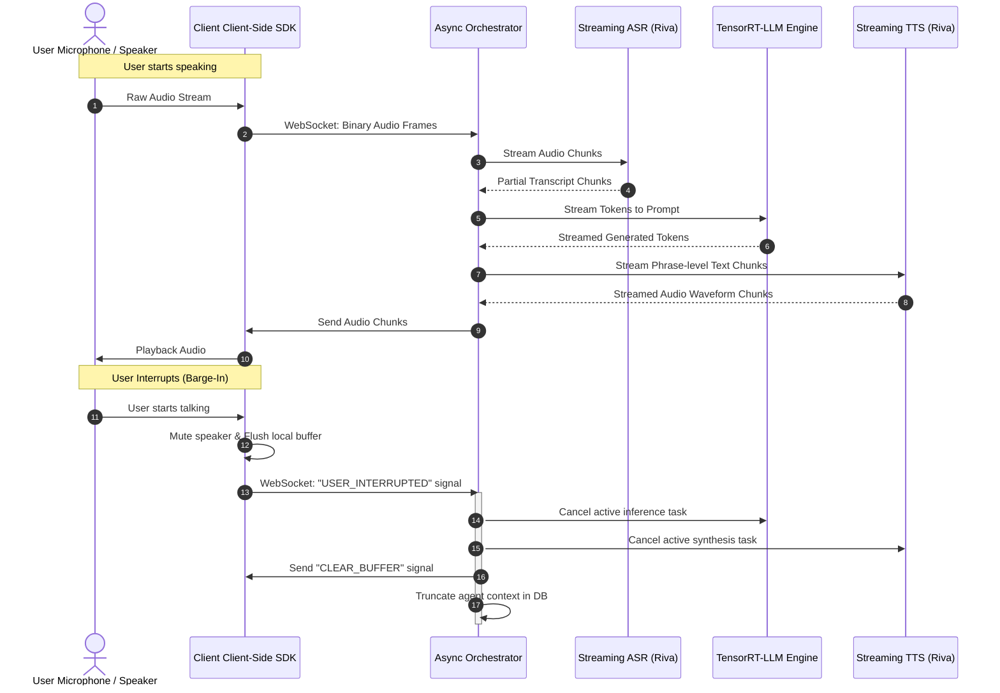

# Low-Latency Voice Agent Architecture (End-to-End Latency < 500ms TTFA)

- **Category**: System Design & Architecture
- **Difficulty**: Hard
- **Target Role**: Senior Speech LLM Engineer / Voice-First AI Architect
- **Source**: NVIDIA Speech AI Team, NeMo & Riva Engineering

---

## 1. Question Description

Design a voice-first agentic conversational system that achieves a human-like, low-latency conversation flow. The primary target is a **Time-to-First-Audio (TTFA) of less than 500 ms** for the system's response under realistic network jitter and server loads. The architecture must natively handle **barge-in (user interruptions)**, dynamically shut down ongoing audio synthesis/playback, manage prompt state, and support cooperative dual-model responder workflows (fast backchanneling vs. deep reasoning).

---

## 2. Low-Latency Voice Agent Architecture

Achieving $\text{TTFA} < 500\text{ ms}$ requires a fully streaming, decoupled pipeline where data flows continuously from the microphone to the speaker. Traditional batch pipelines (where the user speaks, ASR runs on the complete utterance, LLM processes the full prompt, and TTS synthesizes the entire response) lead to sequential latency accumulation, resulting in a TTFA of $2.5\text{--}4.0\text{ seconds}$.

### 2.1 Latency Budget Breakdown
To hit the $500\text{ ms}$ budget, we partition the latency across the pipeline components:

| Component | Operation | Target Latency | Optimization Strategy |
| :--- | :--- | :--- | :--- |
| **VAD (Voice Activity Detection)** | Detect user speech onset / offset. | $20\text{ ms}$ | Frame size of $20\text{ ms}$; lightweight neural VAD (e.g., Silero or WebRTC VAD). |
| **Streaming ASR** | Transcribe streaming audio frames to text. | $120\text{ ms}$ | FastConformer-RNNT model with a $80\text{ ms}$ chunk size and $40\text{ ms}$ lookahead. |
| **Orchestrator Queue / IPC**| Move partial text tokens to LLM. | $10\text{ ms}$ | POSIX shared memory or gRPC streams on host. |
| **LLM Prefill & TTFT** | Generate the first token. | $150\text{ ms}$ | TensorRT-LLM with FP8 quantization, Paged KV Cache, and Prompt Caching. |
| **LLM Decode Chunking** | Generate a text chunk (4-5 words / 1 phrase).| $50\text{ ms}$ | Streaming token generator grouping tokens into syntactically valid speech units. |
| **Streaming TTS** | Convert text chunk to raw audio waveform. | $90\text{ ms}$ | FastPitch (acoustic model) + Vocos/HiFi-GAN (neural vocoder) chunk-based synthesis. |
| **Client Audio Buffer** | Client-side playback buffering. | $30\text{ ms}$ | Jitter buffer tuning with adaptive playback speed adjustments. |
| **Total Cumulative Latency** | **End-to-End Pipeline (TTFA)** | **$\approx 470\text{ ms}$** | **Satisfies the $< 500\text{ ms}$ target.** |

---

## 3. Component Deep Dive

### 3.1 Streaming VAD
* **Mechanism**: VAD processes raw audio frames ($16\text{ kHz}$, $16$-bit PCM mono) in $10\text{ ms}$, $20\text{ ms}$, or $30\text{ ms}$ chunks.
* **Aggressive Thresholding**: For barge-in, we use a hybrid VAD: a lightweight energy-based VAD for ultra-fast initial detection ($<10\text{ ms}$ lag) coupled with a deep-learning VAD (e.g., Silero VAD running on TensorRT) for noise-robust speech confirmation ($<30\text{ ms}$ verification window).
* **State Machine**: Monitors the probability of speech $P(\text{speech})$. 
  * If $P(\text{speech}) > 0.85$ for 2 consecutive frames $\rightarrow$ Trigger immediate audio output mute (Barge-in).
  * If $P(\text{speech}) < 0.15$ for 15 consecutive frames ($300\text{ ms}$) $\rightarrow$ Trigger End-of-Utterance (EoU) and close ASR session.

### 3.2 Streaming ASR
* **Model Choice**: FastConformer-RNNT (Recurrent Neural Network Transducer) or CTC model. FastConformer replaces standard depth-wise separable convolutions with 8x downsampling, reducing computing costs.
* **Streaming Window**: The model processes overlapping audio chunks. We configure the chunk size to $80\text{ ms}$ with a forward lookahead of $40\text{ ms}$. This limits acoustic context latency to $120\text{ ms}$ while preserving Word Error Rate (WER).
* **Incremental Detokenization**: Rather than waiting for sentence boundaries, the ASR decoder emits sub-word tokens immediately to the orchestrator as partial hypothesis streams.

### 3.3 LLM Chunk Decoding
* **The Problem**: A single token (e.g., "The") is too short to produce natural-sounding TTS speech. Waiting for a full sentence introduces hundreds of milliseconds of latency.
* **The Solution**: The orchestrator buffers generated tokens and groups them into **Syntactically Valid Speech Chunks**. A chunk is emitted when a punctuation mark (`,`, `.`, `?`, `!`, `;`) is reached or when the token buffer contains $\geq 4$ words and ends with a non-preposition/non-article token.
* **Speculative Decoding & In-Flight Batching**: TensorRT-LLM schedules prefill and decode tasks dynamically, ensuring that the first token generation (prefill) is not blocked by active decode iterations of other concurrent users.

### 3.4 Streaming TTS (Acoustic Model + Vocoder)
* **Acoustic Model**: FastPitch (non-autoregressive, pitch-predicting) modified for streaming. It takes a text chunk (converted to phonemes) and predicts the mel-spectrogram in a single forward pass.
* **Neural Vocoder**: Triton-optimized Vocos or HiFi-GAN. It converts the generated mel-spectrogram chunks into raw PCM audio buffers.
* **Overlap-and-Add**: To prevent phase discontinuities (clicks/pops) at chunk boundaries, we synthesize mel-spectrograms with a 2-frame overlap ($25\text{ ms}$) and apply a linear fade-in/fade-out crossfade during waveform generation.

### 3.5 Barge-In & Interruption Coordination
* **Interruption Flow**: When the user speaks during the agent's playback:
  1. **Client-Side**: The client VAD detects local speech. It immediately stops local audio playback, flushes the speaker hardware buffer, and sends a `USER_INTERRUPTED` WebSocket signal to the Orchestrator.
  2. **Orchestrator-Side**: Upon receiving the interrupt signal (or when server-side VAD confirms barge-in):
     - Cancels the active LLM generation task.
     - Cancels the active TTS synthesis task.
     - Emits a `CLEAR_QUEUE` signal to the client to wipe any downstream audio frames already in transit.
     - Truncates the agent's conversation history in the session state at the exact word index where the user interrupted.
     - Triggers an immediate ASR session for the new user input.



### 3.6 Dual-Model Responder Architectures
To mask LLM prefill latencies ($150\text{--}250\text{ ms}$), we run a dual-model responder topology:
1. **The Fast Router/Backchannel Model**: A small, ultra-low latency model (e.g., Nemotron-Mini 4B, quantized to FP8) evaluates the user's incoming query. If the query calls for a simple feedback response, or if the main model needs more time, it immediately generates a conversational filler or backchannel (e.g., "Let me pull that up for you...", "Hmm, let's see..."). This generates audio output in $<150\text{ ms}$ while the larger model processes the request.
2. **The Main Reasoning Model**: A larger LLM (e.g., Llama-3-8B or Nemotron-70B) runs in parallel. If the main model generates its response before the backchannel finishes, the orchestrator seamlessly queues the main response immediately after the filler.

---

## 4. Production-Grade Python Async Orchestrator

Below is a complete, production-grade Python async orchestrator showing how to stream data through ASR, LLM, and TTS models while handling clean task cancelation upon user barge-in.

```python
import asyncio
import logging
import time
import uuid
from typing import AsyncGenerator, Dict, List, Optional

# Setup logger
logging.basicConfig(level=logging.INFO, format="%(asctime)s [%(levelname)s] %(threadName)s: %(message)s")
logger = logging.getLogger("VoiceOrchestrator")

class InterruptionException(Exception):
    """Raised when an active streaming pipeline is interrupted by user barge-in."""
    pass

# --- MOCK SYSTEMS FOR DEMONSTRATION ---

class MockASR:
    """Simulates streaming ASR emitting partial transcripts."""
    def __init__(self):
        self.sentences = [
            "what is the temperature",
            "what is the temperature in hanoi right now"
        ]

    async def stream_asr(self, audio_generator: AsyncGenerator[bytes, None]) -> AsyncGenerator[str, None]:
        idx = 0
        try:
            async for _ in audio_generator:
                # Simulate acoustic processing latency
                await asyncio.sleep(0.08)  # 80ms chunk size
                if idx < len(self.sentences):
                    yield self.sentences[idx]
                    idx += 1
                else:
                    yield self.sentences[-1]
        except asyncio.CancelledError:
            logger.info("ASR streaming task cancelled.")
            raise

class MockLLM:
    """Simulates TensorRT-LLM streaming token generation."""
    def __init__(self):
        self.response_tokens = [
            "The", " temperature", " in", " Hanoi", " is", " currently", 
            " 32", " degrees", " Celsius", " with", " high", " humidity", 
            " and", " a", " slight", " chance", " of", " rain."
        ]

    async def generate(self, prompt: str) -> AsyncGenerator[str, None]:
        logger.info(f"LLM starting prefill phase for prompt: '{prompt}'")
        # Prefill phase latency
        await asyncio.sleep(0.15)  # 150ms TTFT
        logger.info("LLM prefill completed. Starting token decode streaming.")
        
        try:
            for token in self.response_tokens:
                # Decode phase latency (ITL ~15ms)
                await asyncio.sleep(0.015)
                yield token
        except asyncio.CancelledError:
            logger.warning("LLM token generation task cancelled in-flight!")
            raise

class MockTTS:
    """Simulates Riva Streaming TTS (Acoustic model + Vocoder)."""
    async def synthesize_chunk(self, text_chunk: str) -> bytes:
        # Acoustic model + Vocoder latency
        # 1 character ~ 10ms of synthesis, base latency ~60ms
        synthesis_time = 0.06 + (len(text_chunk) * 0.002)
        await asyncio.sleep(synthesis_time)
        # Return dummy PCM audio bytes matching the text length
        return b"\x00\x0f" * (len(text_chunk) * 160)

# --- CORE ORCHESTRATOR ---

class VoiceAgentOrchestrator:
    def __init__(self):
        self.asr_service = MockASR()
        self.llm_service = MockLLM()
        self.tts_service = MockTTS()
        
        # Queues for data routing
        self.audio_in_queue: asyncio.Queue[bytes] = asyncio.Queue()
        self.text_chunk_queue: asyncio.Queue[str] = asyncio.Queue()
        self.audio_out_queue: asyncio.Queue[bytes] = asyncio.Queue()
        
        # Task management references
        self.pipeline_tasks: List[asyncio.Task] = []
        self.interrupted_event = asyncio.Event()
        self.is_speaking = False

    async def start_pipeline(self):
        """Spawns concurrent workers for the streaming pipeline."""
        self.interrupted_event.clear()
        self.pipeline_tasks = [
            asyncio.create_task(self._asr_worker(), name="ASRWorker"),
            asyncio.create_task(self._llm_worker(), name="LLMWorker"),
            asyncio.create_task(self._tts_worker(), name="TTSWorker")
        ]
        logger.info("Orchestrator pipeline workers started.")

    async def handle_barge_in(self):
        """Immediately interrupts and cancels all pipeline operations."""
        logger.warning("🚨 BARGE-IN DETECTED! Cancelling active streams.")
        self.interrupted_event.set()
        
        # 1. Cancel all active downstream processing tasks
        for task in self.pipeline_tasks:
            if not task.done():
                logger.info(f"Cancelling task: {task.get_name()}")
                task.cancel()
                
        # Wait for all tasks to settle clean cancellation
        results = await asyncio.gather(*self.pipeline_tasks, return_exceptions=True)
        for res in results:
            if isinstance(res, Exception) and not isinstance(res, asyncio.CancelledError):
                logger.error(f"Error during task cancel transition: {res}")
        
        # 2. Clear all queues to wipe out stale audio frames and text tokens
        while not self.audio_in_queue.empty():
            self.audio_in_queue.get_nowait()
        while not self.text_chunk_queue.empty():
            self.text_chunk_queue.get_nowait()
        while not self.audio_out_queue.empty():
            self.audio_out_queue.get_nowait()
            
        self.is_speaking = False
        self.pipeline_tasks.clear()
        logger.info("Pipeline successfully reset. Ready for new user input.")

    async def feed_audio_input(self, audio_data: bytes):
        """Pushes raw user audio bytes from client connection into ASR pipeline."""
        # Simple client side VAD simulation: if we are speaking and receive high energy audio, trigger barge-in
        if self.is_speaking:
            # In production, check amplitude / VAD packet flags
            has_speech_energy = len(audio_data) > 0  # Simplified check
            if has_speech_energy:
                await self.handle_barge_in()
                return
        
        await self.audio_in_queue.put(audio_data)

    async def _audio_in_generator(self) -> AsyncGenerator[bytes, None]:
        """Bridges the asyncio Queue to an AsyncGenerator for streaming APIs."""
        while not self.interrupted_event.is_set():
            try:
                # Poll queue with timeout to prevent blocking cancellation
                audio_chunk = await asyncio.wait_for(self.audio_in_queue.get(), timeout=0.1)
                yield audio_chunk
            except asyncio.TimeoutError:
                continue
            except asyncio.CancelledError:
                break

    async def _asr_worker(self):
        """Worker that feeds incoming audio stream to ASR and outputs final/partial transcript."""
        try:
            audio_gen = self._audio_in_generator()
            last_transcript = ""
            async for transcript in self.asr_service.stream_asr(audio_gen):
                if transcript != last_transcript:
                    logger.info(f"[ASR Transcript Update]: '{transcript}'")
                    last_transcript = transcript
                    
            # Once user finishes speaking (End-of-Utterance), trigger LLM logic
            if last_transcript:
                await self.text_chunk_queue.put(f"[START_LLM]:{last_transcript}")
        except asyncio.CancelledError:
            logger.info("ASR worker task cancelled clean.")
        except Exception as e:
            logger.error(f"ASR worker error: {e}")

    async def _llm_worker(self):
        """Worker that reads transcript, hits TensorRT-LLM, and chunks outputs for TTS."""
        try:
            while not self.interrupted_event.is_set():
                command = await self.text_chunk_queue.get()
                if command.startswith("[START_LLM]:"):
                    prompt = command.split("[START_LLM]:")[1]
                    
                    token_buffer = []
                    async for token in self.llm_service.generate(prompt):
                        token_buffer.append(token)
                        
                        # Chunking Logic: group by phrase punctuation or word counts
                        # To minimize TTFA, emit the first chunk aggressively (2-3 words)
                        buffer_text = "".join(token_buffer).strip()
                        words = buffer_text.split()
                        
                        # Emit first chunk early to minimize latency
                        if len(words) >= 3 and not self.is_speaking:
                            self.is_speaking = True
                            await self.text_chunk_queue.put(f"[TTS_CHUNK]:{buffer_text}")
                            token_buffer.clear()
                        # Subsequent chunks: group at punctuation boundaries or 5-word limits
                        elif len(words) >= 5 or (words and words[-1][-1] in [".", ",", "!", "?", ";"]):
                            await self.text_chunk_queue.put(f"[TTS_CHUNK]:{buffer_text}")
                            token_buffer.clear()
                            
                    # Flush remaining tokens in the buffer
                    if token_buffer:
                        remaining_text = "".join(token_buffer).strip()
                        if remaining_text:
                            await self.text_chunk_queue.put(f"[TTS_CHUNK]:{remaining_text}")

                elif command.startswith("[TTS_CHUNK]:"):
                    # Pass-through to TTS queue
                    pass
        except asyncio.CancelledError:
            logger.info("LLM worker task cancelled clean.")
        except Exception as e:
            logger.error(f"LLM worker error: {e}")

    async def _tts_worker(self):
        """Worker that listens to text chunks and synthesizes streaming audio."""
        try:
            while not self.interrupted_event.is_set():
                # Read chunks routed by LLM worker
                command = await self.text_chunk_queue.get()
                if command.startswith("[TTS_CHUNK]:"):
                    text_to_synthesize = command.split("[TTS_CHUNK]:")[1]
                    logger.info(f"Synthesizing text chunk: '{text_to_synthesize}'")
                    
                    t_start = time.perf_counter()
                    audio_bytes = await self.tts_service.synthesize_chunk(text_to_synthesize)
                    latency = (time.perf_counter() - t_start) * 1000
                    
                    logger.info(f"TTS Chunk Synced: {len(audio_bytes)} bytes in {latency:.2f}ms")
                    await self.audio_out_queue.put(audio_bytes)
        except asyncio.CancelledError:
            logger.info("TTS worker task cancelled clean.")
        except Exception as e:
            logger.error(f"TTS worker error: {e}")

# --- EXECUTION SIMULATION ---

async def main():
    orchestrator = VoiceAgentOrchestrator()
    await orchestrator.start_pipeline()
    
    # Simulate streaming user audio input
    logger.info("--- Phase 1: User speaks normally ---")
    for i in range(5):
        # Feed dummy user speech audio bytes
        await orchestrator.feed_audio_input(b"\x12\x34" * 1600)
        await asyncio.sleep(0.1)
        
    # Let the pipeline process and start generating speech
    await asyncio.sleep(1.5)
    
    logger.info("--- Phase 2: User interrupts agent mid-response ---")
    # Feed user speech audio frames while agent is actively speaking (is_speaking is True)
    await orchestrator.feed_audio_input(b"\x99\x99" * 1600)
    
    # Wait to observe clean shutdown and queue flushing
    await asyncio.sleep(1.0)
    
    # Restart pipeline for next round
    logger.info("--- Phase 3: Restarting clean session ---")
    await orchestrator.start_pipeline()
    for i in range(3):
        await orchestrator.feed_audio_input(b"\x11\x22" * 1600)
        await asyncio.sleep(0.1)
    await asyncio.sleep(2.0)
    
    # Teardown remaining workers
    for task in orchestrator.pipeline_tasks:
         task.cancel()
    await asyncio.gather(*orchestrator.pipeline_tasks, return_exceptions=True)
    logger.info("Simulation finished.")

if __name__ == "__main__":
    asyncio.run(main())
```

---

## 5. Pro-Tip: How to Impress the Interviewer

* **Coordinate Client-Side Playback Buffers and Server-Side Streams**: Emphasize that streaming TTS audio frames through a network requires an **adaptive jitter buffer** on the client. Explain how you would implement client-side silence-insertion or playback speed modification (e.g., speed up audio by $1.1\times$ dynamically if the buffer is running dry, without changing the pitch) to maintain uninterrupted streaming output.
* **Propose Dual-State Prompt Caching**: Show that you understand LLM memory mechanics. For voice agents, conversation history keeps changing. Explain that you would split the KV Cache into a **static prefix** (e.g., system instructions and tool schemas) which is permanently pinned in GPU memory, and a **dynamic history buffer** managed via Paged KV Cache. This cuts prefill time on every turn.
* **Detail Triton Shared Memory Inter-Process Communication (IPC)**: Standard REST/gRPC calls between system blocks introduce serialization overhead. Suggest using Triton's IPC backend, allowing ASR, LLM, and TTS pods hosted on the same physical node (connected via PCIe Gen5 or NVLink) to read/write output tensors directly from shared GPU memory buffers without host-to-device memory copy rounds.

---

## 6. Advanced Follow-Up Questions & How to Answer

### Q1: What is the impact of thread blocking in Python's async environment when deploying this orchestrator at scale? How do you prevent it?
**Answer**: 
* **The Problem**: In Python, `asyncio` runs on a single thread (due to the Global Interpreter Lock - GIL). If any library calls blocking functions (e.g., standard file system I/O, synchronous network calls, or intensive CPU processing like parsing JSON or detokenizing logits on CPU), the entire event loop freezes. This increases network jitter and blows past the $500\text{ ms}$ TTFA budget.
* **The Fix**: 
  1. Offload all intensive CPU tasks (like tokenization, detokenization, or audio resampling) to native C++ threads or run them in an `asyncio` ThreadPoolExecutor via `await loop.run_in_executor()`.
  2. Implement client/server networks using high-performance, non-blocking web server frameworks like **uvloop** (a fast drop-in replacement for the asyncio event loop written in Cython on top of `libuv`).

### Q2: How do you handle "late-arriving packets" from an cancelled TTS stream after a user barge-in?
**Answer**:
* **The Problem**: Due to network propagation delays, when a user interrupts the agent and the orchestrator cancels the TTS task, some audio frames may already be inside the network socket or the client-side buffer queue. Playing these frames results in the agent speaking for another fraction of a second after the user started talking.
* **The Fix**: 
  1. We assign a unique **Session Generation ID (GenID)** to each generation turn.
  2. Every audio packet streamed from the server to the client contains this GenID.
  3. When a barge-in is triggered, the client immediately increments its local expected GenID and ignores any incoming network packet that carries an older GenID.
  4. The client issues a flushing command to its local speaker API (e.g., calling `snd_pcm_drop` in ALSA or flushing the Web Audio API buffer source) to drop all currently queued audio frames immediately.

### Q3: How do you balance the trade-off between TTS chunk size, audio naturalness, and latency?
**Answer**:
* **The Trade-off**: 
  * Large chunk sizes (e.g., full sentences) allow the TTS acoustic model to predict prosody, intonation, and pitch transitions more naturally since it has complete semantic context. However, latency is high because the system must wait for the LLM to finish generating the sentence.
  * Small chunk sizes (e.g., 2-3 words) minimize latency but lead to robotic-sounding speech, poor sentence-level pitch curves, and audio pops at chunk boundaries.
* **The Solution**: 
  1. **Dynamic Chunking**: We use a small, first chunk (2-3 words) to get audio playing immediately. Subsequent chunks are grouped based on semantic boundaries (e.g., commas, conjunctions) which are typically larger (5-8 words).
  2. **Prosody Conditioning**: We pass the previous chunk's final hidden states (pitch, energy, duration embeddings) as conditioning inputs into the TTS acoustic model for the next chunk, enabling smooth prosody transitions across chunk boundaries.
