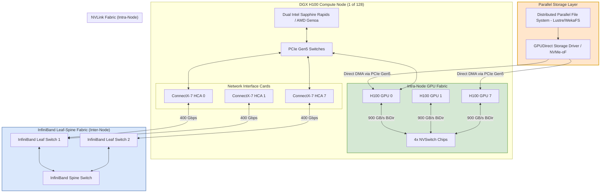

# Designing a Distributed GPU Training Platform for LLMs

- **Category**: System Design
- **Difficulty**: Hard
- **Target Role**: Deep Learning Infrastructure Engineer / Platform Architect / AI Engineer
- **Source**: NVIDIA AI Infrastructure Group Interview Experience
- **Flashcards**: [System Design deck](flash_cards/design/system_design.md)

---

## 1. Question Description

Design a multi-node, multi-GPU distributed training platform capable of training a trillion-parameter Large Language Model (LLM) across 1,024+ NVIDIA H100 SXM5 GPUs ($128\times \text{DGX H100}$ nodes) with high efficiency and fault tolerance.

### Key Requirements
* **Throughput**: Maximize Model FLOPs Utilization (MFU) (target $>50\%$). Eliminate GPU starvation and idle bubbles.
* **Network & Communication**: Design the interconnect fabric (intra-node and inter-node) to support high-frequency gradient and weight synchronization.
* **Storage Ingestion**: Stream datasets from distributed parallel storage to GPU High Bandwidth Memory (HBM3) without CPU or host memory bottlenecks.
* **Fault Tolerance**: Automatically detect, isolate, and recover from hardware failures (GPU, PCIe, NVLink, network switches) within minutes, minimizing training downtime.

---

## 2. High-Level System Architecture

A massive-scale training platform is divided into three planes:
1. **Control & Orchestration Plane**: Allocates compute resources, schedules jobs based on physical topology, and monitors system health.
2. **Data Ingestion Plane**: Streams data from distributed storage directly to GPU HBM3 using GPUDirect Storage (GDS).
3. **Compute & Communication Plane**: Executes forward/backward passes and collective communication (AllReduce, AllGather, ReduceScatter).

### Cluster & Node Architecture (Mermaid)

---

## 3. High-Performance Interconnect & Communication

For distributed training at this scale, communication bandwidth is the primary bottleneck. The system must support two hierarchies of communication:

### 3.1 Intra-Node Communication (NVLink & NVSwitch)
* Inside each DGX H100 node, 8 GPUs are connected via a fully non-blocking **NVIDIA NVLink** fabric powered by 4 NVSwitch chips.
* **Bandwidth**: SXM5 H100 GPUs use 18 NVLinks per GPU, yielding **$900\text{ GB/s}$ bi-directional** ($450\text{ GB/s}$ in each direction) bandwidth per GPU.
* **Mechanism**: Enables high-speed tensor-parallel operations (e.g., column/row parallel linear layers) where parameters and activations must be shared continuously with sub-millisecond latencies.

### 3.2 Inter-Node Communication (InfiniBand & GPUDirect RDMA)
* **Fabric Design**: We construct a non-blocking **Fat-Tree InfiniBand fabric** using **Quantum-2 Switches** (64 ports of $400\text{ Gbps}$ each). To avoid oversubscription, the ratio of leaf-to-spine bandwidth is kept at $1:1$.
* **Network density**: Each DGX H100 node houses **8x ConnectX-7 $400\text{ Gbps}$ HCAs** (1 HCA per GPU).
* **GPUDirect RDMA**: ConnectX-7 HCAs bypass CPU host memory entirely by initiating Direct Memory Access (DMA) over the PCIe Gen5 bus directly to GPU HBM3. This drops latency from $\approx 15\text{ }\mu\text{s}$ (with CPU copies) to **$< 2\text{ }\mu\text{s}$**.
* **NVIDIA SHARP (Scalable Hierarchical Aggregation and Reduction Protocol)**: Collective operations (e.g., `AllReduce`) are offloaded to ASIC processors inside the Quantum-2 switches. Instead of sending gradients back and forth across GPUs, the switches aggregate the tensors in-transit. This reduces network packet traffic by **$2\times$** and frees up GPU compute cycles.

---

## 4. Parallelism Strategies (3D Parallelism & ZeRO)

A 1-Trillion Parameter model cannot fit on a single GPU's memory. Even representing weights in FP16 requires $2\text{ TB}$. We analyze the memory footprint and implement **3D Parallelism** combined with the **Zero Redundancy Optimizer (ZeRO)**.

### 5.1 Memory Footprint Analysis
Let $N = 10^9$ (parameters). Using mixed-precision (FP16/FP32 Adam) training:
* **Model Parameters**: $2N\text{ bytes} = \mathbf{2\text{ TB}}$ (FP16)
* **Gradients**: $2N\text{ bytes} = \mathbf{2\text{ TB}}$ (FP16)
* **Optimizer States (Adam)**: $\mathbf{12\text{ TB}}$ (FP32 master weights: $4N$, momentum: $4N$, variance: $4N$)
* **Total Static Memory**: $\mathbf{16\text{ TB}}$ (excluding activation memory)

### 5.2 3D Parallelism Configuration
We distribute the workload using Megatron-LM style 3D Parallelism:
1. **Tensor Parallelism (TP)**: Set $\text{TP}=8$ (splits layers across the 8 GPUs inside a single DGX node over NVLink).
2. **Pipeline Parallelism (PP)**: Set $\text{PP}=16$ (splits layers sequentially across 16 nodes). We mitigate the pipeline bubble using the **1F1B (One Forward, One Backward)** schedule, overlapping activation communication with backward pass compute.
3. **Data Parallelism (DP) with ZeRO-1 (Optimizer State Sharding)**: Set $\text{DP}=8$ ($1,024\text{ GPUs} / (\text{TP}\cdot\text{PP}) = 8$). ZeRO-1 shards the $12\text{ TB}$ of Adam optimizer states across the 8 data-parallel replicas, reducing optimizer memory from $1.5\text{ TB}$ per node to $\approx 187\text{ GB}$ per node.

---

## 5. Storage & Ingestion: Bypassing the CPU Bottleneck

* **GPUDirect Storage (GDS)**:
  * In standard IO pipelines, data travels from NVMe drives $\to$ OS Page Cache (CPU RAM) $\to$ GPU memory. This saturates the PCIe bus, wastes host memory bandwidth, and consumes up to $80\%$ of host CPU cores.
  * GDS establishes a direct path via PCIe Gen5 switches between the NVMe-over-Fabrics (NVMe-oF) storage adapter and GPU HBM3, reducing latency and achieving up to **$215\text{ GB/s}$** read bandwidth per DGX node.
* **Async Multi-Threaded Prefetching**:
  * Training data is stored as sharded, uncompressed sequential files (e.g., $100\text{--}500\text{ MB}$).
  * The ingestion framework reads ahead the next $5$ steps of training data asynchronously into a pinned CPU buffer, then uses GDS to pull it to the GPU right before the forward pass, hiding storage latency.

---

## 6. Failure Mode and Effects Analysis (FMEA)

| Failure Mode | Root Cause | Impact | Mitigation Strategy |
| :--- | :--- | :--- | :--- |
| **Straggler Node** | GPU thermal throttling (clocks drop from $1500\text{ MHz}$ to $900\text{ MHz}$) or PCIe lane degradation (Gen5 to Gen1). | The entire cluster slows down to match the speed of the straggler due to synchronous `AllReduce` operations. | Host agent runs periodic diagnostics (e.g., via `dcgmPMGetMetrics`). If a GPU's clock frequency remains low or PCIe bandwidth drops below $50\text{ GB/s}$, the node scheduler marks the node as unhealthy, drains it, and transfers the workload. |
| **InfiniBand Link Degradation** | Loose fiber transceiver, cable bending, switch port errors. | NCCL Ring collapses; communication timeout occurs; training crashes. | Configure adaptive routing and dynamic path recalculation on Quantum switches. If packet loss/errors exceed a threshold, NCCL dynamically routing around the degraded link via alternative network paths. |
| **Silent Data Corruption (SDC)** | GPU Tensor Core hardware fault, cosmic ray bit flips. | Loss function diverges to `NaN` or model weights degrade silently, wasting days of compute. | 1. Implement periodic check-runs (running deterministic micro-batches). 2. Run real-time gradient norm checks: if $||\nabla w||_2 > \text{threshold}$, pause training and run hardware diagnostics. 3. Leverage GPU parity/ECC memory checks. |
| **Checkpoint Congestion** | 1,024 GPUs writing $16\text{ TB}$ of states to Lustre simultaneously. | Storage network becomes saturated, halting training for $30\text{--}45\text{ minutes}$. | **Double-Buffered Host Memory Staging**: Write checkpoints locally to node NVMe SSDs in parallel ($\approx 2.5\text{ GB/s}$ per drive, taking $<15\text{ seconds}$). Resume training immediately while a background service slowly streams the checkpoint from the NVMe drives to Lustre over the network. |

---

## 7. Pro-Tip: How to Impress the Interviewer

* **Calculate and Maximize Model FLOPs Utilization (MFU)**: Do not just talk about raw throughput. Show the math for MFU. Explain that MFU represents the ratio of actual hardware FLOPs performed during training to the theoretical peak compute capability of the GPUs. Detail how you would use **FlashAttention-3**, FP8 FP-Precision scaling, and activation checkpointing to push MFU from the standard $35\%$ up to $55\%$.
* **Address NCCL Network Tuning**: Show deep knowledge of NCCL parameters. Explain how configuring environment variables like `NCCL_CROSS_NIC=1` (enables multi-HCA routing), `NCCL_BUFFSIZE=4194304` (sets the ring buffer size to $4\text{ MB}$ to match high-bandwidth pipelines), and enabling SHARP via `NCCL_COLLNET_ENABLE=1` are vital for optimal performance.
* **Explain Memory-Efficient Optimizers**: Demonstrate knowledge of 8-bit optimizers (e.g., bitsandbytes AdamW) and how they can reduce the optimizer state footprint from $12\text{ TB}$ down to $\approx 3\text{ TB}$, drastically reducing communication volumes and network pressure.

---

## 8. Common Follow-Up Questions & How to Answer

### Q1: Explain NCCL Ring vs. Tree collective algorithms and how the library chooses.
**Answer**: 
* **Ring Algorithm**: Tensors are split into chunks and circulated around a logical ring. Total data transferred per GPU for an `AllReduce` is $2(N-1)/N \cdot S$ where $S$ is tensor size and $N$ is the number of GPUs. It is highly bandwidth-efficient for **large tensors** but has high latency (scales linearly with $N$).
* **Tree Algorithm**: Tensors are reduced up a double-binary tree and then broadcast back down. Latency scales logarithmically ($\log N$), making it optimal for **small tensors** or very large node counts.
* NCCL dynamically measures inter-node latency during initialization and switches between Ring and Tree based on tensor size (e.g., switching to Ring when tensor size exceeds $16\text{ MB}$).

### Q2: What happens if you experience a network collision or packet drop on a RoCE v2 cluster vs. InfiniBand?
**Answer**: 
* **InfiniBand**: Leverages credit-based flow control at the link layer. A sender only transmits when the receiver has buffer space. This guarantees zero packet loss due to buffer overflow.
* **RoCE v2**: Relies on Ethernet, which is lossy. To make it lossless, we must enable **PFC (Priority Flow Control)** to send PAUSE frames when switch buffers fill, and **ECN (Explicit Congestion Notification)** to mark packets when congestion is detected, allowing the sender to throttle its rate (DCQCN algorithm). If PFC is misconfigured, packet loss occurs, triggering Go-Back-N retransmissions at the transport layer, causing NCCL timeouts and slashing training performance to near-zero.

### Q3: How do you optimize memory consumption during LLM training without offloading to CPU?
**Answer**: 
1. **Activation Checkpointing (Recomputation)**: We discard activations computed during the forward pass and recalculate them during the backward pass. This reduces activation memory from $\mathcal{O}(L)$ (where $L$ is the number of transformer layers) to $\mathcal{O}(\sqrt{L})$.
2. **FlashAttention-3**: Computes attention on-chip in the GPU SRAM without materializing the intermediate $S \times S$ attention matrix to global HBM3, saving $\approx 50\text{--}80\%$ of activation memory.
3. **Sequence Parallelism**: Extends Tensor Parallelism by splitting activations along the sequence length dimension for layers that are not split by standard TP (such as LayerNorm and Dropout).
