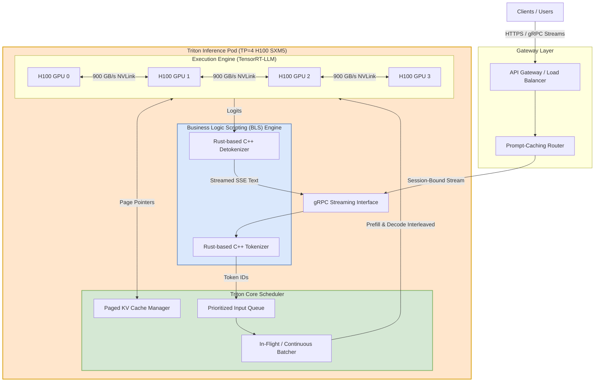

# Designing a Scalable Model Inference Platform with Triton

- **Category**: System Design
- **Difficulty**: Hard
- **Target Role**: MLOps Engineer / Infrastructure Engineer / AI Platform Architect
- **Source**: NVIDIA Triton Team Interview Experience, Glassdoor

---

## 1. Question Description

Design a production-grade inference service to serve a Large Language Model (e.g., Llama-3 70B) under high-throughput and strict latency constraints, supporting 5,000 active concurrent user sessions.

### Key Performance Indicators (KPIs)
* **Latency Budgets**:
  * **Time-to-First-Token (TTFT)**: $p99 \text{ latency} < 100\text{ ms}$ (prefill phase).
  * **Inter-Token Latency (ITL)**: $p99 \text{ latency} < 25\text{ ms}$ per token (decode phase).
* **Throughput**: $>100 \text{ tokens/sec/GPU}$.
* **Cost Efficiency**: Maximize GPU High Bandwidth Memory (HBM) and Tensor Core utilization (aim for $>80\%$ average load).

---

## 2. High-Level System Architecture

To achieve low-latency LLM serving, we leverage **NVIDIA Triton Inference Server** integrated with the **TensorRT-LLM** backend. The system uses a decoupled Gateway-Compute model, utilizing dynamic in-flight batching and shared memory IPC.

### Request Lifecycle & Triton Pipeline (Mermaid)



---

## 3. Core Engine Mechanics & Latency Optimizations

Serving LLMs presents a dual bottleneck: the **Prefill** phase is compute-bound (matrix multiplications over the prompt), while the **Decode** phase is memory-bandwidth bound (generating one token at a time requires loading all model weights from HBM to SRAM).

### 3.1 In-Flight Batching (Continuous Batching)
* **The Problem**: Traditional dynamic batching groups incoming requests at the API boundary. In LLMs, requests have highly variable sequence lengths. The generation loops at the speed of the longest request, leaving other GPUs idle during early terminations.
* **The Solution**: **In-Flight Batching** schedules requests at the iteration level. At each generation step, finished requests are ejected from the batch, and new prefill tasks are inserted into the running batch. This increases GPU throughput by **$3\text{--}4\times$**.

```
Iteration 1: [Req A (Prefill)] [Req B (Decode)] [Req C (Decode)]
Iteration 2: [Req A (Decode)]  [Req B (Decode)] [Req D (Prefill)] <-- Req C finished, Req D inserted
```

### 3.2 Paged KV Cache Management
* During generation, Key-Value (KV) matrices of preceding tokens are saved to avoid redundant calculations.
* **The Problem**: Traditional static allocation reserves contiguous blocks matching the maximum context length (e.g., $4096$ tokens). This wastes up to $60\%$ of GPU memory due to internal/external fragmentation.
* **The Solution**: **Paged KV Cache** divides the KV cache into fixed-size virtual pages (e.g., $64$ tokens per page). As new tokens are generated, the Paged KV Cache Manager maps virtual pages to non-contiguous physical pages in GPU memory, eliminating fragmentation and raising batch capacity.

---

## 4. Pipeline Design: BLS vs. Ensembling
Triton's standard Ensemble model is a static Directed Acyclic Graph (DAG) that does not support loops or state. To handle token-by-token streaming, we implement **Business Logic Scripting (BLS)**:
* **Implementation**: We write a C++ or Rust-based custom backend. It tokenizes the input prompt, communicates with the TensorRT-LLM model, intercepts the resulting logits, detokenizes them, and streams tokens back to the gRPC client in real-time.
* **Zero-Copy IPC**: The BLS backend maps the input/output tensors using POSIX shared memory or CUDA IPC. This prevents serializing and copying tensors across process boundaries.

---

## 5. Back-of-the-Envelope Math

Let's compute the sizing requirements for serving a Llama-3 70B model at FP16/BF16 precision on H100 GPUs (HBM3 bandwidth $3.35\text{ TB/s}$).

### 5.1 Static Memory Footprint (Weights)
$$\text{Weights Memory} = 70 \times 10^9 \text{ parameters} \times 2 \text{ bytes (BF16)} = \mathbf{140\text{ GB}}$$

### 5.2 KV Cache Footprint (Per Token)
For Llama-3 70B ($N_{\text{layers}}=80$, $N_{\text{heads}}=8$ (using Grouped Query Attention), $d_{\text{head}}=128$):
$$\text{Memory/Token} = 2 \times N_{\text{layers}} \times N_{\text{heads}} \times d_{\text{head}} \times 2 \text{ bytes (BF16)}$$
$$\text{Memory/Token} = 2 \times 80 \times 8 \times 128 \times 2 = 327,680 \text{ bytes} \approx \mathbf{320\text{ KB}}$$
For a batch size of $B=128$ with an average sequence length of $2048$ tokens:
$$\text{Total KV Cache} = 128 \times 2048 \times 320\text{ KB} \approx \mathbf{83.88\text{ GB}}$$
$$\text{Total Active Memory} = 140\text{ GB (Weights)} + 83.88\text{ GB (KV Cache)} = \mathbf{223.88\text{ GB}}$$

### 5.3 Decode Memory-Bandwidth Bottleneck Analysis
Generating one token requires reading all weights ($140\text{ GB}$) from GPU memory.
* For $B=1$ (single user request):
  $$\text{Latency} = \frac{140\text{ GB}}{3.35\text{ TB/s}} = \mathbf{41.79\text{ ms}}$$
  * *Result*: Since $41.79\text{ ms} > 25\text{ ms}$ (our target ITL), we cannot meet the latency requirement with single-request sequential decodes on a single H100.
* For $B=128$ (batched requests, sharded via $\text{TP}=4$ H100 GPUs):
  Aggregate HBM3 Bandwidth: $4 \times 3.35\text{ TB/s} = 13.4\text{ TB/s}$.
  $$\text{Weight Read Latency} = \frac{140\text{ GB}}{13.4\text{ TB/s}} \approx \mathbf{10.45\text{ ms}}$$
  $$\text{Tensor Core FP16 Math} \approx \frac{2 \times 70 \times 10^9 \text{ params} \times 128 \text{ batch}}{4 \times 989 \times 10^{12} \text{ TFLOPS}} \approx \mathbf{4.53\text{ ms}}$$
  $$\text{Total Decode Latency/Token} \approx 10.45\text{ ms} + 4.53\text{ ms} \approx \mathbf{14.98\text{ ms}}$$
  * *Result*: By sharding via $\text{TP}=4$ and batching, we reduce the per-token decode latency to $\approx 15\text{ ms}$, satisfying the $<25\text{ ms}$ ITL budget.

---

## 6. Failure Mode and Effects Analysis (FMEA)

| Failure Mode | Root Cause | Impact | Mitigation Strategy |
| :--- | :--- | :--- | :--- |
| **KV Cache Exhaustion (OOM)** | Sudden burst of long-prompt inputs; physical pages saturated. | Requests crash; server crashes with CUDA OOM. | Implement **Request Preemption**. The Triton scheduler preempts the lowest-priority request. It halts its generation and either:<br>1. **Swaps**: Transfers its KV Cache pages to CPU RAM ($H2D$ over PCIe).<br>2. **Recomputes**: Discards its KV Cache and re-runs the prefill phase later once capacity is restored. |
| **Python Tokenizer Memory Leak** | HuggingFace Python tokenizers used inside Python BLS scripts. | Slow memory leak over millions of requests; container crashes. | Do not run tokenizers in the Python backend. Rewrite the tokenizer using the **Rust/C++ tokenizer binding** and load it via a native C++ Triton backend. |
| **Shared Memory Handle Leak** | Client crashes abruptly during a CUDA IPC shared memory session. | Host system runs out of virtual memory handles over time. | Host a daemon process on Triton that monitors client PIDs. If a client PID dies without clean unmapping, the daemon runs `cudaIpcCloseMemHandle` and reclaims the shared memory blocks. |
| **Prefill Stragglers** | Large prompt prefill ($>4096$ tokens) enters the batch during decode. | ITL of all currently active decode sessions spikes to $>100\text{ ms}$. | Implement **Chunked Prefill**. Break the large prefill request into chunks of $512$ tokens. Interleave these chunks with the decode iterations of existing requests, preventing large compute spikes. |

---

## 7. Pro-Tip: How to Impress the Interviewer

* **Propose Speculative Decoding**:
  * Explain how you would optimize latency using Speculative Decoding. Pair a small "draft model" (e.g., Llama-3 8B) with the target "oracle model" (Llama-3 70B).
  * The draft model generates $K$ tokens sequentially (fast, since the model is small). The oracle model verifies all $K$ tokens in a *single parallel batch step*. If the first $M$ tokens ($M \leq K$) are accepted, we append them and discard the rest. This can increase throughput by **$2\text{--}3\times$** while maintaining mathematical equivalence.
* **Detail Prompt Caching**:
  * Explain that system prompts (e.g., custom instructions for chatbots) are identical across sessions.
  * You can save these KV caches in a global hash map (Prompt Cache). When a new request arrives, Triton checks the hash of the prompt. If there's a match, it loads the pre-computed KV Cache pages directly, cutting TTFT from $80\text{ ms}$ to **$<5\text{ ms}$**.

---

## 8. Common Follow-Up Questions & How to Answer

### Q1: How does Tensor Parallelism split Attention layers in Llama?
**Answer**: Llama uses Megatron-LM style Tensor Parallelism:
* **Self-Attention**: The Query ($Q$), Key ($K$), and Value ($V$) projection weight matrices are split column-wise across the $N$ GPUs. Each GPU computes its attention heads independently. The Output projection matrix ($O$) is split row-wise. Each GPU computes its projection, and a single `AllReduce` operation sums the outputs.
* **MLP**: The gate and up-projection matrices ($W_{gate}$, $W_{up}$) are split column-wise, and the down-projection ($W_{down}$) is split row-wise, requiring another `AllReduce`.

### Q2: How do you profile Triton bottlenecks under load?
**Answer**:
1. We use **Triton Model Analyzer** to automate load generation and plot the latency-vs-throughput curves across different batch sizes, model instances, and quantization schemes.
2. We run **NVIDIA Nsight Systems** to profile execution at the microsecond level, verifying whether Tensor Core kernels are executing, checking for NVLink communication stalls, and monitoring Host-to-Device memory copy overheads.

### Q3: What is the difference between Stateless and Stateful routers in LLM serving?
**Answer**: 
* **Stateless Router**: Routes requests randomly or via round-robin. This is simple but doesn't optimize for prompt caching.
* **Stateful Router (Session-affinity)**: Routes a client session to the specific Triton pod that previously processed that client's request. This ensures that the user's conversation history is already stored in that pod's Paged KV Cache, bypassing redundant prefill computations.
