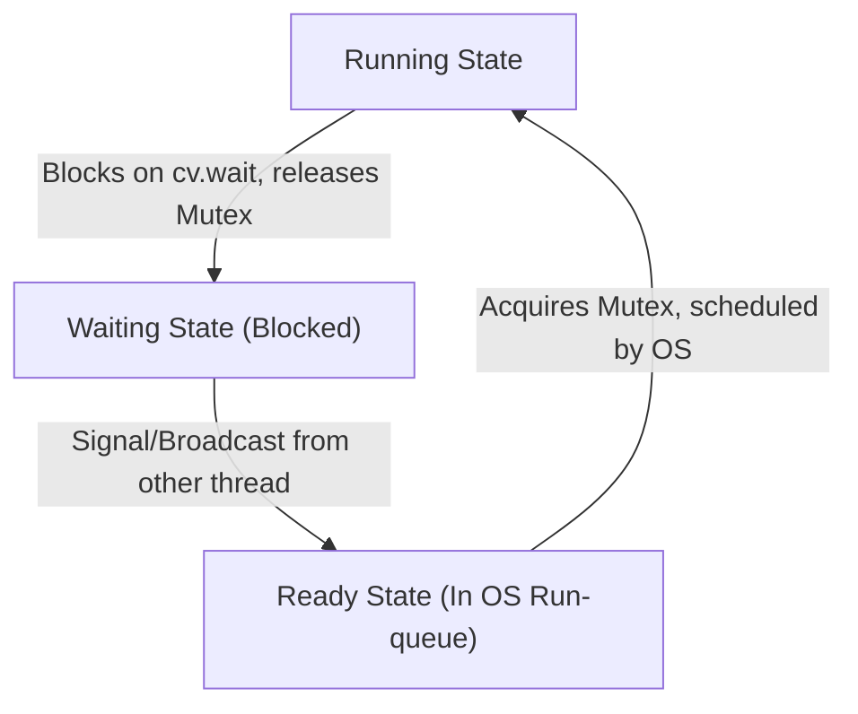

# Thread-Safe Bounded Queue (Producer-Consumer Pattern) in C++

**Category**: Multithreading & Concurrency
**Difficulty**: Medium / Hard
**Target Role**: Low-Level Developer / Systems Engineer / C++ Platform Engineer

---

## Question Description

Implement a thread-safe, bounded (fixed-capacity) FIFO queue in C++ to solve the **Producer-Consumer** problem. The queue must support multiple producers and consumers, handle graceful shutdown, and prevent deadlocks and busy-waiting.

1. **Circular Buffer Optimization**: Avoid dynamic heap allocations during runtime execution by using a circular ring buffer (vector-backed) rather than `std::queue` (which relies on node allocation).
2. **Graceful Shutdown**: Ensure that all waiting threads terminate cleanly when the queue is shut down.
3. **Lock & Scheduling Analysis**: Detail the hardware costs of mutexes, spurious wakeups, and OS context switches.

---

## 1. Optimized C++ Class Implementation

This implementation pre-allocates memory for the queue in the constructor, keeping cache lines hot and preventing memory fragmentation during execution.

```cpp
#include <iostream>
#include <vector>
#include <mutex>
#include <condition_variable>
#include <thread>
#include <stdexcept>
#include <utility>

template <typename T>
class ThreadSafeBoundedQueue {
private:
    std::vector<T> buffer_;
    const size_t capacity_;
    size_t head_ = 0;
    size_t tail_ = 0;
    size_t size_ = 0;

    std::mutex mutex_;
    std::condition_variable cv_not_full_;
    std::condition_variable cv_not_empty_;
    bool is_shutdown_ = false;

public:
    explicit ThreadSafeBoundedQueue(size_t capacity) 
        : capacity_(capacity) {
        if (capacity == 0) {
            throw std::invalid_argument("Capacity must be greater than 0");
        }
        buffer_.resize(capacity);
    }

    ~ThreadSafeBoundedQueue() {
        Shutdown();
    }

    // Disable copy/move semantics to guarantee address stability of mutexes
    ThreadSafeBoundedQueue(const ThreadSafeBoundedQueue&) = delete;
    ThreadSafeBoundedQueue& operator=(const ThreadSafeBoundedQueue&) = delete;
    ThreadSafeBoundedQueue(ThreadSafeBoundedQueue&&) = delete;
    ThreadSafeBoundedQueue& operator=(ThreadSafeBoundedQueue&&) = delete;

    // Push item (blocks if queue is full)
    bool Push(const T& item) {
        std::unique_lock<std::mutex> lock(mutex_);

        // Wait until there is space, or we shutdown
        cv_not_full_.wait(lock, [this]() {
            return size_ < capacity_ || is_shutdown_;
        });

        if (is_shutdown_) {
            return false;
        }

        buffer_[tail_] = item;
        tail_ = (tail_ + 1) % capacity_; // Stride optimization: if capacity is 2^k, use: (tail_ + 1) & (capacity_ - 1)
        size_++;

        // Notify one waiting consumer
        cv_not_empty_.notify_one();
        return true;
    }

    // Push item (Move version for temporary objects)
    bool Push(T&& item) {
        std::unique_lock<std::mutex> lock(mutex_);

        cv_not_full_.wait(lock, [this]() {
            return size_ < capacity_ || is_shutdown_;
        });

        if (is_shutdown_) {
            return false;
        }

        buffer_[tail_] = std::move(item);
        tail_ = (tail_ + 1) % capacity_;
        size_++;

        cv_not_empty_.notify_one();
        return true;
    }

    // Pop item (blocks if queue is empty)
    bool Pop(T& val) {
        std::unique_lock<std::mutex> lock(mutex_);

        // Wait until not empty, or shutdown
        cv_not_empty_.wait(lock, [this]() {
            return size_ > 0 || is_shutdown_;
        });

        // If shutdown and no remaining items to process, return false
        if (is_shutdown_ && size_ == 0) {
            return false;
        }

        val = std::move(buffer_[head_]);
        head_ = (head_ + 1) % capacity_;
        size_--;

        // Notify one waiting producer
        cv_not_full_.notify_one();
        return true;
    }

    // Gracefully wake up all blocked threads and terminate operations
    void Shutdown() {
        {
            std::lock_guard<std::mutex> lock(mutex_);
            if (is_shutdown_) return;
            is_shutdown_ = true;
        }
        // Notify all threads to unblock them from wait states
        cv_not_empty_.notify_all();
        cv_not_full_.notify_all();
    }

    size_t Size() {
        std::lock_guard<std::mutex> lock(mutex_);
        return size_;
    }

    bool IsEmpty() {
        std::lock_guard<std::mutex> lock(mutex_);
        return size_ == 0;
    }
};

// ============================================================================
// Verification and Multi-threaded Test Execution
// ============================================================================
int main() {
    const size_t queueCapacity = 5;
    ThreadSafeBoundedQueue<int> queue(queueCapacity);

    std::vector<std::thread> producers;
    std::vector<std::thread> consumers;

    // 3 Producers pushing 15 values each
    for (int i = 0; i < 3; ++i) {
        producers.emplace_back([&queue, i]() {
            for (int j = 0; j < 15; ++j) {
                int val = i * 100 + j;
                if (!queue.Push(val)) {
                    break; // Queue shut down
                }
                std::this_thread::sleep_for(std::chrono::milliseconds(5));
            }
        });
    }

    // 2 Consumers popping values
    for (int i = 0; i < 2; ++i) {
        consumers.emplace_back([&queue, i]() {
            int val;
            while (queue.Pop(val)) {
                std::cout << "[Consumer " << i << "] Popped: " << val << std::endl;
                std::this_thread::sleep_for(std::chrono::milliseconds(10));
            }
            std::cout << "[Consumer " << i << "] Queue shutdown. Exiting.\n";
        });
    }

    // Join producers
    for (auto& t : producers) {
        t.join();
    }

    // Allow consumers to drain the queue before shutting down
    std::this_thread::sleep_for(std::chrono::milliseconds(100));
    std::cout << "Producers complete. Calling Shutdown()...\n";
    queue.Shutdown();

    // Join consumers
    for (auto& t : consumers) {
        t.join();
    }

    std::cout << "All execution threads terminated successfully.\n";
    return 0;
}
```

---

## 2. Lock Analysis: `std::unique_lock` vs. `std::lock_guard`

*   **`std::lock_guard`**: A lightweight, non-copyable RAII wrapper that acquires the mutex on construction and releases it on destruction. It has zero overhead but cannot be unlocked manually.
*   **`std::unique_lock`**: An advanced RAII wrapper that tracks lock ownership via an internal boolean flag. It supports manual unlocking/relocking (`lock.unlock()`), deferred locking, and timing locks.
*   **Condition Variable Requirement**: `std::condition_variable::wait()` requires a `std::unique_lock<std::mutex>&`. This is because the wait operation must **atomically release the mutex** while placing the thread to sleep, and then **re-acquire the mutex** upon waking up. `std::lock_guard` does not provide this flexibility.

---

## 3. Deep Dive: Spurious Wakeups & Loop Conditions

A **Spurious Wakeup** occurs when a thread waiting on a condition variable is scheduled to run by the OS kernel even though no other thread called `notify_one()` or `notify_all()`.



### Why Spurious Wakeups Happen:
1.  **OS Kernel Efficiency**: Under the hood (e.g., POSIX threads `pthread_cond_wait`), implementing wakeups without spurious triggers requires expensive synchronization across kernel scheduling cores. Allowing rare spurious wakeups enables lighter kernel scheduling code.
2.  **LSU Race Conditions**: A thread may be properly notified of an empty space, but before it wakes up and re-acquires the lock, a third thread steals the lock and inserts/extracts an item. When the notified thread wakes up, the condition is no longer met.

### Prevention:
We must always verify the condition inside a `while` loop (or use the lambda predicate version of `wait` which does this internally):
```cpp
while (size_ == capacity_) {
    cv_not_full_.wait(lock);
}
```
Using an `if` statement would allow a spuriously woken thread to overwrite data in a full buffer or pop from an empty buffer, leading to memory corruption or undefined behavior.

---

## 4. Context Switching Overhead

When a thread blocks on a condition variable:
1.  **Thread State Transition**: The thread moves from **Running** to **Waiting**.
2.  **State Save (TCB)**: The OS kernel saves the thread's CPU state (Program Counter, stack pointer, general-purpose registers) to its Thread Control Block (TCB).
3.  **Kernel Scheduler Dispatch**: The scheduler loads the state of a thread from the **Ready** queue.
4.  **Hardware Costs**:
    *   **Cache Pollution**: The L1/L2 data and instruction caches become cold because the incoming thread loads new memory addresses, causing cache evictions.
    *   **TLB (Translation Lookaside Buffer) Misses**: If the switch is between different processes, the MMU page table pointer (CR3 on x86-64) is rewritten, invalidating TLB entries. For threads in the same process, TLB misses are lower but still occur for local stacks.
5.  **Latency Cost**: An OS context switch typically takes $1 - 5\text{ microseconds}$ of CPU execution, but recovering cache state can take up to $10 - 50\text{ microseconds}$ of degraded performance.

---

## 5. Common Follow-Up Questions & How to Answer

### Q1: What if this queue needs to be resized dynamically during runtime?
**A**: Dynamic resizing is highly disruptive to thread-safe collections.
1.  We must acquire a write-lock that prevents all Push and Pop operations (e.g., locking the primary mutex).
2.  Allocate a new buffer with the requested size, copy/move existing items in order from the old circular buffer (starting at `head_` to `tail_`), reset indices (`head_ = 0`, `tail_ = size_`), and swap the buffers.
3.  Because this blocks all concurrent workers, resizing should be done in batch phases or avoided by pre-allocating the maximum expected capacity.

### Q2: How can we reduce lock contention in highly concurrent environments?
**A**:
*   **Dual Lock Queue**: Use separate locks for the head (consumers) and tail (producers) of the queue. This allows a producer and a consumer to access the queue concurrently. However, managing the edge case where the queue is empty/has one element requires careful atomic coordination (e.g., dummy node techniques).
*   **Lock-Free Queue**: Transition to lock-free designs using atomic operations (like CAS).

### Q3: How do you prevent priority inversion in a real-time OS when threads block on this queue?
**A**: If a low-priority thread holds the queue mutex, and a high-priority thread tries to acquire it, the high-priority thread blocks. If a medium-priority thread preempts the low-priority thread, the high-priority thread is indirectly starved (Priority Inversion).
*   **Solution**: Enable **Priority Inheritance** on the mutex. The OS kernel temporarily boosts the priority of the low-priority lock holder to match the priority of the blocked high-priority thread.

---

## 6. Python Integration & GIL Context

Translating the Producer-Consumer pattern and thread-safe queues to Python requires understanding the limitations of the Global Interpreter Lock (GIL) and how to bypass them.

### 1. The GIL and Thread Serialization
Python's standard library provides `queue.Queue` (a thread-safe bounded FIFO queue).
*   **The Constraint**: Standard Python threads (from the `threading` module) are execution-serialized by the GIL. Even on a multi-core CPU, only one thread can execute Python bytecode at any given moment.
*   **Performance Impact**: In a pure Python producer-consumer implementation, there is no physical parallel execution. Threads will yield control (e.g., when blocked on I/O or explicitly sleeping), but lock contention and interpreter switching overhead will prevent high-performance execution.

### 2. Bypassing the GIL in High-Performance Pipelines

#### A. Multiprocessing
To achieve true parallel execution across multiple CPU cores, Python developers use `multiprocessing.Queue`.
*   **Mechanics**: This architecture spawns separate OS processes, each running its own Python interpreter and maintaining its own GIL. 
*   **Overhead**: Communication between processes requires serializing (pickling) data, transferring it over IPC pipes/sockets, and deserializing it on the consumer side. This makes `multiprocessing.Queue` significantly slower than C++ memory-mapped transfers for small objects.

#### B. C++ Extensions and `pybind11`
A highly effective pattern in AI and systems engineering (such as PyTorch's data loaders) is to implement the queue in C++ and expose it to Python via `pybind11`.
*   **GIL Release**: Inside the C++ binding wrapper, you must explicitly release the GIL before executing blocking queue operations:
    ```cpp
    // pybind11 wrapper snippet
    py::class_<ThreadSafeBoundedQueue<DataFrame>>(m, "BoundedQueue")
        .def("push", [](ThreadSafeBoundedQueue<DataFrame>& q, DataFrame df) {
            // Release GIL while waiting on the condition variable
            py::gil_scoped_release release;
            return q.Push(std::move(df));
        })
        .def("pop", [](ThreadSafeBoundedQueue<DataFrame>& q) {
            DataFrame df;
            {
                py::gil_scoped_release release;
                q.Pop(df);
            } // Re-acquires GIL on scope destruction to construct Python return object
            return df;
        });
    ```
*   By releasing the GIL, the Python thread blocks in the C++ runtime on the condition variable (`cv_not_empty_.wait`), allowing the Python interpreter to execute other Python threads.

#### C. Asyncio Queues for Single-Threaded Concurrency
If CPU-bound parallelism is not needed, `asyncio.Queue` is used.
*   **No OS Threads**: `asyncio` is single-threaded and event-loop driven.
*   **No Locks**: Since it runs on a single thread, it does not use OS mutexes or condition variables. Instead, it yields control using Python coroutines (`await queue.put(item)`, `await queue.get()`). Spurious wakeups and context-switching overhead are eliminated.

---

## 7. Pro-Tip: How to Impress the Interviewer

*   **Terms to Use**: "Circular Ring Buffer vs. Dynamic Allocation", "Thread Control Block (TCB)", "Cache Coldness / Cache Eviction", "Voluntary vs. Involuntary Context Switches", "Priority Inversion & Priority Inheritance Protocol", "Polymorphic Memory Resources (`std::pmr`)".
*   **Common Mistakes to Avoid**:
    *   *Mistake*: Suggesting that notifying a condition variable must always happen while holding the lock. *Correction*: Waking up a thread while holding the lock can cause the woken thread to immediately block on the mutex. Notifying *after* releasing the lock can prevent this, but requires care to avoid race conditions on the condition variables.
    *   *Mistake*: Implementing the circular queue using the modulo `%` operator without mentioning optimization. *Correction*: Tell the interviewer that if capacity is a power of 2, you can replace the expensive `%` modulo operation with a fast bitwise `&` operator (i.e., `index & (capacity - 1)`).
    *   *Mistake*: Overlooking the cost of GIL transitions. When wrapping a C++ queue in Python, calling `py::gil_scoped_release` is mandatory if push/pop can block, otherwise the entire Python process will freeze.
